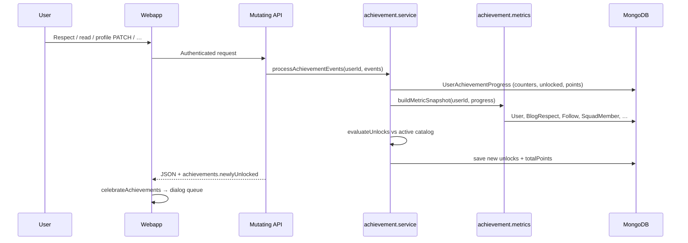
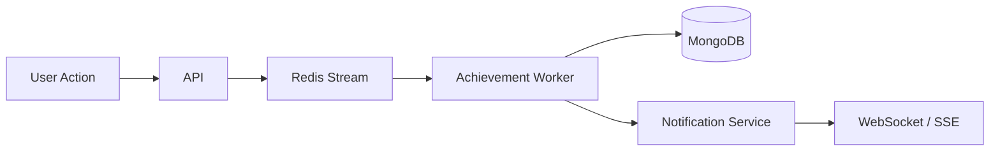
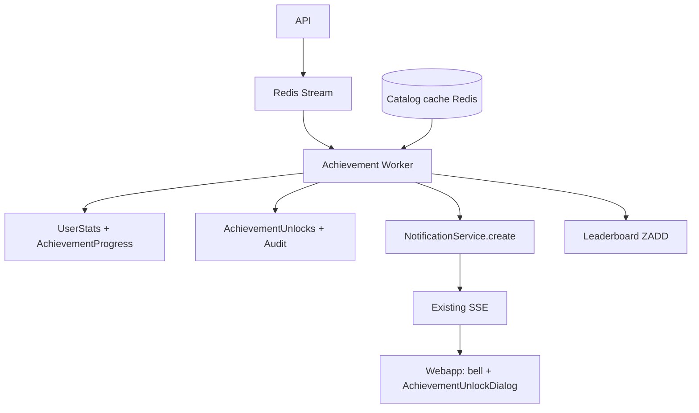
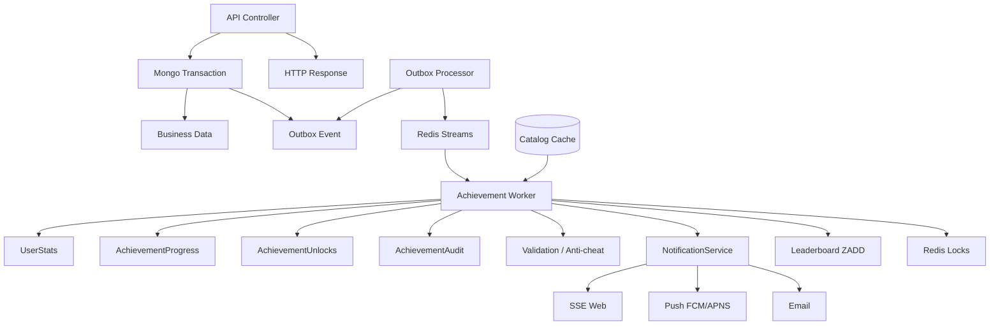

# Achievements — end-to-end flow

How badge catalog, progress tracking, unlocks, celebrations, and admin management work across the webapp, API, and admin dashboard.

**Primary UI:** `webapp/src/app/achievements/page.tsx` → `webapp/src/features/achievements/pages/AchievementsPage.tsx`  
**API client:** `webapp/src/api/achievements.ts`  
**Contracts:** `webapp/src/contracts/achievementsApi.ts`  
**Server routes:** `server/src/routes/achievements.routes.ts` (mounted at `/api/achievements`)  
**Server logic:** `server/src/achievements/achievement.service.ts`, `server/src/achievements/achievement.metrics.ts`  
**Catalog store:** `server/src/services/achievements/achievementCatalogStore.ts`  
**Engine (v2):** `server/src/services/achievements/achievementEngine.service.ts`  
**Dispatch (controllers):** `server/src/services/achievements/dispatchAchievementEvents.ts`  
**Worker / outbox:** `achievementWorker.service.ts`, `achievementOutboxProcessor.service.ts`  
**Models:** `UserStats`, `AchievementUnlock`, `AchievementProgress`, `AchievementOutboxEvent`, `AchievementAudit`, `AchievementEventLog`

### Runtime modes

| Mode | Env | Behavior |
|------|-----|----------|
| **Sync (default)** | `ACHIEVEMENT_ASYNC` unset | `dispatchAchievementEvents` evaluates inline; returns `newlyUnlocked` on API response + notifications |
| **Async** | `ACHIEVEMENT_ASYNC=1` + Redis | Outbox → Redis stream → worker; unlocks via SSE notifications only |

---

## Architecture at a glance

Achievements are **server-evaluated** and **pull-delivered on mutation**:

1. User performs an action (respect, read, profile update, follow, etc.).
2. The relevant controller calls `processAchievementEvents(userId, events)`.
3. The service updates counters/flags, rebuilds a **metric snapshot**, and compares against the active catalog.
4. New unlocks are appended to `UserAchievementProgress` and returned inline as `{ achievements: { newlyUnlocked: [...] } }`.
5. The webapp calls `handleAchievementsResponse()` → Zustand queue → centered unlock dialog + confetti.

There is **no achievements SSE, webhook, or Redis layer**. Blog read deduplication uses Redis separately; achievements only consume the resulting `briefsRead` counter after a counted read commit.



---

## Entry and auth

| Surface | Route / path |
|---------|----------------|
| Achievements page | `/achievements` |
| Account menu | `AccountDropdown` → **Achievements** |
| Profile summary | Own profile sidebar + Syntax Card dialog |
| Unlock celebration | Global modal (any page via `LayoutShell`) |

- **Guard:** Signed-in users only on `/achievements` (`SignInRequiredPanel` when no session).
- **Token:** `useAuthStore().token` on `GET /api/achievements*` via Bearer auth.
- **Read API:** Pull-only — full list or summary counts.

---

## User journeys

### 1. View achievements progress

1. Navigate to **/achievements** (account menu or profile link).
2. Webapp: `achievementsApi.list(token)` → `GET /api/achievements`.
3. Page shows:
   - **Stats row:** Unlocked `x/y`, Points, In progress, Completion %.
   - **Badge catalog:** Two-column card grid with filters (**All** / **In progress** / **Unlocked**).
4. Each card shows status: **Unlocked**, **In progress** (progress bar), or **Locked** (prerequisite not met).

### 2. Earn a badge (typical path)

1. User completes a platform action (e.g. gives Respect, uploads avatar, follows 3 authors).
2. Server evaluates achievements during that HTTP handler.
3. Response includes optional payload:

```json
{
  "success": true,
  "achievements": {
    "newlyUnlocked": [
      {
        "id": "profile-avatar",
        "slug": "profile-picture",
        "title": "Profile Picture",
        "description": "Upload a profile picture.",
        "category": "profile",
        "points": 10,
        "celebrateAs": "dialog",
        "metric": "profile.has_avatar",
        "target": 1,
        "current": 1
      }
    ]
  }
}
```

4. Webapp: `handleAchievementsResponse(body)` → `celebrateAchievements(unlocks)`.
5. `AchievementCelebrationHost` shows `AchievementUnlockDialog` (confetti, progress, link to `/achievements`).
6. Multiple unlocks in one response are queued and shown one dialog at a time.

### 3. See summary elsewhere (profile / Syntax Card)

1. Own profile sidebar or Syntax Card dialog loads `achievementsApi.summary(token)`.
2. `GET /api/achievements/summary` → `{ unlockedCount, total, totalPoints }`.
3. Profile shows `unlocked/total` bar + **View all** link to `/achievements`.

### 4. Admin manages catalog

1. Staff opens **Admin → Achievements** (`/achievements` in admin app).
2. CRUD against `/api/v1/admin/management/achievements` (RBAC: `achievement:list`, `achievement:manage`).
3. Changes sync to MongoDB; static defaults are upserted on server load via `ensureDefaultAchievements()`.
4. **Delete** is soft (`active: false`) — same pattern as retired static keys.

---

## Unlock evaluation (server)

### Events

`processAchievementEvents(userId, events)` accepts:

| Event | Effect on progress doc |
|-------|-------------------------|
| `respect_given` | `counters.respectGiven++` |
| `brief_read` | `counters.briefsRead++` |
| `cv_parsed` | `flags.cvImported = true` |
| `profile_sync` | No counter change — triggers full re-evaluation |

After events, `evaluateUnlocks()` runs when counters changed, `profile_sync` was sent, or events were non-empty.

### Unlock condition

For each active catalog entry (sorted by `sortOrder`):

1. Skip if already in `progress.unlocked`.
2. If `unlocksAfter` is set, prerequisite achievement must already be unlocked.
3. Unlock when `metricValue(metric, snapshot) >= target`.

Points are awarded once per unlock; `totalPoints` increments on the progress document.

### Metric snapshot

`buildMetricSnapshot()` merges:

- **Live DB counts:** respect given, posts authored, following, category follows, squads joined, feedback submitted.
- **User document booleans:** avatar (non-default), bio (≥20 chars, not default placeholder), cover, GitHub, work, stack/setup counts, etc.
- **Progress counters:** `briefsRead`, `respectGiven` (max with DB count).

Full metric keys are defined in `server/src/achievements/achievement.types.ts` (`AchievementMetric`).

### List API item states

`GET /api/achievements` returns each catalog row with:

| Field | Meaning |
|-------|---------|
| `unlocked: true` | Badge earned; `unlockedAt` set |
| `locked: true` | `unlocksAfter` prerequisite not met |
| Neither | In progress — show `current`, `target`, progress % |

---

## Active catalog (v4 defaults)

Static seed: `server/src/achievements/achievement.catalog.ts` — **15** achievements, `ACHIEVEMENT_CATALOG_VERSION = 4`.

Retired keys (hidden in DB, not in active catalog): `profile-location`, `profile-cv`, `profile-education`.

| Key | Title | Category | Metric | Target | Points |
|-----|-------|----------|--------|--------|--------|
| `respect-given-1` | Everyone gets an upvote! | engagement | `respect.given.total` | 1 | 5 |
| `respect-given-3` | Daily Syntax Readit! | engagement | `respect.given.total` | 3 | 10 |
| `read-brief-4` | Daily Syntax Reader | reading | `read.brief.total` | 4 | 15 |
| `posts-1` | Daily Syntax Author | writing | `posts.authored.count` | 1 | 15 |
| `profile-avatar` | Profile Picture | profile | `profile.has_avatar` | 1 | 10 |
| `profile-cover` | Background Banner | profile | `profile.has_cover` | 1 | 10 |
| `profile-bio` | Bio Complete | profile | `profile.has_bio` | 1 | 10 |
| `profile-github` | GitHub Connected | profile | `profile.has_github` | 1 | 10 |
| `profile-work` | Work Experience | profile | `profile.has_work` | 1 | 10 |
| `stack-1` | Stack & Tools | profile | `stack.tools.count` | 1 | 10 |
| `profile-setup-1` | My Setup | profile | `profile.setup.count` | 1 | 10 |
| `follow-authors-3` | Follow 3 Authors | social | `social.following.count` | 3 | 15 |
| `follow-categories-3` | Follow 3 Categories | social | `blog.categories.followed.count` | 3 | 15 |
| `squad-join-1` | Squad Up | social | `squads.joined.count` | 1 | 15 |
| `feedback-1` | First Feedback | writing | `feedback.submitted.count` | 1 | 10 |

All entries use `celebrateAs: 'dialog'`. Metrics like `respect.received.total`, `followers.count`, and `read.streak.longest` are supported by the engine but not used by current catalog rows.

---

## Server trigger map

Where `processAchievementEvents` runs and what gets returned to the client:

| User action | Controller | Events | `newlyUnlocked` in response |
|-------------|------------|--------|-----------------------------|
| Give Respect (new edge) | `blogRespect.controller.ts` | `respect_given` (viewer) | Viewer only |
| Give Respect (new edge) | same | `profile_sync` (author) | **Not** returned to viewer |
| Read commit (counted) | `blog.controller.ts` | `brief_read` | Reader |
| First publish post | `blog.controller.ts` | `profile_sync` | Author |
| Profile PATCH / section | `profile.controller.ts` | `profile_sync` | User |
| Parse CV | `profile.controller.ts` | `profile_sync` only | User |
| Follow user | `follow.controller.ts` | `profile_sync` (follower + fire-and-forget target) | Follower |
| Follow category (new) | `blogCategoryFollow.controller.ts` | `profile_sync` | User |
| Join squad | `squad.controller.ts` | `profile_sync` | User |
| Submit feedback (logged in) | `feedback.controller.ts` | `profile_sync` | User |

Read commit only fires when the read pipeline marks the view as **counted** and not already processed (see `docs/BLOG_READ_STREAK.md` / read commit flow).

---

## REST API summary

### User (webapp)

| Method | Path | Auth | Purpose |
|--------|------|------|---------|
| GET | `/api/achievements` | Bearer (`verifyToken`) | Full catalog + per-user progress |
| GET | `/api/achievements/summary` | Bearer | Counts + total points only |

**Inline unlock payload** (no dedicated endpoint) — returned on successful mutations when unlocks occur:

| Method | Path | Notes |
|--------|------|-------|
| POST | `/api/blog/p/:username/:slug/respect` | Viewer unlocks |
| POST | `/api/blog/p/:username/:slug/read/commit` | Reader unlocks |
| PUT | `/api/blog/post/:postId` | First publish unlocks |
| PATCH | `/auth/profile` | Profile unlocks |
| PATCH | `/auth/profile/:section` | Section updates |
| POST | `/auth/parse-cv` | Profile unlocks |
| POST | `/api/follow/:username` | Follower unlocks |
| POST | `/api/blog/categories/:slug/follow` | New follow unlocks |
| POST | `/api/squads/s/:slug/join` | Squad unlocks |
| POST | `/api/feedback/` | Unlock when `userId` present |

Response shape when unlocks occur:

```json
{
  "success": true,
  "achievements": {
    "newlyUnlocked": [ "AchievementUnlockDto[]" ]
  }
}
```

### Admin

Base: `/api/v1/admin/management` — staff JWT + `staffManagementContext` + RBAC.

| Method | Path | Permission | Purpose |
|--------|------|------------|---------|
| GET | `/achievements` | `achievement:list` | List catalog (incl. inactive) |
| GET | `/achievements/options` | `achievement:list` | Categories, modules, metrics enums |
| POST | `/achievements` | `achievement:manage` | Create achievement |
| PATCH | `/achievements/:id` | `achievement:manage` | Update achievement |
| DELETE | `/achievements/:id` | `achievement:manage` | Soft deactivate |

Controller: `server/src/admin-platform/controllers/managementAchievements.controller.ts`

---

## Data model (server)

### `AchievementCatalog`

Collection: `achievementcatalog` — `server/src/models/AchievementCatalog.ts`

| Field | Notes |
|-------|--------|
| `key` | Stable id (matches static `id` in seed) |
| `slug` | URL-safe slug for icons / links |
| `title`, `description` | Display copy |
| `category`, `module` | Taxonomy |
| `metric`, `target`, `points` | Unlock rule |
| `unlocksAfter` | Optional prerequisite `key` |
| `sortOrder`, `celebrateAs` | UI ordering + celebration type |
| `active` | `false` = hidden from user catalog |

### `UserAchievementProgress`

Collection: `userachievementprogresses` — `server/src/models/UserAchievementProgress.ts`

| Field | Notes |
|-------|--------|
| `userId` | Unique per user |
| `unlocked[]` | `{ achievementId, unlockedAt, pointsAwarded }` |
| `counters` | `respectGiven`, `briefsRead`, `hotTakeSwipes` |
| `flags` | `cvImported` |
| `totalPoints` | Sum of awarded points |
| `catalogVersion` | Last synced catalog version |

---

## Webapp integration

### Celebration pipeline

```
API response
  → handleAchievementsResponse()     webapp/src/lib/achievements/handleAchievementsResponse.ts
  → celebrateAchievements()          webapp/src/store/achievementCelebration.ts
  → AchievementCelebrationHost       webapp/src/features/achievements/components/AchievementCelebrationHost.tsx
  → AchievementUnlockDialog          confetti + “View all achievements”
```

Mounted globally in `webapp/src/components/layout/shell/LayoutShell.tsx`.

### Call sites that show unlock dialogs

| File | Trigger |
|------|---------|
| `webapp/src/lib/auth/runProfilePatch.ts` | All profile PATCH / section updates |
| `webapp/src/hooks/useBlogCardEngagement.ts` | Respect on feed cards |
| `webapp/src/features/blog/post-detail/blogPostDetailSections.tsx` | Respect on post detail |
| `webapp/src/features/blog/pages/PublicBlogPostPage.tsx` | Read view commit |
| `webapp/src/features/profile/pages/ProfilePage.tsx` | CV parse |

### Gaps (server returns unlocks; webapp may not celebrate)

These flows attach `achievements` on the server but **do not** call `handleAchievementsResponse` today:

- Follow user / category
- Squad join
- Feedback submit
- First blog publish

Users still earn badges; they appear on `/achievements` or when a wired flow runs later. To fix: call `handleAchievementsResponse` in the corresponding webapp API handlers.

### Achievements page UI

| Component | Role |
|-----------|------|
| `AchievementsPage.tsx` | Shell header, stats, filters, grid |
| `AchievementCard.tsx` | Per-badge card (locked / in progress / unlocked) |
| `achievementIcons.ts` | Slug → Lucide icon map (icon-ready for custom assets) |

---

## Admin app UI

| Path | Role |
|------|------|
| `admin/src/app/(dashboard)/achievements/page.tsx` | Page shell |
| `admin/src/components/achievements/AchievementsCatalogPanel.tsx` | Table + create/edit dialog |
| `admin/src/lib/achievements/achievementCatalogAdmin.ts` | API client |
| `admin/src/components/dashboard/navConfig.ts` | Nav entry (`achievement:list` \| `achievement:manage`) |

---

## Catalog sync

On server startup / catalog load:

1. `ensureDefaultAchievements()` upserts rows from `achievement.catalog.ts`.
2. `loadActiveAchievementCatalog()` returns only `active: true` entries.
3. `catalogVersion` = `activeCount * 1_000_000 + (maxUpdatedAt % 1_000_000)`.

Admin edits override DB fields; static seed re-applies defaults on upsert for known keys.

---

## Known limitations

1. **`registerAchievementListener`** (`achievement.listener.ts`) listens for `profile.updated` but is **never registered** — profile achievements rely on direct calls in `profile.controller.ts`.
2. **`cv_parsed` event** is defined but not emitted; CV flow uses `profile_sync` only. `flags.cvImported` is unused in current paths.
3. **Author respect unlocks** are evaluated server-side but not delivered in the viewer’s HTTP response.
4. **No real-time push** — missed dialogs require visiting `/achievements` or triggering a wired mutation.
5. **`isProfileCoreComplete()`** in metrics is not wired into unlock rules.

---

## Related docs

- Respect (triggers `respect.given.total`): `docs/BLOG_RESPECT.md`
- Read commit (triggers `read.brief.total`): `docs/BLOG_READ_STREAK.md`
- Profile updates (triggers profile metrics): `docs/PROFILE_UPDATE_FLOW.md`
- Feedback (triggers `feedback.submitted.count`): `docs/FEEDBACK_SYSTEM.md`

---

## Flow diagram

```mermaid
flowchart TD
  subgraph triggers [User actions]
    A1[Give Respect]
    A2[Read post commit]
    A3[Profile PATCH]
    A4[Follow / Squad / Feedback / Publish]
  end

  subgraph server [Server]
    B[processAchievementEvents]
    C[Update counters / flags]
    D[buildMetricSnapshot]
    E[evaluateUnlocks vs catalog]
    F[(UserAchievementProgress)]
    G[attachAchievementsToResponse]
  end

  subgraph webapp [Webapp]
    H[handleAchievementsResponse]
    I[Celebration queue]
    J[AchievementUnlockDialog]
    K[/achievements page]
  end

  A1 & A2 & A3 & A4 --> B
  B --> C --> D --> E
  E --> F
  E --> G
  G --> H --> I --> J
  F --> L[GET /api/achievements]
  L --> K
```

---

## Production improvements (roadmap)

> **Implementation status (2026):** Phases 1–4 shipped in code — `UserStats`, metric index, idempotent `AchievementUnlocks`, Redis catalog cache, outbox + stream worker (enable async with `ACHIEVEMENT_ASYNC=1`), `achievement_unlocked` notifications via SSE, XP/levels, leaderboard API. Phases 5 (quests, seasonal, rule engine) remain doc-only.

> **Roadmap sections below** mix shipped items (Phases 1–4) with future work (Phase 5+). See implementation status line above.
>
> **See also:** [Refined production plan (Syntax-specific)](#refined-production-plan-syntax-specific) — corrected priorities, reuse of existing Notification/SSE, and gamification roadmap. That section supersedes conflicting details below where noted.
>
> **Final review:** [Final production review](#final-production-review) — outbox pattern, remaining gaps, v1 ship phases, and updated architecture scores.

### Architecture score (current)

| Area | Rating | Notes |
|------|--------|-------|
| Simplicity | 9/10 | Inline evaluation is easy to trace |
| Developer Experience | 8/10 | Single service, clear controller hooks |
| Scalability | 5/10 | Sync evaluation + full snapshot rebuild per action |
| Real-time capability | 3/10 | No push; missed unlocks need page reload |
| Event reliability | 4/10 | No queue, retries, or idempotency locks |
| Analytics readiness | 5/10 | No event log; hard to replay or audit |
| Production readiness | 6/10 | Fine at ~15 badges; degrades as catalog grows |

### Biggest problem: synchronous evaluation on every request

Today:

```text
User Action
   ↓
Controller
   ↓
processAchievementEvents()
   ↓
Mongo Queries
   ↓
Metric Snapshot Rebuild
   ↓
Achievement Evaluation
   ↓
HTTP Response
```

Every wired action evaluates achievements **inline** in the request path: Respect, Follow, Read commit, Squad join, Feedback, Profile update, First publish.

As catalog size grows:

| Catalog size | Expected impact |
|--------------|-----------------|
| ~15 (today) | Acceptable |
| ~100 | Noticeable latency on hot paths |
| ~500 | Painful — multiple collection counts per request |

**Highest-impact change:** move evaluation out of HTTP into a **Redis-backed worker queue**. That improves API latency, enables retries, scales workers independently, and unlocks real-time delivery via pub/sub or the existing notification stack.

---

### 1. Event-driven architecture

**Instead of:**

```ts
await processAchievementEvents(userId, [{ type: 'respect_given' }]);
```

**Publish events:**

```ts
AchievementEvent.publish({
  userId,
  type: 'respect_given',
  timestamp: Date.now(),
});
```

**Target flow:**



**Benefits:**

- API returns faster (fire-and-forget or ack-after-enqueue)
- Retries on worker failure
- Workers scale horizontally
- Controllers stop owning evaluation logic

---

### 2. Expand Redis usage

Redis today is used for blog read dedupe only. Recommended achievement layers:

#### Achievement progress cache

Replace repeated `buildMetricSnapshot()` Mongo fan-out with hot counters:

```json
achievement:user:{userId}
{
  "respectGiven": 3,
  "briefsRead": 4,
  "following": 5
}
```

Increment on action:

```text
INCR achievement:user:{userId}:respectGiven
```

Periodic or lazy flush to Mongo for durability.

#### Achievement catalog cache

**Current:** `loadActiveAchievementCatalog()` → Mongo on every evaluation.

**Recommended:**

```text
Redis key: achievement:catalog:v4
TTL: 24h (or invalidate on admin PATCH)
```

#### User achievement list cache

> **Superseded:** Do **not** cache per-user achievement lists in Redis at Syntax's current scale. See [Refined plan §2](#2-dont-cache-user-achievement-lists-in-redis).

**Earlier proposal (not recommended for Syntax now):**

```text
Redis key: achievement:user:{id}:list
```

At 15–300 achievements, `1 catalog query + 1 progress query` in Mongo is already cheap. Cache **catalog only**.

---

### 3. Dedicated achievement worker

New process: `achievement-worker` (or shared job consumer).

**Consumes from:** Redis Streams, Kafka, RabbitMQ, or SQS — Redis Streams fits existing infra.

**Responsibilities:**

- Apply event deltas to counters / `UserStats`
- Evaluate unlocks against cached catalog
- Persist progress + unlocks
- Emit notifications (in-app, email, push)
- Publish to Redis pub/sub for live clients

**Rule:** HTTP controllers **never** call `evaluateUnlocks()` — only enqueue.

---

### 4. Real-time unlocks

> **Superseded:** Reuse existing **Notification model + SSE stream + notification center** — do not add a separate WebSocket gateway. See [Refined plan §1](#1-reuse-existing-notification-system).

**Current gap:** unlocks only arrive via inline JSON on mutations the webapp handles, or via pull on `/achievements`.

**Target flow (Syntax):**

```text
Achievement Worker
      ↓
NotificationService.create({ type: "achievement_unlocked", … })
      ↓
Existing SSE stream
      ↓
Browser → AchievementUnlockDialog + notification bell
```

**Payload example:**

```json
{
  "type": "achievement_unlocked",
  "userId": "…",
  "achievementId": "profile-avatar"
}
```

Achievement unlock becomes a first-class notification type — same pipeline as milestones, follows, and feed alerts.

---

### 5. Denormalized stats (remove full metric rebuilds)

**Current:** `buildMetricSnapshot()` queries User, Follow, Squad, Blog, Feedback, etc. per evaluation.

**Recommended:** maintain `UserStats` (or extend `UserAchievementProgress`) updated incrementally:

```json
{
  "userId": "…",
  "followers": 100,
  "following": 40,
  "postsAuthored": 5,
  "briefsRead": 10,
  "respectGiven": 12,
  "categoriesFollowed": 2,
  "squadsJoined": 1,
  "feedbackSubmitted": 0
}
```

Evaluation becomes:

```ts
stats.following >= achievement.target
```

Single document read (+ Redis cache) instead of N collection counts.

**Migration:** backfill from existing collections once; then increment on each domain event.

---

### 6. Rules engine (future catalog)

**Current:** `metric` + `target` (+ optional `unlocksAfter`) — good for v1.

**Future:** JSON rule trees for Product/admin without deploys:

```json
{
  "operator": "AND",
  "conditions": [
    { "metric": "social.following.count", "op": ">=", "value": 10 },
    { "metric": "posts.authored.count", "op": ">=", "value": 3 }
  ]
}
```

Or compound streak rules:

```json
{
  "rule": "respectGiven >= 5 AND read.streak.longest >= 7"
}
```

Admin dashboard already has catalog CRUD — extend with rule builder UI and server-side evaluator.

---

### 7. Notification table for missed unlocks

**Current:** unlocks live only in `UserAchievementProgress.unlocked[]` and ephemeral inline responses.

**Recommended:** persist unlock notifications (aligns with platform notification center):

```json
{
  "type": "achievement",
  "userId": "…",
  "achievementId": "profile-avatar",
  "seen": false,
  "createdAt": "…"
}
```

**Benefits:**

- Notification bell / center
- Recover celebrations after tab close
- Email and mobile push triggers
- Audit trail for support

---

### 8. Event sourcing / achievement event log

Append-only collection `achievement_events`:

```json
{
  "event": "respect_given",
  "userId": "…",
  "metadata": {},
  "createdAt": "…"
}
```

**Enables:**

- Replay after bugs or catalog changes
- Rebuild user progress from events
- Analytics dashboards and funnels
- Leaderboards and seasonal resets

---

### 9. Distributed locking (idempotent unlocks)

**Race scenario:** three Respect requests arrive concurrently; two workers might award the same badge.

**Mitigation:**

```text
SETNX achievement-lock:{userId}:{achievementId}  EX 30
```

Or Redlock around `evaluateUnlocks` per user. Unlock writes should be idempotent (unique index on `userId + achievementId`).

---

### 10. Decouple celebration from HTTP response

**Current:**

```text
API Response → handleAchievementsResponse → Unlock Dialog
```

Fails silently if the user closes the tab before the response is handled, or if the webapp path does not call `handleAchievementsResponse` (see gaps above).

**Target:**

```text
Achievement Unlocked
   ↓
Notification queue + persisted record
   ↓
WebSocket / SSE + in-app notification
   ↓
Celebration dialog on next session (if unseen)
```

User always receives the unlock eventually.

---

### Database split (scale path)

**Current:** single `UserAchievementProgress` doc holds counters, flags, and `unlocked[]` — can grow large for power users.

**Recommended split:**

| Collection | Contents |
|------------|----------|
| `achievement_progress` | `userId`, `totalPoints`, `catalogVersion` |
| `achievement_unlocks` | `userId`, `achievementId`, `unlockedAt`, `pointsAwarded` |
| `user_stats` | Denormalized counters for evaluation |

Indexes: `(userId, achievementId)` unique on unlocks; `(userId)` on stats.

---

### Enterprise / gamification features (not in v1)

| Feature | Example |
|---------|---------|
| **Expiry** | `{ "expiresAt": "…" }` — e.g. 30-day reading streak badge |
| **Seasonal** | `Summer 2026 Reader` — time-boxed catalog rows |
| **Hidden** | `{ "hidden": true }` — show `???` until unlocked |
| **Leaderboards** | `ZADD achievement:leaderboard:points {score} {userId}` in Redis |

---

### Target Syntax architecture

> **Superseded** by [Architecture to ship today](#architecture-to-ship-today) in the refined plan (Notification/SSE reuse, no separate WebSocket layer).

```text
NGINX
 ↓
Node APIs                    (enqueue only)
 ↓
Redis Streams                achievement-events
 ↓
Achievement Worker           evaluate + persist + notify
 ↓
MongoDB                      progress, unlocks, stats, event log

NotificationService + existing SSE   (not a new WebSocket gateway)

Admin Dashboard
 ↓
Achievement Rule Engine      catalog + rules + cache invalidation
```

---

### Suggested implementation order

> Generic phasing below. **Syntax priority order:** UserStats → Worker → Notification/SSE — see [Prioritized ship order for Syntax](#prioritized-ship-order-for-syntax).

| Phase | Work | Impact |
|-------|------|--------|
| **1** | Redis Streams + worker; controllers enqueue only | Latency, reliability |
| **2** | `UserStats` denormalization + Redis counter cache | Removes snapshot fan-out |
| **3** | Catalog Redis cache only (not per-user lists) | Shared catalog reads |
| **4** | Unlock → `NotificationService` + existing SSE | Real-time + missed unlock recovery |
| **5** | Event log + idempotent locks | Analytics, safety at scale |
| **6** | Rules engine + gamification (XP, quests, seasons) | Product velocity |

Phase 1 alone addresses the largest production risk while keeping the current catalog and webapp UI largely unchanged.

> **Priority order for Syntax** differs — see [Refined plan: prioritized ship order](#prioritized-ship-order-for-syntax).

---

## Refined production plan (Syntax-specific)

> **Status:** Proposed — not implemented. Refines the roadmap above for Syntax as a social platform: less over-engineering at current scale, stronger foundation for future gamification. **Where this section conflicts with the generic roadmap, this section wins.**

Some of the initial roadmap is slightly over-engineered for ~15 badges today and under-designed for retention systems (XP, quests, seasons) tomorrow. This is the architecture to ship toward.

---

### What changes vs. generic roadmap

| Topic | Generic roadmap | Syntax recommendation |
|-------|-----------------|----------------------|
| Real-time delivery | New WebSocket / pub/sub layer | Reuse **Notification + SSE** |
| Redis caching | Catalog + per-user list | **Catalog only** |
| Stats | Optional later | **`UserStats` immediately** |
| Progress | Computed on read | Persist **`AchievementProgress`** |
| Evaluation | Loop all badges | **Metric index** — evaluate subset only |
| Gamification | Achievements only | **XP, levels, quests, seasons, leaderboards** |

---

### 1. Reuse existing notification system

Syntax already has:

```text
Notification Model
SSE Stream
Notification Center
Unread Count
```

**Do not build:**

```text
Achievement Worker → WebSocket (new gateway)
```

**Build:**

```text
Achievement Worker
   ↓
NotificationService.create()
   ↓
SSE (existing)
   ↓
AchievementUnlockDialog + bell dropdown
```

Achievement unlock is just another notification type:

```ts
{
  type: 'achievement_unlocked',
  userId,
  achievementId,
}
```

This removes an entire service and unifies missed-unlock recovery with the notification center.

---

### 2. Don't cache user achievement lists in Redis

**Do not cache:**

```text
achievement:user:{id}:list
```

**Reason:**

| Scale | List size | Mongo cost |
|-------|-----------|------------|
| Today | ~15 achievements | Trivial |
| Near term | 100–300 achievements | Still cheap |

`GET /api/achievements` = **1 catalog query + 1 progress query**. That is sufficient.

**Do cache:**

```text
achievement:catalog:v4
```

Every user reads the same catalog; invalidate on admin catalog update.

---

### 3. Introduce UserStats immediately

**Biggest database win.** This should come **before** or alongside the worker queue.

**Current:** `buildMetricSnapshot()` hits Users, Posts, Follows, Squads, Feedback, Respect on every evaluation.

**Create:**

```ts
UserStats {
  userId,
  postsCount,
  followingCount,
  followersCount,
  respectGiven,
  respectReceived,
  briefsRead,
  squadsJoined,
  feedbackSubmitted,
  categoriesFollowed,
  // profile flags as 0/1 or booleans
}
```

Evaluation:

```ts
// before: metric snapshot fan-out
stats.followersCount >= achievement.target
```

**Single document read** (+ optional Redis INCR for hot counters during worker migration).

Update incrementally on domain events (respect, follow, publish, etc.).

---

### 4. Add achievement progress tracking

**Current:** progress is indirect — `target = 10`, `current = 6` recomputed from stats each time.

**Persist:**

```ts
AchievementProgress {
  userId,
  achievementId,
  current,
  target,
  percentage   // derived or stored
}
```

**Benefits:**

- Profile widgets without recalculation
- “You're 80% complete!” progress notifications
- Leaderboard / near-miss campaigns
- Cheaper list API (join catalog + progress + unlocks)

---

### 5. Achievement categories — more depth

**Current:** Profile, Reading, Writing, Social, Engagement — fine for v1.

**For engagement growth:**

```text
Onboarding
Reading
Writing
Social
Streaks
Community
Creator
Power User
Seasonal
```

Creates natural progression paths and filter tabs on `/achievements`.

---

### 6. Add XP system

**Current:** points are awarded but **do nothing** long-term.

**Introduce:**

```text
XP → Level → Rank
```

Flow:

```text
Achievement Unlock → +25 XP → Level Up notification
```

Achievements gain lasting profile value (Syntax Card, leaderboards, unlock tiers).

---

### 7. Daily / weekly quests

Retention driver — **separate from** lifetime achievements.

Examples:

```json
{ "title": "Read 3 briefs", "reward": 50 }
```

```json
{ "title": "Give 5 respects", "reward": 100 }
```

Quest definitions rotate; completion grants XP or bonus badges. Stored in dedicated collections, not mixed into `AchievementCatalog`.

---

### 8. Seasonal events

Examples:

```text
Hacktoberfest 2026 — Read 20 articles, Write 3 blogs → Seasonal Badge
```

**Requires catalog fields:**

```ts
startDate
endDate
seasonal: true
```

Current catalog has no time bounds — seasonal badges cannot expire or auto-hide today.

---

### 9. Leaderboards

Strong Redis use case (unlike per-user list cache):

```text
achievement:points          → ZADD (total XP / points)
achievement:readers         → ZADD (briefsRead)
achievement:authors         → ZADD (postsCount)
```

Examples: Top Readers, Top Authors, Top Contributors.

Drives community engagement; pair with public profile / explore surfaces later.

---

### 10. Achievement evaluation optimization

**Avoid:** looping all 300 badges on every `respect_given`.

**Build metric index at catalog load:**

```ts
metricMap = {
  'respect.given.total': ['respect-given-1', 'respect-given-3', 'respect-given-10'],
  'read.brief.total': ['read-brief-4', '…'],
  // …
}
```

On event `respect_given`, evaluate **only** respect-linked achievements.

Huge win at 100+ catalog entries with no extra infrastructure.

---

### Missing production features

#### Catalog versioning

**Current:** `catalogVersion = activeCount * 1_000_000 + …` — clever but fragile.

**Prefer:**

```ts
{
  version: 5,
  publishedAt: Date,
}
```

Explicit publish events; easier admin UX and migration scripts.

#### Achievement audit log

```ts
AchievementAudit {
  userId,
  achievementId,
  action,        // unlocked | progress_updated | revoked
  sourceEvent,
  createdAt,
}
```

For support tickets, debugging, and rollback.

#### Unique unlock constraint

Mongo index:

```ts
{ userId: 1, achievementId: 1 }  unique
```

Prevents duplicate rewards under concurrent workers.

#### Event replay (bounded retention)

```ts
AchievementEvent { event, userId, metadata, createdAt }
```

**Not** forever for every micro-action — e.g. **90-day retention** is enough to recover from bugs and run analytics without unbounded storage.

---

### Architecture to ship today

```text
API
 ↓
Redis Stream
 ↓
Achievement Worker
 ↓
MongoDB

Collections
-----------
AchievementCatalog
AchievementUnlocks
AchievementProgress
UserStats
AchievementAudit
AchievementEvent      (90d TTL)

Redis
------
achievement:catalog:v*     (catalog cache only)
achievement:leaderboard:* (sorted sets)
achievement-events         (stream)
achievement-lock:*         (SETNX per user/achievement)

Existing (reuse)
----------------
NotificationService
SSE stream
Notification center
AchievementUnlockDialog    (triggered from SSE + optional inline JSON during migration)
```

**Delivers:** fast APIs, real-time unlocks via existing SSE, scalable evaluation, leaderboards, path to quests/XP/seasons, event replay, admin flexibility — **without** unnecessary services too early.



---

### Prioritized ship order for Syntax

> **Superseded by** [What to ship in v1](#what-to-ship-in-v1) in the final production review (adds Outbox pattern, metric index in Phase 1).

These three deliver ~**80% of production scalability** while keeping the codebase maintainable:

| Priority | Work | Why |
|----------|------|-----|
| **1** | **`UserStats` denormalization** | Eliminates `buildMetricSnapshot()` fan-out immediately |
| **2** | **Redis Stream + Achievement Worker** | Gets evaluation off HTTP; retries + metric-index eval |
| **3** | **Reuse Notification + SSE** | Real-time unlocks + missed celebrations; no new gateway |

Then, in order:

| Priority | Work |
|----------|------|
| **4** | XP + Levels |
| **5** | Leaderboards (Redis sorted sets) |
| **6** | Daily / weekly quests |
| **7** | Seasonal achievements (`startDate` / `endDate`) |
| **8** | Rule engine (compound conditions) |

**Also early (with 1–2):** catalog-only Redis cache, metric index, unique unlock index, bounded `AchievementEvent` log.

**Defer:** per-user list Redis cache, standalone WebSocket layer, full event sourcing forever, rules engine before quests prove retention value.

---

### Gamification summary

| System | Purpose | Storage |
|--------|---------|---------|
| **Achievements** | Lifetime milestones | `AchievementCatalog`, `AchievementUnlocks`, `AchievementProgress` |
| **XP / Levels** | Long-term profile value | `UserStats` or `UserGamification` |
| **Quests** | Daily/weekly retention | Separate quest definitions + completions |
| **Seasonal** | Time-boxed campaigns | Catalog `startDate` / `endDate` |
| **Leaderboards** | Community competition | Redis sorted sets |
| **Notifications** | Delivery + recovery | Existing `Notification` + SSE |

This plan stays lean at current scale and opens a clear path to full gamification without rewriting the v1 inline evaluation model twice.

---

## Final production review

> **Status:** Proposed — not implemented. Capstone review of the refined architecture: updated scores, remaining enterprise gaps, and the **v1 ship plan** that should be executed (not the full roadmap at once).

### Architecture score: before vs. after refined plan

| Category | Before (current) | After (refined target) |
|----------|------------------|-------------------------|
| Scalability | 5/10 | 8.5/10 |
| Reliability | 4/10 | 8/10 |
| Real-time | 3/10 | 9/10 |
| Maintainability | 8/10 | 8.5/10 |
| Gamification readiness | 4/10 | 10/10 |
| Production readiness | 6/10 | 9/10 |

The refined plan (UserStats, worker queue, Notification/SSE reuse, XP/quests/seasons path) closes most gaps. The items below are **still not covered** and should be designed before or during v1 implementation.

---

### Remaining production concerns

#### 1. Outbox pattern (critical)

**Current proposal:**

```text
Controller → Redis Stream → Worker
```

**Failure modes:**

```text
Mongo saved, Redis publish failed   → event lost
Redis published, Mongo failed       → orphan / duplicate work
```

**Production pattern:**

```text
Controller
 ↓
Mongo Transaction
 ├── Business Data
 └── Outbox Event
 ↓
Outbox Processor
 ↓
Redis Stream
```

```ts
OutboxEvent {
  _id,
  aggregateId,
  type,
  payload,
  status,       // pending | published | failed
  createdAt,
}
```

One of the most important enterprise patterns for reliable event delivery. **Include in Phase 2** alongside Redis Streams + worker.

---

#### 2. Multi-tenant readiness

Today everything assumes `userId`. Later: Syntax Enterprise, creator communities, partner programs.

Add **`tenantId`** (nullable default) from day one on:

- `AchievementCatalog`
- `AchievementUnlock`
- `UserStats`
- `AchievementProgress`

Retrofitting multi-tenancy later is painful; a single optional field now is cheap.

---

#### 3. Achievement revocation strategy

Current system only **unlocks**. Undefined behavior when requirements are reversed (e.g. user deletes profile picture after **Profile Picture** badge).

| Strategy | Behavior | Example |
|----------|----------|---------|
| **Permanent unlock** | Once earned, never revoked | Steam-style badges |
| **Dynamic unlock** | Badge can disappear if metric drops | LinkedIn-style completeness |

**Must be explicit in catalog** (e.g. `revocable: false` default) and documented for support. Current architecture does not define this.

---

#### 4. Anti-cheat layer

Metrics like read 4 posts, follow 3 users, give respects are farmable.

Introduce **`AchievementValidationService`** (or hooks in worker) for:

- Same IP / device clustering
- Bot account signals
- Self-interactions (follow alt accounts, respect own posts)
- Suspicious velocity (10 respects in 1 second)

Block or flag unlocks pending review for high-value rewards.

---

#### 5. Abuse detection metadata on events

Extend **`AchievementEvent`** (bounded retention) with:

```ts
{
  userId,
  event,
  source,        // api path / worker job id
  ip,
  userAgent,
  sessionId,
  metadata,
  createdAt,
}
```

Enables fraud detection, reward abuse investigation, and security audits later without new instrumentation.

---

#### 6. Notification fatigue controls

Profile completion can trigger **5 unlocks in 3 seconds** (avatar, bio, cover, GitHub, work).

**Batch notifications:**

```text
🎉 5 Achievements Unlocked
+50 XP
```

Single SSE payload + one dialog (expandable list) instead of five sequential modals.

Implement in `NotificationService` or achievement worker when `newlyUnlocked.length > 1`.

---

#### 7. Achievement dependency graph

**Current:** `unlocksAfter` supports linear `A → B` only.

**Future:** compound prerequisites:

```json
{
  "requires": ["profile-avatar", "profile-bio", "profile-work"]
}
```

Enables **Profile Master**-style meta-achievements. Plan schema extension before catalog grows past ~50 entries.

---

#### 8. Achievement packs

Admin flexibility for grouping catalog entries:

```text
Onboarding Pack | Social Pack | Creator Pack
```

Admin can **enable**, **disable**, or **archive** entire packs instead of toggling hundreds of rows individually.

Optional `packId` on `AchievementCatalog`; packs are metadata, not separate unlock logic.

---

#### 9. Data retention strategy

Define retention up front — storage grows unpredictably without it.

| Data | Retention |
|------|-----------|
| Unlocks | Forever |
| XP / levels | Forever |
| Progress | Forever |
| Achievement events | 90 days |
| Achievement audit | 1 year |
| Notifications | 180 days (align with notification system policy) |

TTL indexes or scheduled archival jobs per collection.

---

#### 10. Mobile push architecture

Existing stack: `NotificationService` + SSE (web).

Mobile later needs **FCM / APNS**. Design **channel-agnostic payloads now:**

```ts
{
  type: 'achievement_unlocked',
  title: 'Profile Picture',
  body: 'You earned +10 XP',
  deeplink: '/achievements',
  data: { achievementId, points, xp },
}
```

Same payload drives **SSE**, **push**, and **email** — no achievement-specific mobile fork.

---

### What to ship in v1

Not everything in the roadmap at once.

#### Phase 1

```text
UserStats
Metric index (evaluate subset per event)
Unique unlock index (userId + achievementId)
```

#### Phase 2

```text
Redis Streams
Achievement Worker
Outbox pattern
```

#### Phase 3

```text
NotificationService integration
SSE (existing)
Achievement notification type + batching
```

#### Phase 4

```text
XP
Levels
Leaderboards (Redis sorted sets)
```

#### Phase 5

```text
Quests
Seasonal events (startDate / endDate)
Rule engine
```

---

### Final production architecture

```text
API
 │
 ├── Mongo Transaction
 │     ├── Business Data
 │     └── Outbox Event
 │
 └── Return Response

Outbox Processor
 │
 ▼
Redis Streams
 │
 ▼
Achievement Worker
 │
 ├── UserStats
 ├── AchievementProgress
 ├── AchievementUnlocks
 ├── AchievementAudit
 ├── AchievementValidation (anti-cheat)
 └── NotificationService.create()

NotificationService
 │
 ├── SSE (web)
 ├── Push (FCM / APNS — later)
 └── Email (optional)

Redis
 │
 ├── Streams (achievement-events)
 ├── Catalog cache (achievement:catalog:v*)
 ├── Leaderboards (sorted sets)
 └── Locks (SETNX per user/achievement)

Mongo
 │
 ├── AchievementCatalog      (+ tenantId, packId, revocable, startDate/endDate)
 ├── AchievementUnlocks      (+ tenantId, unique index)
 ├── AchievementProgress
 ├── UserStats
 ├── AchievementAudit
 ├── AchievementEvents         (90d TTL + abuse metadata)
 └── OutboxEvents              (pending → published)
```



---

### Highest ROI for Syntax (top 3)

After full review, these deliver the most value for acceptable complexity:

| # | Improvement | Solves |
|---|-------------|--------|
| **1** | **UserStats denormalization** | Scalability — removes `buildMetricSnapshot()` fan-out |
| **2** | **Redis Stream + Achievement Worker** | Scalability — evaluation off HTTP; horizontal workers |
| **3** | **Outbox pattern + Notification/SSE integration** | Reliability + UX — no lost events; real-time + batched unlocks |

Together they address the biggest **scalability**, **reliability**, and **user experience** gaps while keeping the architecture relatively simple. Phases 4–5 (XP, quests, seasons, rules) build on this foundation without blocking v1 production cutover.

