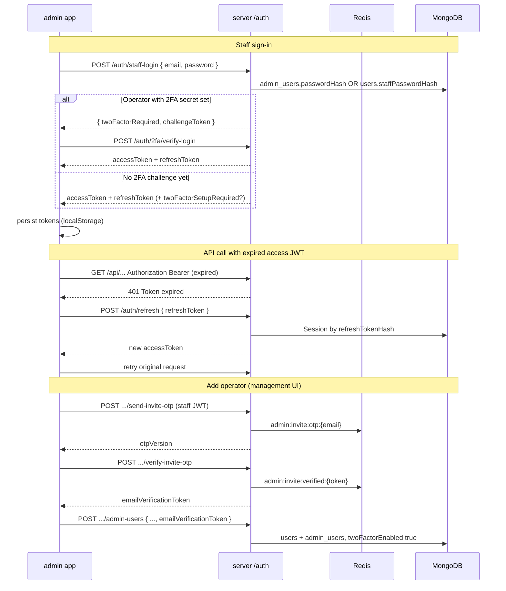
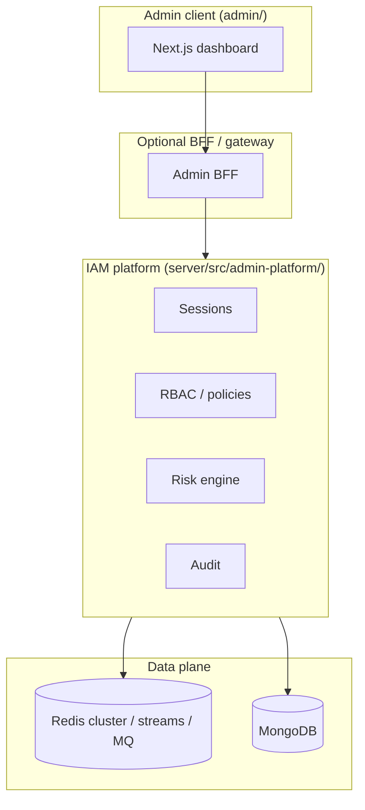

# Admin app — authentication, sessions, RBAC, and Redis

**Status:** May 2026  
**Apps:** `admin/` (Next.js dashboard), `server/src/admin-platform/` (API)  
**Related:** [ADMIN_PLATFORM_REORG_PLAN.md](./ADMIN_PLATFORM_REORG_PLAN.md), [RBAC_AND_USER_MANAGEMENT_SPEC.md](./RBAC_AND_USER_MANAGEMENT_SPEC.md), [admin/README.md](../admin/README.md)

---

## 1. Executive summary

| Topic | Current behavior |
|-------|------------------|
| **Staff login** | Email + password via `POST /auth/staff-login` (not end-user OTP) |
| **Operator invite** | Separate **admin invite OTP** (`/admin-users/send-invite-otp`, `verify-invite-otp`) — reuses email OTP **hashing** and Redis, not public `send-otp` |
| **Sessions** | Same JWT + refresh token + Mongo `sessions` as main app |
| **Token refresh** | `POST /auth/refresh` — rotation + new refresh token (Phase 1); admin proactive refresh (see §4) |
| **Management me** | `GET /api/v1/admin/management/me` — permissions + role for nav (Phase 1) |
| **RBAC** | `AdminRole.permissions[]` → Redis cache → per-route middleware on `/api/v1/admin/management/*` |
| **CMS routes** | Coarse `requireStaff` (`editor` \| `admin` on `users.staffRole`) for help/legal/trash |

---

## 2. Auth flows (current)

### 2.1 Diagram



### 2.2 Staff login (operators)

| Step | Endpoint | Notes |
|------|----------|-------|
| 1 | `POST /auth/staff-login` | Rate limit `rl:stafflogin:` |
| 2a | `admin_users` match | Bcrypt `passwordHash` → linked `users` row |
| 2b | Legacy | `users.staffRole` + `staffPasswordHash` |
| 3 | Session | `createSession` → access JWT + refresh token |
| 4 | 2FA | If `twoFactorEnabled` + `twoFactorSecret`: returns `twoFactorRequired` + `challengeToken` (staff_password skip disabled for operators with secret) |
| 5 | Setup | If `twoFactorEnabled` but no secret: session issued + `twoFactorSetupRequired: true` |

**Not used for staff login:** `POST /auth/send-otp`, `POST /auth/verify-otp` (those are for **end users** on the webapp).

### 2.3 Add operator (invite OTP)

| Step | Endpoint | Auth | Redis keys |
|------|----------|------|------------|
| Send code | `POST /api/v1/admin/management/admin-users/send-invite-otp` | Staff JWT + `admin_assignment:manage` | `admin:invite:otp:{email}`, `admin:invite:otpVer:{email}` |
| Verify | `POST .../verify-invite-otp` | Same | Deletes OTP; sets `admin:invite:verified:{token}` (15 min) |
| Create | `POST .../admin-users` | Same | Consumes verification token; creates user + operator |

**Reuses from platform OTP stack:** `generateEmailOtpDigits`, `hashEmailOtp`, `verifyEmailOtpHash`, `sendAuthEmail` — **not** `send-otp` / `verify-otp` HTTP handlers (those create sessions or signup users).

**Password rules (server + UI):** length > 10, at least one `a-z` and one `A-Z`.

**2FA policy:** `users.twoFactorEnabled: true` on create; first login may return `twoFactorSetupRequired` until authenticator is configured via `POST /auth/2fa/setup` + `enable`.

### 2.4 End-user auth (webapp) — for comparison

| Flow | Endpoints | Purpose |
|------|-----------|---------|
| Login OTP | `send-otp` → `verify-otp` | Existing user, issues session |
| Signup OTP | `signup-email` → `verify-otp` | New user + legal acceptance |
| OAuth | `/auth/google`, etc. | Social signup/signin |

Admin app should **not** call signup/login OTP for dashboard access; only staff-login + optional 2FA.

---

## 3. Tokens, sessions, and security parameters

### 3.1 JWT access token

| Parameter | Env / config | Default |
|-----------|--------------|---------|
| Algorithm | `auth.config` | RS256 |
| Expiry | `JWT_ACCESS_EXPIRY` | `7d` |
| Payload | `userId`, `sessionId` | Verified in `verifyToken` |

Expired access token → **401** with message: `Token expired. Please refresh or log in again.` (`server/src/middlewares/auth/verifyToken.ts`).

### 3.2 Refresh token

| Parameter | Value |
|-----------|--------|
| Storage (client) | `localStorage` key `syntax-stories-admin-session` |
| Storage (server) | `sessions.refreshTokenHash` (SHA-256 of raw token) |
| Endpoint | `POST /auth/refresh` body `{ refreshToken }` |
| Rate limit | `rl:refresh:` — 30/min per key |
| On success | New access JWT + **new refresh token**; session rotated (`SESSION_DURATION_MS` extended) |
| Rotation | **Yes (Phase 1)** — each refresh issues new refresh token; reuse of old token revokes **session family** |
| Session family | `sessionFamilyId` on `sessions`; `previousRefreshTokenHash` for reuse detection |
| Fingerprint | `deviceFingerprint` = SHA256(ip \| userAgent) slice on create |

### 3.3 Session document (`sessions`)

| Field | Use |
|-------|-----|
| `userId` | Platform user |
| `refreshTokenHash` | Lookup for refresh |
| `revoked` | Logout / admin revoke |
| `expiresAt` | Hard stop for refresh |
| `lastActiveAt` | Activity heuristic |

### 3.4 Redis keys (auth-related)

| Key pattern | TTL | Purpose |
|-------------|-----|---------|
| `admin:invite:otp:{email}` | 600s | HMAC hash of invite OTP |
| `admin:invite:otpVer:{email}` | — | Monotonic version per send |
| `admin:invite:verified:{token}` | 900s | Proof of verified email for create |
| `admin:perms:{userId}` | 300s | L2 cached effective permission array |
| `iam:snapshot:{sessionId}` | 7d | Permission snapshot at staff login / refresh |
| `iam:permver:{userId}` | — | Monotonic version; bump on role/catalog change |
| `iam.permission.invalidate` | Pub/Sub | Multi-node L1 cache invalidation |
| `otp:login:{email}` | `OTP_LOGIN_TTL_SECONDS` (300) | Webapp login OTP |
| `otp:signup:{email}` | `OTP_SIGNUP_TTL_SECONDS` (600) | Webapp signup OTP |
| `otp:attempts:{email}` | 5 min block | Brute-force guard |
| `2fa:setup:{userId}` | 600s | Pending TOTP secret |
| `auth:challenge:{hash}` | Short | 2FA login step-up |
| `rl:stafflogin:` | Rate limit window | Staff password attempts |
| `rl:refresh:` | 60s window | Refresh abuse |

### 3.5 OTP email (shared infrastructure)

| Parameter | Env | Default |
|-----------|-----|---------|
| Login OTP TTL | `OTP_LOGIN_TTL_SECONDS` | 300 |
| Signup OTP TTL | `OTP_SIGNUP_TTL_SECONDS` | 600 |
| Min resend | `OTP_MIN_RESEND_SECONDS` | 60 |
| Hash pepper | `OTP_PEPPER` or `JWT_SECRET` | Required in prod |
| Transport | SMTP or Resend (`EMAIL_*`) | — |

---

## 4. Admin app client (fixed: token refresh)

### 4.1 Problem (before)

- Access JWT expired → API returned 401.
- Admin stored `refreshToken` but **never** called `POST /auth/refresh`.
- User saw errors or was logged out on next `fetchMe` / management call.

### 4.2 Current implementation

| Module | Role |
|--------|------|
| `admin/src/lib/auth/adminSession.ts` | `refreshAccessToken` (stores new `refreshToken` from response) |
| `admin/src/lib/auth/adminAuthenticatedFetch.ts` | On **401**, refresh once, retry request |
| `admin/src/lib/auth/proactiveRefresh.ts` | Schedules refresh ~5 min before JWT `exp` |
| `admin/src/store/session.ts` | Tokens + `permissions[]` / `roleName`; proactive refresh on hydrate |
| `admin/src/components/dashboard/RequireAuth.tsx` | `fetchMe` + `fetchManagementMe` after refresh |
| `admin/src/admin/api/management.ts` | `fetchManagementMe`, all management calls use authenticated fetch |
| `admin/src/lib/api.ts` | Help/trash/feedback/contact CMS calls use `adminAuthenticatedFetch` |

### 4.3 Client storage contract

```ts
// localStorage: syntax-stories-admin-session
{
  state: {
    token: string | null;
    refreshToken: string | null;
    permissions: string[];       // from GET /management/me
    roleName: string | null;
    permVersion: number | null;
  }
}
```

---

## 5. RBAC — how the server resolves access

### 5.1 Data model

| Collection | Purpose |
|------------|---------|
| `admin_roles` | `name`, `level` (0–1000), `permissions: string[]` |
| `admin_users` | Operator credentials; `roleId` → single role |
| `admin_user_roles` | Legacy multi-role junction (fallback) |
| `admin_resources` | Catalog slug, e.g. `user`, `billing` |
| `admin_action_types` | Catalog slug, e.g. `list`, `manage` |
| `admin_scope_types` | e.g. `management` |
| `admin_access_permissions` | Rows with `key` = `resource:action` |

Canonical permission keys: `server/src/admin-platform/rbac/adminPermissions.ts`.

### 5.2 Effective permissions algorithm

```
1. If FEATURE_ADMIN_RBAC_ENABLED=false → grant ALL_ADMIN_PERMISSIONS (dev escape hatch).

2. L1 in-process cache (60s TTL per userId)

3. Redis GET admin:perms:{userId}
   → if hit: return Set(JSON array)

4. Load active admin_users for userId → populate roleId.permissions
   OR fallback admin_user_roles → union role permissions

5. Filter to keys in getMergedPermissionKeySet()
   (static ADMIN_PERMISSIONS + non-deleted DB catalog rows)

6. Redis SETEX admin:perms:{userId} TTL=300s; populate L1

7. Return Set
```

**Management fast path:** If `iam:snapshot:{sessionId}` exists and `snapshot.permVersion === iam:permver:{userId}`, middleware uses snapshot permissions (no Mongo join).

**Invalidation:** `invalidateAdminPermissionCache(userId)` bumps `iam:permver`, clears L1 + L2, publishes `iam.permission.invalidate` for other nodes; `invalidateAllStaffAdminPermissionCaches()` on catalog edits.

### 5.3 Request pipeline (management API)

```
Authorization: Bearer <access JWT>
  → verifyToken (JWT + session not revoked)
  → staffManagementContext
       → resolveStaffRoleForUser (users.staffRole OR admin_users.kind)
       → getEffectiveAdminPermissions → req.adminPermissions
  → requireAdminPermission('user:list') OR requireAnyAdminPermission(...)
  → controller
```

**Deny log:** `[admin] PERMISSION_DENIED { actorId, route, requiredPermission }`

### 5.4 CMS routes (help / legal / trash)

```
verifyToken → requireStaff('editor','admin')
  → resolveStaffRoleForUser (same as above)
  → does NOT check adminPermissions Set
```

CMS routes use `help:manage`, `legal:manage`, `trash:manage` via `cmsAdminGate` when RBAC is enabled (Phase 2).

### 5.5 Default seeded roles

| Role | Level | Permissions |
|------|-------|-------------|
| Super Admin | 1000 | All keys in `ADMIN_PERMISSIONS` |
| Platform Admin | 500 | All except `admin_role:manage`, `admin_assignment:manage` |
| Support | 200 | User read/list/search, feedback, contact, billing read |
| Content Editor | 100 | `feedback:read`, `blog:read_metrics` (+ CMS via staffRole) |

Bootstrap operator: `admin@syntax.com` → Super Admin (`ADMIN_BOOTSTRAP_*` env).

### 5.6 How the admin UI “reads” roles and catalog

The UI does **not** embed permissions in the JWT. It:

1. Calls management API with Bearer token.
2. Server enforces permissions per route (403 if missing).
3. UI pages load data if API returns 200:
   - **Roles:** `GET /api/v1/admin/management/roles` → `RolesCrudSection`
   - **Resources / actions / scopes / permissions:** `GET .../access-resources`, `access-actions`, `access-scope-types`, `access-permissions` → `AccessControlPanel`
   - **Operators:** `GET .../admin-users` → `AdminTeamPanel`

**Implemented (Phase 1):** `GET /api/v1/admin/management/me` returns `permissions`, `roleName`, `permVersion`, `permHash`, and user profile for admin nav gating.

---

## 6. API contracts (admin-relevant)

### 6.1 Auth (`/auth`)

| Method | Path | Body | Response |
|--------|------|------|----------|
| POST | `/staff-login` | `{ email, password }` | `{ accessToken, refreshToken, expiresIn, user? }` or `{ twoFactorRequired, challengeToken }` |
| POST | `/refresh` | `{ refreshToken }` | `{ accessToken, refreshToken, expiresIn, sessionId }` |
| POST | `/2fa/verify-login` | `{ challengeToken, token }` | Session tokens |
| GET | `/me` | — | `{ data: { user } }` — includes `staffRole`, not RBAC list |

### 6.2 Management (`/api/v1/admin/management`)

| Method | Path | Auth | Response `data` |
|--------|------|------|-----------------|
| GET | `/me` | Staff JWT | `{ user, roleName, permissions[], permVersion, permHash }` |

Standard envelope:

```json
{ "success": true, "data": { ... } }
{ "success": false, "error": { "code": "PERMISSION_DENIED", "message": "..." } }
```

Operator create:

```json
POST /admin-users
{
  "email": "ops@company.com",
  "password": "SecurePass1",
  "displayName": "Ops User",
  "kind": "admin",
  "roleId": "<ObjectId>",
  "emailVerificationToken": "<from verify-invite-otp>"
}
```

OpenAPI reference for public auth shapes: `docs/openapi/auth-contracts.yaml` (extend for staff/invite in a follow-up).

---

## 7. Suggested improvements (prioritized)

### Phase 6 — Implemented (May 2026)

| Item | Location |
|------|----------|
| Risk scoring engine | `iam/risk/riskScore.service.ts`, `GET /management/risk` |
| Temporal permission elevations | `iam/temporal/`, `GET/POST/DELETE /management/iam/elevations` |
| ReBAC (impersonation scope) | `iam/rebac/rebac.service.ts`, `getUserById` guard |
| SAML SP metadata + login + ACS | `federation/saml.routes.ts` (`/api/v1/admin/saml/*`) |
| SCIM 2.0 Users API | `federation/scim.routes.ts` (`/api/v1/admin/scim/v2/Users`) |

**Env flags:** `FEATURE_ADMIN_RISK_ENGINE`, `FEATURE_ADMIN_TEMPORAL_PERMISSIONS`, `FEATURE_ADMIN_REBAC`, `FEATURE_SAML_SSO`, `SAML_IDP_SSO_URL`, `FEATURE_SAML_DEV_ACS`, `FEATURE_SCIM_PROVISIONING`, `SCIM_BEARER_TOKEN`.

### Phase 5 — Implemented (May 2026)

| Item | Location |
|------|----------|
| Permission graph compiler (resource bitmasks) | `iam/permissionCompiler.service.ts`, snapshots |
| Session tiers (`standard` / `privileged` / `root` / `impersonation`) | `iam/sessionTier.config.ts`, `Session` model, `requireSessionTier.ts` |
| Device binding + trusted devices | `iam/deviceBinding.service.ts`, `TrustedDevice` model, `/management/devices` |
| Operator impersonation | `iam/impersonation.service.ts`, `managementImpersonation.controller.ts`, `ImpersonationBanner.tsx` |
| Permission dependency validation | `iam/permissionDependencies.ts`, role CRUD |
| Federation status (SAML/SCIM foundation) | `iam/federation.config.ts`, `GET /management/federation` |
| New permission `user:impersonate` | `adminPermissions.ts`, Super Admin seed |

**Env flags (optional):** `FEATURE_ADMIN_DEVICE_BINDING`, `FEATURE_ADMIN_SESSION_TIERS` (default on), `FEATURE_ADMIN_IMPERSONATION` (default on), `FEATURE_SAML_SSO`, `FEATURE_SCIM_PROVISIONING`.

### Phase 4 — Implemented (May 2026)

| Item | Location |
|------|----------|
| ABAC / policy engine (`authorize`) | `iam/policyEngine.service.ts`, `requireAdminPermission.ts` |
| Security zones (finance, root, support, …) | `iam/securityZones.config.ts`, snapshots + `/management/me` |
| Capability IDs in snapshots | `iam/permissionCapabilities.ts`, `permissionSnapshot.service.ts` |
| BullMQ auth email queue (optional) | `queues/authEmailBullmq.ts`, `FEATURE_AUTH_EMAIL_BULLMQ` |
| httpOnly admin session cookies (optional) | `auth/adminSessionCookies.ts`, `verifyToken`, admin client `adminFetchDefaults.ts` |
| `POST /management/iam/simulate` | `managementSimulate.controller.ts`, Roles permission simulator UI |
| Full 2FA setup flow (replace stub) | `TwoFactorSetupFlow.tsx` (`POST /auth/2fa/setup`, `/enable`) |

**Env flags (optional):** `FEATURE_ADMIN_HTTPONLY_COOKIES`, `FEATURE_AUTH_EMAIL_BULLMQ`, `ADMIN_COOKIE_DOMAIN`, `NEXT_PUBLIC_ADMIN_HTTPONLY_COOKIES` (admin client).

### Phase 3 — Implemented (May 2026)

| Item | Location |
|------|----------|
| IAM metrics (Redis `iam:metrics`) | `iam/iamMetrics.service.ts` |
| `GET /management/iam-metrics` | `managementIamMetrics.controller.ts` (`audit:read`) |
| Session list + revoke (operator) | `managementSessions.controller.ts`, `/security` UI |
| Audit log API + UI | `managementAudit.controller.ts`, `/audit` page |
| `npm run seed:admin` | `server/src/scripts/seedAdminPlatform.ts` |
| Super Admin `systemProtected` | `AdminRole.systemProtected`, `deleteRoleSoft` guard |

### Phase 2 — Implemented (May 2026)

| Item | Location |
|------|----------|
| Step-up 2FA for sensitive permissions | `iam/stepUp.config.ts`, `stepUp.service.ts`, `requireAdminPermission.ts` |
| `POST /auth/2fa/step-up` | `auth/stepUp.controller.ts` |
| Audit Redis Stream + processor | `iam/auditStream.service.ts`, `writeAuditLog` dual-write |
| Auth email queue (invite OTP) | `queues/authEmailQueue.ts` |
| CMS RBAC (`help:manage`, `legal:manage`, `trash:manage`) | `cmsAdminGate.ts`, help/legal/trash routes |
| Admin audit events (operator, role, invite) | `AuditAction.ADMIN_*`, management controllers |
| Force 2FA setup gate | `management/me` → `twoFactorSetupRequired`, `ForceTwoFactorSetup.tsx` |
| Admin step-up UI | `StepUpDialog.tsx`, `adminAuthenticatedFetch` |

### Phase 1 — Implemented (May 2026)

| Item | Location |
|------|----------|
| Refresh token rotation + session families | `server/src/services/sessionRefresh.service.ts` |
| Permission snapshots on staff login / refresh | `server/src/admin-platform/iam/permissionSnapshot.service.ts` |
| L1 + L2 permission cache | `adminPermissionL1Cache.ts`, `rbac.service.ts` |
| Distributed invalidation (Redis Pub/Sub) | `permissionInvalidation.service.ts` |
| `GET /management/me` | `managementMe.controller.ts` |
| Session fingerprinting | `session.service.ts` (`deviceFingerprint`) |
| Admin: proactive refresh | `admin/src/lib/auth/proactiveRefresh.ts` |
| Admin: rotated refresh token persisted | `admin/src/store/session.ts` |
| Admin: CMS `api.ts` → authenticated fetch | `admin/src/lib/api.ts` |
| Admin: permission-based nav | `navConfig.ts`, `DashboardShell.tsx` |

### P0 — Done

- [x] **Silent refresh** on 401 in management API + `RequireAuth`
- [x] **Invite OTP** separate from public signup OTP
- [x] **Bootstrap** Super Admin + `admin_users` on seed

### P1 — Security & UX (remaining)

| Item | Why |
|------|-----|
| **Staff login OTP (optional)** | Second factor via email for operators without TOTP yet — reuse login OTP with staff-only guard |

**Done in Phase 4:** httpOnly cookie option (`FEATURE_ADMIN_HTTPONLY_COOKIES`), force 2FA setup UI (`TwoFactorSetupFlow.tsx`).

### P2 — RBAC & CMS unification (remaining)

| Item | Why |
|------|-----|
| Remove **`FEATURE_ADMIN_RBAC_ENABLED=false`** in production docs | Prevent accidental open management API |
| Re-run **`seedDefaultRoles`** after deploy so Content Editor gets CMS permissions | `help:manage`, `legal:manage`, `trash:manage` |

### P3 — Operations (done in Phase 3)

| Item | Status |
|------|--------|
| `npm run seed:admin` CLI | Done — `cd server && npm run seed:admin` |
| **Session list** in admin UI | Done — `/security` |
| **IAM metrics** | Done — Redis counters + overview + `/security` |
| **Audit log UI** | Done — `/audit` (`audit:read`) |

For **high-scale IAM**, distributed sessions, zero-trust, and enterprise patterns, see **§8**.

---

## 8. Enterprise IAM roadmap (high-scale)

This RBAC/auth architecture is already **enterprise-grade IAM territory** technically. The document above describes current behavior; §8.1–8.10 cover distributed scale; **§8.11** is the next control-plane evolution.

**Next improvements should focus on:**

| Goal | Why |
|------|-----|
| Reduce auth latency | Fewer Redis/DB round-trips per request |
| Reduce Redis pressure | Zones, snapshots, capability IDs, L1 cache |
| Prevent privilege escalation | Domains, step-up, dependency engine, break-glass |
| Distributed scalability | Pub/Sub invalidation, streams, separate admin API |
| Zero-trust principles | Risk engine, session tiers, fingerprinting |
| Future-proof RBAC | Policy engine, capability IDs, shadow evaluation |
| Operational resilience | Immutable audit, observability, queues |
| Microservice extraction | IAM layers, gateway, tenant isolation |

**Evolution path:**

```txt
Admin RBAC system (today)
        ↓
Enterprise IAM + zero-trust control plane (target)
```

---

### 8.1 Redis architecture improvements

**Today (good foundation):**

```txt
adminPerms:{userId}
admin:invite:otp:{email}
otp:*
rl:*
2fa:*
```

**Enterprise pattern — separate Redis into zones** (logical or physical clusters):

```txt
Redis Cluster
│
├── auth-cache
│   ├── sessions
│   ├── refresh
│   ├── 2fa
│   └── otp
│
├── rbac-cache
│   ├── permissions
│   ├── roles
│   ├── policies
│   └── access snapshots
│
├── rate-limit
│   ├── login
│   ├── refresh
│   ├── otp
│   └── api abuse
│
├── realtime
│   ├── websocket presence
│   ├── notifications
│   └── activity streams
│
└── queues
    ├── emails
    ├── audit
    ├── jobs
    └── telemetry
```

**Why:** Prevents permission cache pollution, queue memory pressure, session eviction, OTP spikes killing auth, and rate-limit overload.

#### Versioned key namespaces

| Today | Target |
|-------|--------|
| `adminPerms:{userId}` | `iam:v2:perm:{tenantId}:{userId}` |

Version prefixes (`iam:v3:…`) enable instant invalidation, migration, rollback, and blue-green deployments.

Example keys:

```txt
iam:v3:roles:hash
iam:v3:user-perms:{userId}
iam:v3:policy-engine
```

#### Redis Bloom filters

Use for: revoked JWTs, used refresh tokens, blocked IPs, abusive devices. Extremely memory-efficient at scale.

---

### 8.2 Permission resolution at scale

#### Permission snapshots (on login)

Instead of recalculating permissions on every request, generate once per session:

```json
{
  "userId": "123",
  "roleIds": ["admin"],
  "permissions": ["user:list", "user:read"],
  "version": 45,
  "generatedAt": 1716123456789
}
```

Store: `iam:snapshot:{sessionId}`

**Benefits:** Faster middleware, no repeated DB joins, stable permissions for the request lifecycle, easier audit replay.

#### Resolution pipeline (layered)

```txt
L1 → In-process memory cache (per node)
L2 → Redis permission snapshot
L3 → Mongo aggregate (role + catalog)
L4 → Rebuild + republish snapshot
```

#### Edge authorization cache

```txt
JWT → edge cache (iam:edge:{sessionId}, TTL 5–15 min) → permission snapshot → controller
```

#### Distributed invalidation bus

Today: `invalidateAdminPermissionCache(userId)` only clears one node.

**Target:** Redis Pub/Sub (or stream):

```ts
redis.publish('iam.permission.invalidate', { userId, tenantId });
// all API nodes subscribe and drop L1 + edge caches
```

**Benefits:** Horizontal scaling, multi-region, zero stale permission nodes.

#### Structured permission compiler

Compile roles into optimized structures instead of resolving string arrays every time:

```txt
Role → permission graph → compiled access map (binary or bitmap)
```

---

### 8.3 Session architecture

#### Session families + refresh rotation

**Today:** Refresh tokens are not rotated — higher theft/replay risk.

**Target:**

```txt
Session family
   ├── refresh token 1 (current)
   ├── refresh token 2 (after rotation)
   └── refresh token 3
```

If an **old** refresh token is reused → **revoke entire session family** (pattern used by Google, Stripe, GitHub).

Maps to existing `POST /auth/refresh` and `sessions` collection — extend schema with `familyId`, `rotationCounter`, `replacedAt`.

#### Device fingerprinting

Add to session documents and audit:

```txt
deviceId
browserHash
ipHash
geo
riskScore
```

**Benefits:** Stolen session detection, impossible travel, suspicious activity alerts.

#### Session presence (admin UX)

```txt
presence:admin:{userId}
```

Track: online admins, active sessions, last activity, concurrent devices.

#### Session revocation trees

If a root admin is compromised, revoke all descendants, delegated sessions, and impersonated sessions.

---

### 8.4 Security and zero-trust

#### Adaptive authentication (risk engine)

**Today:** `password` → optional TOTP.

**Target:** Risk score drives step-up auth:

| Signal | Action |
|--------|--------|
| New country / device | Step-up 2FA |
| TOR / VPN | Step-up or block |
| Impossible travel | Block + alert |
| High-risk action (role change, billing) | Step-up |

```ts
if (riskScore > 70) {
  require2FA(); // or block
}
```

#### Admin security zones

Not all admins are equal:

```txt
ZONE_PUBLIC_SUPPORT
ZONE_FINANCE
ZONE_ROOT
ZONE_COMPLIANCE
```

```ts
requireSecurityZone('finance'); // before billing / payout APIs
```

Protects billing, payouts, role management, and legal tools even if a support role is misconfigured.

#### Impersonation (enterprise)

Flow: admin impersonates end user for support.

Requirements:

- Special impersonation session type
- Heavy audit (`impersonatorId`, `targetUserId`)
- Banner in admin UI
- Short TTL + one-click exit

#### Multi-dimensional rate limiting

**Today:** `rl:stafflogin`, `rl:refresh`, etc.

**Target:**

```txt
rl:ip:{hash}
rl:user:{userId}
rl:device:{deviceId}
rl:session:{sessionId}
rl:tenant:{tenantId}   # future multi-tenant
```

Dynamic limits: `if (riskScore > 80) limit = 2/min`.

#### Distributed locks (dangerous mutations)

```txt
lock:user:{userId}
lock:role:{roleId}
```

Use for: role changes, billing sync, permission catalog updates (prevent concurrent corrupt writes).

---

### 8.5 IAM model evolution

#### Hybrid IAM: RBAC + ABAC + policies

**Today:** `role → permissions[]` (RBAC only).

**Target:**

```ts
authorize({
  actor,
  action: 'read',
  resource: 'billing',
  conditions: {
    region: 'india',
    workspace: 'xyz',
  },
});
```

Add: `server/src/admin-platform/rbac/policies/` (or `core/iam/policies/`).

#### Hierarchical permission graph

| Flat (today) | Hierarchical (target) |
|--------------|-------------------------|
| `user:list`, `user:read` | `iam.user.*`, `iam.user.read`, `iam.user.security.reset` |

**Benefits:** Wildcards, inheritance, cleaner enterprise grants.

#### ReBAC (relationship-based access) — later

```txt
User → belongs to workspace → owns project → contains resource
```

Access derives from the graph (Zanzibar-style). Useful for squads, orgs, delegated admin.

---

### 8.6 IAM middleware stack (target pipeline)

**Today:**

```txt
verifyToken → staffManagementContext → requireAdminPermission → controller
```

**Target:**

```txt
verifySession
  ↓
riskEngine
  ↓
resolveTenant          # when multi-tenant
  ↓
resolvePolicies
  ↓
resolvePermissions   # snapshot / L1–L4
  ↓
auditContext
  ↓
authorize
  ↓
controller
```

#### Request correlation

Every request: `x-request-id`, `x-trace-id` in logs, audit, Redis, and metrics.

---

### 8.7 Audit and observability

#### Audit event streaming

**Today:** Audit writes are mostly passive.

**Target:**

```txt
Action → Redis Stream / Kafka → audit processor → ClickHouse / Elastic
```

Store: `before`, `after`, `diff`, `riskScore`, `sessionId`, `device`, `traceId`.

#### Queue architecture (side effects)

Do not send email inline on hot paths.

```txt
queues/
├── auth-email      # OTP, invite (BullMQ recommended)
├── audit
├── notifications
├── billing-sync
└── telemetry
```

Invite OTP and staff alerts should enqueue, not block HTTP.

#### Feature flags (safe rollout)

```txt
FEATURE_REFRESH_ROTATION
FEATURE_STRICT_2FA
FEATURE_POLICY_ENGINE
FEATURE_DEVICE_BINDING
FEATURE_PERMISSION_SNAPSHOTS
```

---

### 8.8 Target platform architecture



---

### 8.9 Highest-priority improvements (enterprise track)

Aligns with §7 P1 — ordered for impact vs effort:

| Priority | Item | Area | Phase 1 |
|----------|------|------|---------|
| 1 | **Refresh token rotation** + session families | Session | Done |
| 2 | **Distributed permission invalidation** (Pub/Sub) | Redis / RBAC | Done |
| 3 | **Permission snapshots** on login (`iam:snapshot:{sessionId}`) | RBAC | Done |
| 4 | **`GET /management/me`** (permissions + role for admin UI) | Admin UX | Done |
| 5 | **Audit streaming** (Redis Stream → processor) | Observability | Done |
| 6 | **Proactive refresh** in admin client | Admin UX | Done |
| 7 | **Queue-based emails** (OTP, invite) | Redis / queues | Done |
| 8 | **Session fingerprinting** | Security | Done |

**Next tier (Phase 7+):** Immutable audit ledger, permission delegation graph, IAM gateway, break-glass access.

---

### 8.10 Admin app implications (`admin/` only)

| Enterprise backend change | Admin app work |
|---------------------------|----------------|
| `GET /management/me` | Hydrate session store with `permissions[]`, `roleName`, zones |
| Proactive refresh | Decode JWT `exp`; refresh before expiry |
| Permission snapshot version | Send `If-Match` or `X-Perm-Version` on sensitive mutations (optional) |
| Step-up 2FA | UI modal when API returns `STEP_UP_REQUIRED` |
| Impersonation | Banner + “Exit impersonation” |
| Presence | “Who’s online” in admin header (optional) |

**Do not** implement IAM logic in `webapp/` — user app stays on public auth (`send-otp`, OAuth). All staff/operator flows stay in `admin/` + `admin-platform/`.

---

### 8.11 Enterprise IAM control plane (next phase)

Prioritized improvement zones for latency, Redis pressure, privilege escalation prevention, distributed scale, zero-trust, RBAC longevity, resilience, and future service extraction.

#### 8.11.1 Split IAM into dedicated layers

RBAC, auth, and session logic are still tightly coupled under `admin-platform/`. Recommended layout:

```txt
admin-platform/
│
├── iam/
│   ├── authentication/
│   ├── authorization/
│   ├── sessions/
│   ├── policies/
│   ├── risk/
│   ├── audit/
│   ├── impersonation/
│   └── federation/
```

**Unlocks:** OAuth enterprise, SAML SSO, SCIM provisioning, delegated admin, organization isolation, service-to-service auth.

#### 8.11.2 Permission graph compiler

**Today:** `role.permissions[]` — slow at scale.

**Target:** Compile into bitsets, permission DAGs, or compiled maps:

```ts
compiledPermissions = {
  billing: 0b101011,
  users: 0b111001,
};
```

**Benefits:** Extremely fast authorization, smaller Redis payloads, faster snapshots, edge-cache friendly.

#### 8.11.3 Capability IDs (replace string permissions)

| String (`"user:list"`) | Capability ID |
|------------------------|---------------|
| Slow string compares | `CAP_USER_LIST = 101` |
| Large JWT / snapshot | `permissions: Uint32Array` |
| More Redis memory | Bitwise checks |

#### 8.11.4 Policy evaluation engine

**Today:** `requireAdminPermission('user:list')` — static RBAC.

**Target:**

```ts
authorize({
  actor,
  action,
  resource,
  context: {
    region,
    tenant,
    deviceRisk,
    ipRisk,
    ownership,
    environment,
    workspace,
  },
});
```

**Enables:** ABAC, conditional access, temporary permissions, emergency access, geo/environment restrictions.

#### 8.11.5 Session tiers

Not all sessions are equal:

```txt
STANDARD | PRIVILEGED | ROOT | IMPERSONATION | TEMPORARY | SERVICE
```

```ts
requireSessionTier('ROOT'); // RBAC edits, billing sync, root actions, security settings
```

#### 8.11.6 Step-up authentication engine

**Today:** 2FA optional after login.

**Target:** Low-risk actions pass; high-risk actions require step-up:

```txt
user:list     → OK
role:manage   → step-up required
```

Example response:

```json
{
  "code": "STEP_UP_REQUIRED",
  "methods": ["totp"]
}
```

**Critical for:** `admin_role:manage`, `admin_assignment:manage`, payout APIs, delete APIs, impersonation.

#### 8.11.7 Immutable audit ledger

**Today:** Audit likely mutable Mongo documents.

**Target:** Append-only audit stream with hash chain, event signatures, tamper detection:

```txt
eventHash = SHA256(prevHash + eventPayload)
```

Enterprise compliance feature (SOC2, ISO).

#### 8.11.8 Redis Stream architecture

**Today:** Redis is mostly cache + OTP.

**Add streams:**

```txt
stream:audit
stream:security
stream:auth
stream:permissions
```

**Benefits:** Async processing, realtime analytics, alert pipelines, event sourcing, observability.

#### 8.11.9 Dedicated risk scoring engine

Turn `riskScore` into `iam/risk/`:

| Signal | Weight (example) |
|--------|------------------|
| New device | +20 |
| TOR | +40 |
| Impossible travel | +70 |
| Root action | +50 |
| Failed logins | +30 |

```ts
{ riskScore: 82, decision: 'BLOCK' }
```

#### 8.11.10 Security domains

```txt
security.domains: finance | support | infrastructure | compliance | root
```

```ts
requireDomain('finance');
```

Prevents support admins from accidentally gaining billing, payout, or legal access.

#### 8.11.11 Tenant isolation layer (now)

Even if single-tenant today, add everywhere:

```ts
tenantId | workspaceId | organizationId
```

In: JWT, sessions, Redis keys, audit logs, permissions, cache namespaces.

**Future-proofs:** SaaS, organizations, teams, enterprise accounts.

#### 8.11.12 IAM gateway / auth proxy

**Today:** `client → admin-platform`

**Target:**

```txt
client → IAM Gateway → platform services
```

Gateway owns: auth, refresh, permissions, risk, rate limiting, session validation, observability.

**Benefits:** Microservice extraction, centralized security, edge auth, easier scaling.

#### 8.11.13 Shadow permission evaluation

When allowing `user:list`, silently evaluate `policy-engine-v2` and compare outcomes.

**Benefits:** Safe migration to ABAC, policy engine, ReBAC without breaking production.

#### 8.11.14 Temporal permissions

```txt
Support role valid: 9AM–6PM IST
Temporary elevation: 30 minutes
```

**Use cases:** Emergency debugging, contractors, time-boxed elevation.

#### 8.11.15 Permission delegation

```txt
Admin delegates billing.read for 1 hour to support engineer
```

Requires a **delegation graph** in IAM.

#### 8.11.16 Permission dependency engine

Prevent dangerous misconfiguration — e.g. if role has `admin_assignment:manage`, it must also include `admin_role:read`.

#### 8.11.17 Distributed L1 cache invalidation

Extend §8.2 Pub/Sub with per-node memory:

```txt
L1 → local memory
L2 → Redis snapshot
L3 → Mongo
```

Huge latency win on hot paths.

#### 8.11.18 JWT permission fingerprints

Do not embed full permission arrays in JWT. Add:

```txt
permHash
permVersion
```

```ts
if (jwt.permVersion !== redis.permVersion) {
  reloadPermissions();
}
```

**Benefits:** Smaller tokens, instant invalidation, better edge auth.

#### 8.11.19 ReBAC preparation layer

Add resource ownership structure even before Zanzibar:

```txt
resourceOwnerId
workspaceOwnerId
resourceRelations[]
```

Prepares delegated teams and shared ownership.

#### 8.11.20 IAM observability dashboard

| Metric | Why |
|--------|-----|
| Auth latency | Detect Redis / DB regressions |
| Refresh failures | Session attacks |
| Permission rebuilds | Cache health |
| Denied actions | Misconfigured roles |
| OTP sends | Abuse detection |
| Risk scores | Anomaly tracking |

#### 8.11.21 Secure admin runtime

Separate deployment boundary:

```txt
admin-api.company.com
```

Separate Redis DB, queues, secrets, observability from public auth — never mix root admin and end-user auth in the same trust boundary.

#### 8.11.22 Break-glass access

Emergency root: `BREAK_GLASS_ADMIN` with dual approval, heavy audit, forced recording, time-limited access.

#### 8.11.23 Soft-delete role protection

Never hard-delete `Super Admin`. Use `systemProtected: true` on catalog roles.

#### 8.11.24 Permission simulation API

```http
POST /iam/simulate
```

```json
{
  "roleId": "...",
  "action": "billing.sync"
}
```

Admin UI can show “Can access billing sync” before saving a role.

#### 8.11.25 Target control-plane architecture

```txt
                    ┌────────────────────┐
                    │    Admin Client    │
                    └─────────┬──────────┘
                              │
                    ┌─────────▼──────────┐
                    │    IAM Gateway     │
                    └─────────┬──────────┘
                              │
         ┌────────────────────────────────────┐
         │          IAM PLATFORM              │
         │────────────────────────────────────│
         │ Auth │ Policies │ Sessions │ Risk │
         │ RBAC │ ReBAC    │ Audit    │ MFA  │
         └────────────────────────────────────┘
                              │
         ┌────────────────────────────────────┐
         │ Redis │ Streams │ MQ │ Telemetry  │
         └────────────────────────────────────┘
                              │
                    ┌─────────▼──────────┐
                    │      MongoDB       │
                    └────────────────────┘
```

#### 8.11.26 Highest-value immediate improvements (consolidated)

Do these first (extends §8.9):

| # | Item |
|---|------|
| 1 | Refresh token rotation |
| 2 | Permission snapshots |
| 3 | Distributed invalidation (Pub/Sub + L1) |
| 4 | `GET /management/me` |
| 5 | Step-up authentication |
| 6 | Redis streams (`stream:audit`, `stream:auth`, …) |
| 7 | Queue architecture (BullMQ) |
| 8 | Session fingerprinting |
| 9 | L1 + L2 permission cache |
| 10 | Capability IDs + permission compiler |

**System evolution:**

```txt
Admin RBAC system        →  Enterprise IAM + zero-trust control plane
```

---

## 9. Environment checklist (admin auth)

```bash
# API
NEXT_PUBLIC_API_BASE_URL=http://localhost:7373

# Server
JWT_ACCESS_EXPIRY=7d          # or shorter in prod (e.g. 15m) + rely on refresh
JWT_REFRESH_EXPIRY=7d
MONGODB_URI=...
REDIS_URL=...                 # required for OTP + adminPerms cache + 2FA setup

# Bootstrap operator
ADMIN_BOOTSTRAP_EMAIL=admin@syntax.com
ADMIN_BOOTSTRAP_PASSWORD=...  # required in production

# Email (invite OTP + optional alerts)
EMAIL_USER=...
EMAIL_API_KEY=...             # or SMTP

# RBAC
FEATURE_ADMIN_RBAC_ENABLED=true
```

---

## 10. File map

| Area | Path |
|------|------|
| Admin platform module | `server/src/admin-platform/` |
| IAM snapshots / invalidation | `admin-platform/iam/` |
| Refresh rotation | `server/src/services/sessionRefresh.service.ts` |
| Staff login | `admin-platform/auth/staffLogin.controller.ts` |
| Invite OTP | `admin-platform/auth/adminInviteOtp.service.ts` |
| RBAC service | `admin-platform/rbac/services/rbac.service.ts` |
| L1 permission cache | `admin-platform/rbac/services/adminPermissionL1Cache.ts` |
| Management me | `admin-platform/controllers/managementMe.controller.ts` |
| Management routes | `admin-platform/rbac/routes/management.routes.ts` |
| Session refresh | `server/src/modules/auth/controllers/session.controller.ts` |
| Webapp auth client (reference) | `webapp/src/api/auth.ts`, `webapp/src/store/auth.ts` |
| Admin session | `admin/src/store/session.ts` |
| Admin authenticated fetch | `admin/src/lib/auth/adminAuthenticatedFetch.ts` |
| Admin login UI | `admin/src/app/login/page.tsx` |
| Add operator wizard | `admin/src/components/users/AddAdminUserDialog.tsx` |

---

*Phases 1–6 landed May 2026. Phase 7+: audit ledger, delegation, IAM gateway. Enterprise roadmap: §8 (control plane: §8.11).*
