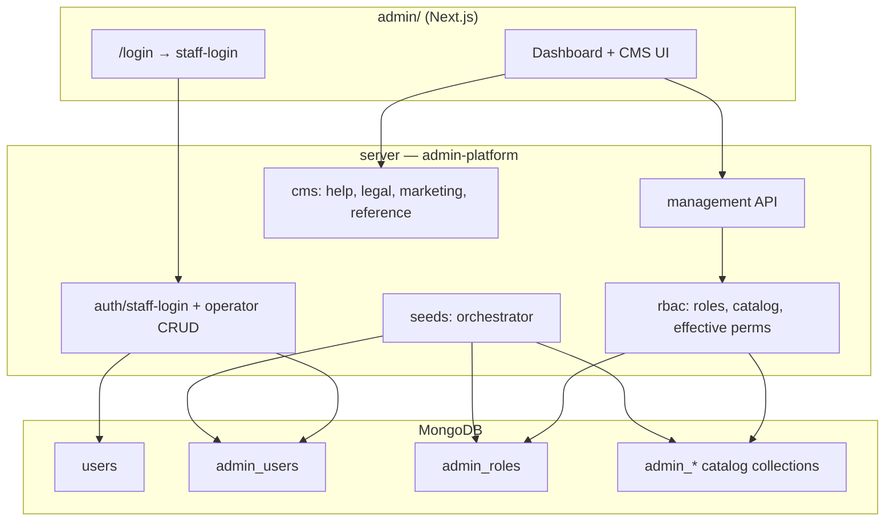

# Admin platform reorganization plan

**Status:** Phase 1–4 implemented (May 2026). Duplicate `server/src/modules/admin`, `help`, `trash`, `legal` removed — use `server/src/admin-platform/` only.  
**Goal:** One cohesive **admin platform** on the server — auth, RBAC, CMS, schemas, and seeds — with a clear bootstrap path after a fresh DB. The Next.js app stays in `/admin`; backend consolidates under `server/src/admin-platform/`.

**Companion:** [admin/README.md](../admin/README.md) (auth + current file map)

---

## 1. Problem statement

After wiping Mongo:

- `ensureSyntaxAdminSeed` creates a **legacy** `users` row (`staffRole: admin`, `staffPasswordHash`) but **no** `admin_users` or `AdminRole`.
- `ensureAdminAccessCatalogSeed` fills resources/actions/permissions but **no default roles**.
- Management API (`/api/v1/admin/management/*`) returns `PERMISSION_DENIED` because RBAC resolves an empty permission set.
- CMS/help/legal/trash still use coarse `requireStaff` while management uses fine RBAC — two mental models.
- Seeds and CMS live in `modules/cms/`, `bootstrap/`, `modules/legal/`, `modules/help/` — hard to own as “admin platform.”
- Bulk JSON import seeds (reference entities, About page, tech stack) were removed; content should be created via CMS or an explicit admin seed CLI.

---

## 2. Target architecture



### Target folder layout (`server/src/admin-platform/`)

```
admin-platform/
├── README.md                    # module index (links to /docs)
├── index.ts                     # registerRoutes(app), registerSeeds()
│
├── auth/
│   ├── staffLogin.controller.ts       # move from modules/auth
│   ├── operator.service.ts            # create/update admin_users + linked user
│   └── operator.validation.ts
│
├── rbac/
│   ├── adminPermissions.ts
│   ├── rbac.service.ts
│   ├── adminPermissionCatalog.service.ts
│   ├── adminStaffResolution.ts
│   ├── middleware/
│   │   ├── staffManagementContext.ts
│   │   ├── requireStaff.ts            # move from modules/help
│   │   ├── requireAdminPermission.ts
│   │   └── requireAnyAdminPermission.ts
│   ├── models/
│   │   ├── AdminUser.ts
│   │   ├── AdminRole.ts
│   │   ├── AdminUserRole.ts
│   │   ├── AdminResource.ts
│   │   ├── AdminActionType.ts
│   │   ├── AdminScopeType.ts
│   │   └── AdminAccessPermission.ts
│   └── routes/
│       └── management.routes.ts
│
├── cms/
│   ├── help/                    # move from modules/help (admin routes only)
│   ├── legal/                   # admin legal routes + policy seeds
│   ├── trash/
│   ├── marketing/               # MarketingPage CRUD (future)
│   └── reference/               # ReferenceEntity admin CRUD (future)
│
├── seeds/
│   ├── runAdminPlatformSeeds.ts # single orchestrator
│   ├── accessCatalog.seed.ts    # from ensureAdminAccessCatalogSeed
│   ├── defaultRoles.seed.ts     # NEW
│   ├── bootstrapOperator.seed.ts # NEW — replaces ensureSyntaxAdminSeed
│   └── legalPolicies.seed.ts    # move from modules/legal
│
└── controllers/                   # management controllers (or co-locate under rbac/)
```

**Platform code stays outside** `admin-platform/` (blog, billing, achievements, webapp auth). Only staff/admin concerns move in.

---

## 3. Default RBAC catalog (already defined)

Canonical keys: `server/src/modules/admin/adminPermissions.ts` → move to `admin-platform/rbac/adminPermissions.ts`.

### 3.1 Scope types

| Slug | Display | Use |
|------|---------|-----|
| `management` | Management | All v1 dashboard permissions |

(Future: `billing`, `content` scopes if you split APIs.)

### 3.2 Resource types (derived from keys)

| Resource slug | Permissions |
|---------------|-------------|
| `user` | list, read, search, update_profile, lock, unlock, reset_email, read_oauth, read_security, revoke_sessions |
| `billing` | read_subscription, read_ledger, open_stripe_customer, sync_subscription |
| `blog` | read_metrics |
| `admin_role` | manage |
| `admin_assignment` | manage |
| `audit` | read |
| `feedback` | read |
| `contact_lead` | read |

### 3.3 Action types (derived)

`list`, `read`, `search`, `update_profile`, `lock`, `unlock`, `reset_email`, `read_oauth`, `read_security`, `revoke_sessions`, `read_subscription`, `read_ledger`, `open_stripe_customer`, `sync_subscription`, `read_metrics`, `manage`, `read`.

Seeded idempotently by `ensureAdminAccessCatalogSeed` (today) — keep behavior, relocate file.

### 3.4 Default roles (NEW — must seed)

| Role | `level` | Permissions | Notes |
|------|---------|-------------|-------|
| **Super Admin** | 1000 | All keys in `ADMIN_PERMISSIONS` | Bootstrap operator only; can manage roles and assignments |
| **Platform Admin** | 500 | All except `admin_role:manage`, `admin_assignment:manage` | Day-to-day ops, user + billing + feedback |
| **Support** | 200 | `user:*` (read/search/list), `feedback:read`, `contact_lead:read`, `billing:read_*` | No lock/unlock/revoke unless you add explicitly |
| **Content Editor** | 100 | `feedback:read`, `blog:read_metrics` + CMS via `requireStaff` | Maps to `kind: staff`; help/legal/trash via coarse gate until CMS gets RBAC keys |

**Bootstrap operator:**

- Email: `admin@syntax.com` (env override: `ADMIN_BOOTSTRAP_EMAIL`)
- Password: from env `ADMIN_BOOTSTRAP_PASSWORD` (required in production; dev default documented only in `.env.example`)
- `admin_users.kind`: `super_admin`
- `admin_users.roleId` → Super Admin
- Linked `users` row: `staffRole: admin` (for CMS `requireStaff` compatibility)
- Deprecate `users.staffPasswordHash` after migration window

---

## 4. Auth & operator service (build order)

### Phase 1 — Bootstrap that works on empty DB (priority)

| # | Task | Files |
|---|------|-------|
| 1.1 | Add `defaultRoles.seed.ts` — upsert 4 roles above | `admin-platform/seeds/` |
| 1.2 | Replace `ensureSyntaxAdminSeed` with `bootstrapOperator.seed.ts` — creates `users` + `admin_users` + role link | seeds |
| 1.3 | Run seeds in order: catalog → roles → operator → legal | `runAdminPlatformSeeds.ts`, `database.ts` |
| 1.4 | Verify login: `POST /auth/staff-login` → management `GET .../users?limit=25` returns 200 | manual |
| 1.5 | Remove hardcoded password `1234` from source; use env | security |

**Acceptance:** Fresh DB + server start → login at admin `/login` → Users and Access pages load without `PERMISSION_DENIED`.

### Phase 2 — Operator CRUD hardening

| # | Task |
|---|------|
| 2.1 | `operator.service.ts`: create operator = transaction(`users` stub or link + `admin_users` + invalidate permission cache) |
| 2.2 | `POST /management/admin-users` uses service; enforce `getActorMaxRoleLevel` |
| 2.3 | Password reset flow for operators (admin-initiated, audited) |
| 2.4 | Admin app: `AddAdminUserDialog` aligned with new API errors |

### Phase 3 — Unify authorization

| # | Task |
|---|------|
| 3.1 | Move `requireStaff` into `admin-platform/rbac/middleware/` |
| 3.2 | Add CMS permission keys: `help:manage`, `legal:manage`, `trash:manage` (or one `cms:manage`) |
| 3.3 | Wire help/legal/trash routes to `requireAdminPermission` when RBAC enabled |
| 3.4 | Remove `FEATURE_ADMIN_RBAC_ENABLED=false` escape hatch from production docs |

### Phase 4 — Folder migration (no behavior change)

| # | Task |
|---|------|
| 4.1 | Create `server/src/admin-platform/` and move files per §2 |
| 4.2 | Re-export from old paths with deprecation re-exports (one release) |
| 4.3 | Update `routes/index.ts` to import from `admin-platform/index.ts` |
| 4.4 | Delete empty `modules/admin/`, relocate CMS modules |

### Phase 5 — CMS & content seeds

| # | Task |
|---|------|
| 5.1 | Marketing About page: admin UI editor, optional `npm run seed:admin -- --only=marketing-about` |
| 5.2 | Reference entities: admin import CSV or API bulk create — not auto-import on connect |
| 5.3 | Legal policies: keep seed for empty DB OR admin “install templates” button |

---

## 5. Seed orchestration (new)

**Today:** `database.ts` calls 6+ functions across modules.  
**Target:** single entry:

```ts
// admin-platform/seeds/runAdminPlatformSeeds.ts
export async function runAdminPlatformSeeds(): Promise<void> {
  await seedAccessCatalog();
  await seedDefaultRoles();
  await seedBootstrapOperator();
  await seedLegalPolicies();
  await seedLegalAcceptanceForBootstrap();
  // optional CLI-only: marketing, reference, feedback categories
}
```

**Optional npm script:**

```json
"seed:admin": "tsx src/admin-platform/seeds/cli.ts"
```

Flags: `--only=roles`, `--force-bootstrap-password-rotate`, dry-run.

**Do not auto-seed** large reference/marketing JSON on every connect (removed May 2026).

---

## 6. What was removed (May 2026)

| Removed | Reason |
|---------|--------|
| `modules/cms/seedData/*.ts` | Bulk import noise; use CMS or CLI |
| `ensureCmsReferenceSeeds` | Same |
| `ensureMarketingContentSeeds` | Same |

**Still runs on connect:** feedback categories (platform), legal policies, RBAC catalog, bootstrap user (legacy shape until Phase 1).

---

## 7. API surface (unchanged URLs)

Keep stable paths for the admin app:

| Prefix | Purpose |
|--------|---------|
| `POST /auth/staff-login` | Operator login |
| `/api/v1/admin/management/*` | Users, roles, catalog, admin-users, feedback, leads |
| `/api/v1/admin/help/*` | Help CMS |
| `/api/v1/admin/legal/*` | Legal CMS |
| `/api/v1/admin/trash/*` | Trash |
| `GET /api/marketing/about` | Public (content from DB, not seed file) |

---

## 8. Admin Next.js app work (parallel track)

| # | Task |
|---|------|
| A.1 | Login page: show clear error when RBAC denies (403 vs 401) |
| A.2 | Access page: read-only view of seeded default roles |
| A.3 | Users → Admin team: create operator only if `admin_assignment:manage` |
| A.4 | Remove duplicate `admin/RBAC_AND_USER_MANAGEMENT_SPEC.md`; link to `/docs` |
| A.5 | Documentation routes under `(dashboard)/documentation` → point to repo `/docs` |

---

## 9. Migration checklist (file moves)

| From | To |
|------|-----|
| `modules/admin/**` | `admin-platform/rbac/**` + `controllers/` |
| `bootstrap/ensureSyntaxAdminSeed.ts` | `admin-platform/seeds/bootstrapOperator.seed.ts` |
| `modules/admin/bootstrap/ensureAdminAccessCatalogSeed.ts` | `admin-platform/seeds/accessCatalog.seed.ts` |
| `modules/auth/controllers/staffLogin.controller.ts` | `admin-platform/auth/staffLogin.controller.ts` |
| `modules/help/requireStaff.middleware.ts` | `admin-platform/rbac/middleware/requireStaff.ts` |
| `modules/help/*` (admin routes) | `admin-platform/cms/help/` |
| `modules/legal/*` (admin + seeds) | `admin-platform/cms/legal/` |
| `modules/trash/*` | `admin-platform/cms/trash/` |

---

## 10. Security notes

- Never commit bootstrap passwords; use `ADMIN_BOOTSTRAP_PASSWORD` in `.env`.
- `admin_users.passwordHash` and legacy `staffPasswordHash` — select:false, never in API responses.
- Invalidate Redis `adminPerms:{userId}` on role/assignment changes (already in `rbac.service.ts`).
- Super Admin role assignment: only Super Admin actors (level check).
- Audit log for operator create, role change, user lock (existing spec §12–14).

---

## 11. Suggested implementation order (summary)

1. **Phase 1** — Default roles + bootstrap `admin_users` (fixes your current `PERMISSION_DENIED`).
2. **Phase 2** — Operator service + admin-user API hardening.
3. **Phase 4** — Physical folder move to `admin-platform/` (can overlap with 2).
4. **Phase 3** — Unify CMS routes under RBAC keys.
5. **Phase 5** — CMS content tools + optional CLI seeds.

---

## 12. Open decisions

| Decision | Recommendation |
|----------|----------------|
| Keep `users.staffRole`? | Yes, for CMS compatibility until Phase 3 |
| Keep `AdminUserRole` junction? | Deprecate; single `roleId` on `admin_users` |
| End-user OTP for admin app? | No — staff-login only |
| Feedback category seeds on connect? | Move to `seed:admin --only=feedback` later |

---

*Last updated: 2026-05-19. Update this doc when Phase 1 lands.*
