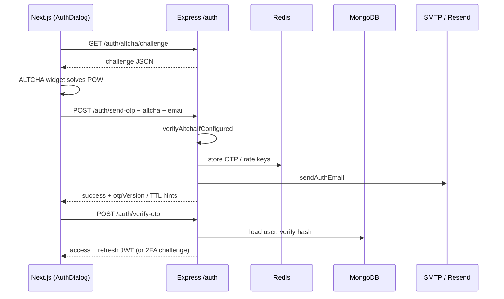
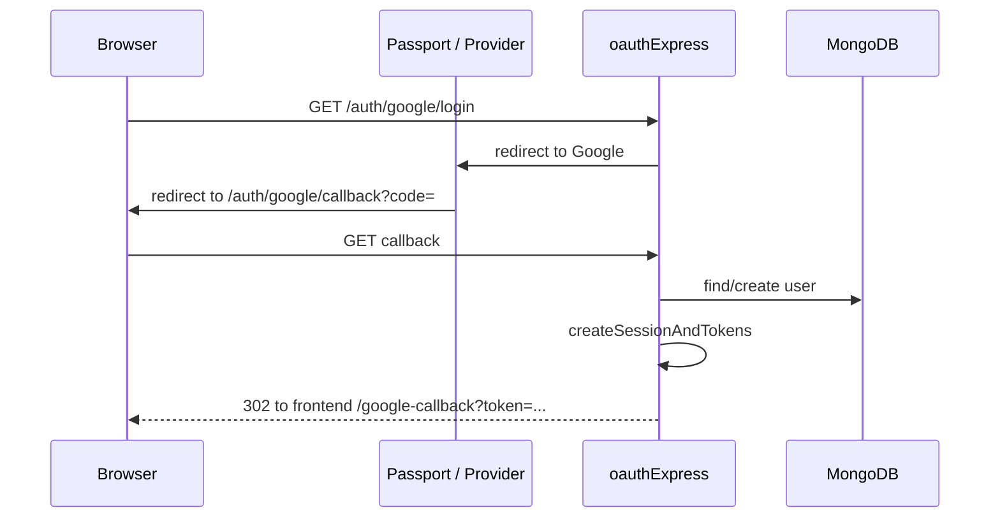

# Syntax Stories — Architecture & API Reference

This document describes how the **Syntax Stories V2.0** codebase is organized, how requests flow through the system, and how each major HTTP surface behaves. It complements the topic-specific notes in this folder:

- [Analytics](./Analytics.md)
- [Audit Log](./Audit%20Log.md)
- [Email OTP flow](./EMAIL_OTP_FLOW.md) — code generation, HMAC storage, Redis, mail delivery, verify
- [Auth stack resilience](./AUTH_STACK_RESILIENCE.md) — failure ordering, mitigations, Redis keys
- [Followers](./Followers.md)

---

## 1. High-level picture

The product is a **monorepo** with two main applications:

| Package | Role | Typical runtime |
|--------|------|-----------------|
| **`server/`** | Express + TypeScript API, Passport OAuth, MongoDB, Redis, transactional email | Node.js (port from `PORT` in `.env`) |
| **`webapp/`** | Next.js (App Router) frontend, Zustand auth state, calls the API via `NEXT_PUBLIC_API_BASE_URL` | Node.js dev server or static/hosted build |

**Traffic split (conceptual):**

- **Browser navigations** to `{BACKEND}/auth/{provider}/login|signup` start OAuth; callbacks redirect back to the **frontend** with tokens in the query string.
- **JSON calls** from the SPA go to `{API_BASE}/auth/*` (email OTP, refresh, profile, etc.) and `{API_BASE}/api/*` (health, follow, blog, uploads, analytics, …).

The backend mounts the main REST API under **`/api`**, the **auth JSON router** under **`/auth`**, and **upload** helpers under **`/api/upload`**. Static files served from disk live under **`/uploads`**.

---

## 2. Server boot sequence

File: `server/src/index.ts`

1. **`connectRedis()`** — optional Redis client for sessions, rate limits, OTP/intent keys, OAuth link keys, etc.
2. **`connectDatabase()`** — MongoDB via Mongoose.
3. **`import('./app')`** — builds the Express app (lazy so env and DB wiring are ready).
4. **`app.listen(env.PORT)`** — starts HTTP.

File: `server/src/app.ts` wires global middleware, then routes.

---

## 3. Express middleware stack (order matters)

Applied **before** your route handlers (simplified):

1. **`trust proxy`** — `1` hop (for correct `req.ip` behind reverse proxies).
2. **`helmet`** — security headers; CSP disabled in non-production for DX.
3. **`express.json()`** — JSON bodies.
4. **`cookie-parser`** — cookies.
5. **`cors`** — credentials enabled; production uses `FRONTEND_URL` / allowed-origin helpers from `config/frontendUrl.ts`.
6. **`express-session`** — cookie session; store is **Redis** (`connect-redis`) when Redis is available, otherwise default memory store.
7. **`passport.initialize()`** + **`passport.session()`** — OAuth strategies (session used for OAuth state / linking flows where applicable).

Then **route mounts**:

- `GET/POST ...` **OAuth entry + callback** routes (see §5) — defined directly on `app`.
- **`/uploads`** — static files from `uploads/` on disk.
- **`/api`** — `routes/index.ts` (health, follow, companies, github, analytics, blog, ping).
- **`/api/upload`** — `routes/upload.routes.ts` (authenticated multipart uploads).
- **`/auth`** — `modules/auth/auth.routes.ts` (JSON auth API: OTP, refresh, profile, 2FA, QR login, etc.).

Finally **`errorHandler`** catches errors.

---

## 4. Server folder layout (conventions)

| Area | Path | Purpose |
|------|------|--------|
| **Auth domain** | `server/src/modules/auth/` | `auth.controller.ts`, `auth.routes.ts` — email OTP, sessions, JWT, profile, 2FA, CV parse, etc. |
| **Shared utilities** | `server/src/shared/` | Cross-cutting helpers used by many modules (e.g. `audit/auditLog.ts`, `metrics/otpMetrics.ts`). |
| **Infrastructure** | `server/src/infrastructure/` | External I/O adapters (e.g. `mail/sendAuthEmail.ts` — SMTP + Resend). |
| **Feature-ish routes** | `server/src/routes/` | Routers mounted under `/api` or `/api/upload`. |
| **Controllers** | `server/src/controllers/` | Handlers for non-auth verticals (follow, blog, analytics, health). |
| **Services** | `server/src/services/` | Domain logic shared by controllers (e.g. `emailOtp.service.ts`, `authLogin.service.ts`). |
| **Models** | `server/src/models/` | Mongoose schemas (`User`, `Session`, `BlogPost`, `Follow`, …). |
| **Config** | `server/src/config/` | `env`, `jwt`, `redis`, `database`, `auth.config`, `frontendUrl`, `keys` (PEM), upload limits. |
| **Middlewares** | `server/src/middlewares/` | Auth (`verifyToken`, validation, rate limits, idempotency, ALTCHA), follow rate limit, analytics rate limit, `errorHandler`. |
| **Passport** | `server/src/passport/` | Per-provider strategies (`google`, `github`, `facebook`, `discord`, `x`). |
| **OAuth glue** | `server/src/oauth/oauthExpress.ts` | `oauthCallbackHandler`, `oauthLinkHandler` — redirects to frontend with tokens or 2FA challenge. |

---

## 5. OAuth (browser) — every route and what it does

These are registered on **`app`**, not under `/api`. They use **Passport** and redirect the **user’s browser**. Callbacks use **`oauthCallbackHandler`** which may issue JWTs via **`createSessionAndTokens`** (`modules/auth/auth.controller.ts`) or redirect to 2FA.

**Pattern:**

- **`/auth/{provider}/login`** — `state: 'login'` (existing account intent).
- **`/auth/{provider}/signup`** — `state: 'signup'` (registration intent).
- **`/auth/{provider}`** — alias for login (Google/GitHub).
- **`/auth/{provider}/link`** — account linking: validates `?k=` against Redis (`link:<key>`), then Passport with `state: link:<key>`.
- **`/auth/{provider}/callback`** — verifies OAuth, loads user, optional 2FA redirect, else session + tokens, audit logs, redirect to frontend `/{clientCallbackSlug}?token=...&refreshToken=...`.

**Google** — `google-callback`, id field `googleId`.  
**GitHub** — `github-callback`, id field `gitId`.  
**Discord** — only if `hasDiscordConfig`; else stub redirects with error message.  
**Facebook** — only if `hasFacebookConfig`; else `501` JSON on `/auth/facebook`.  
**X (Twitter)** — only if `hasXConfig`; else `501` on `/auth/x`.  
**Apple** — `501` JSON: not configured.

If the DB user has **`twoFactorEnabled`**, the callback redirects to the frontend with **`twoFactorRequired=1`** and a **`challengeToken`** (from `utils/authChallenge.ts`) instead of issuing tokens immediately.

---

## 6. Auth JSON API — `/auth/*`

Router: `server/src/modules/auth/auth.routes.ts`  
Handlers: `server/src/modules/auth/auth.controller.ts`

Unless noted, paths are relative to **`{API_ORIGIN}/auth`**. The webapp’s `webapp/src/api/auth.ts` uses `getAuthBase()` = `{NEXT_PUBLIC_API_BASE_URL}/auth`.

### 6.1 Middleware vocabulary

| Middleware | Role |
|------------|------|
| **`rateLimitSendOtp`** / **`rateLimitVerifyOtp`** / **`rateLimitSignupEmail`** / **`rateLimitRefresh`** | Redis-backed (or fallback) rate limiting per route. |
| **`idempotency`** | `X-Idempotency-Key` deduplication for safe retries (see `middlewares/auth/idempotency.ts`). |
| **`verifyAltchaIfConfigured`** | When `ALTCHA_HMAC_KEY` or `JWT_SECRET` is set, requires valid `altcha` field on body (`altcha-lib` `verifySolution`). Skipped in `NODE_ENV=test`. If `ALTCHA_REQUIRED` and no key → `503`. |
| **`sendOtpValidation`** / **`signupEmailValidation`** / **`verifyOtpValidation`** / **`updateProfileValidation`** | Joi (or project validation) on body. |
| **`verifyToken`** | JWT Bearer → `req.user`. |

### 6.2 Endpoint table

| Method | Path | Middleware chain (summary) | Purpose |
|--------|------|----------------------------|---------|
| GET | `/auth/altcha/challenge` | — | Returns ALTCHA challenge JSON (`createChallenge`); requires `ALTCHA_HMAC_KEY` or `JWT_SECRET`. |
| GET | `/auth/status` | — | Health-style JSON for auth service. |
| POST | `/auth/send-otp` | rate limit → idempotency → ALTCHA → validate → handler | Send **login** email OTP. |
| POST | `/auth/signup-email` | rate limit → idempotency → ALTCHA → validate → handler | Send **signup** email OTP. |
| POST | `/auth/verify-otp` | rate limit → idempotency → validate → handler | Verify OTP; may return tokens, or `twoFactorRequired` + `challengeToken`. |
| POST | `/auth/refresh` | rate limit → handler | Rotate **access** token using **refresh** token body. |
| POST | `/auth/logout` | `verifyToken` | Invalidate session / clear server-side session state as implemented. |
| POST | `/auth/revoke-session` | — | Revoke by refresh token (no access JWT required). |
| GET | `/auth/me` | `verifyToken` | Current user profile payload. |
| PATCH | `/auth/profile` | `verifyToken` → validate | Partial profile update. |
| POST | `/auth/parse-cv` | `verifyToken` → multer PDF | Parses PDF text → `utils/parseCvFromPdf` → suggested profile fields. |
| POST | `/auth/link-request` | `verifyToken` | Returns **redirect URL** to `/auth/{provider}/link?k=...` for linking OAuth. |
| POST | `/auth/email-change/init` | `verifyToken` | Start email change (sends codes). |
| POST | `/auth/email-change/verify` | `verifyToken` | Complete email change with codes. |
| POST | `/auth/email-change/cancel` | `verifyToken` | Cancel pending change. |
| POST | `/auth/disconnect/:provider` | `verifyToken` | Remove linked OAuth provider from user. |
| POST | `/auth/2fa/setup` | `verifyToken` | Begin TOTP setup (secret + QR). |
| POST | `/auth/2fa/enable` | `verifyToken` | Enable 2FA after verifying a code. |
| POST | `/auth/2fa/disable` | `verifyToken` | Disable 2FA. |
| POST | `/auth/2fa/verify-login` | — | Complete login when `twoFactorRequired` (challenge + TOTP). |
| POST | `/auth/qr-login/init` | — | Create QR login session; returns token for polling. |
| POST | `/auth/qr-login/approve` | `verifyToken` | Approve QR login from logged-in device. |
| POST | `/auth/qr-login/poll` | — | Poll for completion / tokens. |

**Email sending** goes through **`infrastructure/mail/sendAuthEmail.ts`** (SMTP first, then Resend if configured). **OTP storage, hashing, versioning, resend gates** live in **`services/emailOtp.service.ts`**. **Post-email-login session response** is centralized in **`services/authLogin.service.ts`** (`respondWithSessionAfterEmailAuth`). **Audit** events use **`shared/audit/auditLog.ts`** (`writeAuditLog`). **OTP counters** use **`shared/metrics/otpMetrics.ts`** (`bumpOtpMetric` / `getOtpMetricsSnapshot`). **Deep dive (RNG, HMAC formula, Redis keys, mail HTML):** [EMAIL_OTP_FLOW.md](./EMAIL_OTP_FLOW.md).

---

## 7. Main API — `/api/*`

Router: `server/src/routes/index.ts` — all prefixes below are under **`/api`**.

### 7.1 Health & ping

| Method | Path | Auth | Purpose |
|--------|------|------|---------|
| GET | `/api/health` | No | Liveness / dependency checks (`health.controller`). |
| GET | `/api/ping` | No | Plain text `SYNTAX STORIES`. |

### 7.2 Follow

Router: `routes/follow.routes.ts` — see [Followers](./Followers.md) for product behavior.

| Method | Path | Auth | Notes |
|--------|------|------|------|
| GET | `/api/follow/search` | No | User search. |
| GET | `/api/follow/profile/:username` | No | Public profile slice. |
| GET | `/api/follow/counts/:username` | No | Follower/following counts. |
| GET | `/api/follow/followers/:username` | No | Paginated followers. |
| GET | `/api/follow/following/:username` | No | Paginated following. |
| GET | `/api/follow/check/:username` | JWT | Whether current user follows `username`. |
| POST | `/api/follow/:username` | JWT + rate limit | Follow. |
| DELETE | `/api/follow/:username` | JWT + rate limit | Unfollow. |

### 7.3 Blog (authoring)

Router: `routes/blog.routes.ts`

| Method | Path | Auth | Purpose |
|--------|------|------|---------|
| POST | `/api/blog/` | JWT | Create/publish post (controller logic). |
| GET | `/api/blog/draft` | JWT | Load current user draft. |
| PUT | `/api/blog/draft` | JWT | Save draft. |
| GET | `/api/blog/` | JWT | List current user’s posts. |

### 7.4 Analytics

Router: `routes/analytics.routes.ts` — see [Analytics](./Analytics.md).

| Method | Path | Auth | Purpose |
|--------|------|------|---------|
| POST | `/api/analytics/profile-view/:username` | No (rate limited) | Record profile view. |
| GET | `/api/analytics/profile-overview/:username` | No | Aggregated overview. |
| GET | `/api/analytics/profile/:username/timeseries` | No | ~30-day series. |

### 7.5 Companies (OpenCorporates proxy)

Router: `routes/companies.routes.ts`

| Method | Path | Auth | Purpose |
|--------|------|------|---------|
| GET | `/api/companies/search?q=` | No | Proxies OpenCorporates when `OPENCORPORATES_API_TOKEN` set; enriches with guessed logo domain. |

### 7.6 GitHub helpers

Router: `routes/github.routes.ts`

| Method | Path | Auth | Purpose |
|--------|------|------|---------|
| GET | `/api/github/repo-info/:owner/:repo` | No | Public GitHub API fetch for blog/repo cards. |
| GET | `/api/github/repos` | JWT | Lists repos for user with linked GitHub token. |
| GET | `/api/github/repo/:fullName` | JWT | Repo detail + suggested `project` block shape. |

### 7.7 Uploads (multipart)

Router: `routes/upload.routes.ts` — mounted at **`/api/upload`**. All actions below require **`verifyToken`**.

| Method | Path | Field | Purpose |
|--------|------|-------|---------|
| POST | `/api/upload/avatar` | `avatar` | Avatar image → disk + optional blur placeholder. |
| POST | `/api/upload/cover` | `cover` | Cover banner. |
| POST | `/api/upload/media` | `media` | Generic media. |
| POST | `/api/upload/company-logo` | `logo` | Company logo. |
| POST | `/api/upload/school-logo` | `logo` | School logo. |
| POST | `/api/upload/org-logo` | `logo` | Org logo. |

Processed files are under `uploads/` and exposed via **`/uploads/...`** static route.

---

## 8. Webapp architecture

### 8.1 Layout

- **`webapp/src/app/`** — App Router pages, `layout.tsx`, `providers.tsx`.
- **`webapp/src/features/auth/`** — Feature module: `components/` (`AuthDialog`, `AuthDialogWrapper`, `AltchaField`), `hooks/useOtpFlow.ts`, `index.ts` exports.
- **`webapp/src/components/auth/`** — Thin re-export to `@/features/auth` for backward compatibility.
- **`webapp/src/api/auth.ts`** — Typed **`authApi`** client + **`authFetch`** (timeout, `Authorization`, **`X-Device-Fingerprint`**, 401 → refresh retry via `setAuthRetryHandler`).
- **`webapp/src/store/auth.ts`** — Zustand: tokens, user, `sendLoginOtp` / `signUp` / `verifyCode` / `verifyTwoFactor`, hydration, etc.
- **`webapp/src/store/authDialog.ts`** — UI open/close + initial tab.

### 8.2 How `authFetch` works

1. Builds URL from `NEXT_PUBLIC_API_BASE_URL` or `window.location.origin` for relative paths.
2. Sets **`Content-Type: application/json`** (except `parseCv` which uses `FormData`).
3. Adds **`Authorization: Bearer`** when `token` is passed.
4. Adds **`X-Device-Fingerprint`** from `lib/deviceFingerprint.ts` in the browser.
5. **28s abort** timeout to avoid hung “Sending…” states.
6. On **401** with a token, invokes optional **`authRetryHandler`** once (wired from the store to refresh the access token) then retries the request.

### 8.3 Email OTP + ALTCHA (UI flow)

1. **`getAltchaChallengeUrl()`** — if API base is set, points to **`GET /auth/altcha/challenge`**.
2. **`AltchaField`** — dynamically `import('altcha')` in `useEffect` so **`customElements`** is not touched during SSR.
3. **`useOtpFlow`** — owns resend cooldown timer, resend nested dialog state, ALTCHA form ref for resend, `runResendWithOptionalAltcha`, `applyVerifyError` (reads `AuthError.extras.attemptsLeft`).
4. Login/signup forms submit **`altcha`** payload in JSON body when enabled; same for resend dialog.

### 8.4 OAuth from the client

Social buttons are plain **`<a href={`${NEXT_PUBLIC_API_BASE_URL}/auth/google/login`}>`** (etc.). **`markOAuthNavigationPending()`** runs on click so the UI can show a global loader across the redirect. Return path: backend redirects to **`/{google|github|...}-callback?token=...`**; a dedicated client route typically reads query params and persists tokens in the store (see app routes under `webapp/src/app/`).

---

## 9. End-to-end sequence examples

### 9.1 Email login with ALTCHA

### 9.2 OAuth login without 2FA

---

## 10. Configuration touchpoints

| Concern | Server env (see `server/.env.example`) | Webapp env (see `webapp/.env.example`) |
|---------|----------------------------------------|----------------------------------------|
| API origin | `PORT`, `BACKEND_URL`, CORS / `FRONTEND_URL` | `NEXT_PUBLIC_API_BASE_URL` |
| Database | `MONGODB_URI` | — |
| Redis | Redis URL vars as in `config/redis.ts` | — |
| JWT / keys | `JWT_SECRET`, PEM paths via `config/keys.ts` | — |
| ALTCHA | `ALTCHA_HMAC_KEY`, `ALTCHA_REQUIRED` | Uses challenge URL derived from public API base |
| Email | `EMAIL_*`, `RESEND_*` | — |
| OAuth | Per-provider `*_CLIENT_ID` / `*_CLIENT_SECRET` / callback URLs | — |

---

## 11. Testing

- **Server:** `server/npm test` — Jest; example integration test hits **`GET /api/health`** (`__tests__/health.integration.test.ts`).
- **Typecheck:** `npx tsc --noEmit` in `server/` and `webapp/`.

---

## 12. Changelog mindset (architecture)

Recent structural choices (for maintainers):

- **Auth** lives under **`modules/auth/`** to separate a large surface from generic `controllers/`.
- **Email** and **audit** moved to **`infrastructure/`** and **`shared/`** so passport, OAuth, and follow/analytics can share the same primitives without circular imports.

For **audit event names** and persistence details, prefer [Audit Log](./Audit%20Log.md).

---

*Generated to reflect the repository layout and routes as wired in `server/src/app.ts` and `server/src/routes/*`. If you add a new router, update this file and the relevant topic doc in `docs/`.*
