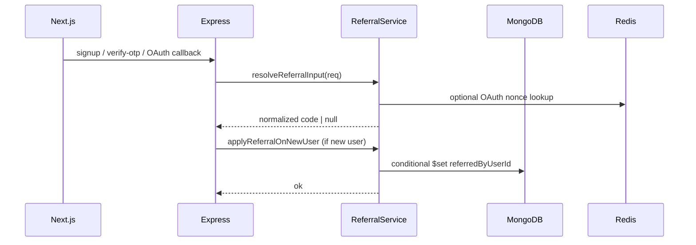

# Invite a friend — stable production spec

This document defines a **referral invite** system for Syntax Stories: opaque codes, signup attribution, MongoDB as source of truth, Redis for OAuth carry and rate limits, and Next.js capture UX.

**Intent:** Refine and stabilize—**not** stack features until the core never ships. One service module, one resolver, strict idempotency, minimal analytics. Defer reward engines and status machines until the baseline is proven.

Align implementation with `server/src/shared/redis/keys.ts`, `server/src/modules/auth/controllers/otp.controller.ts`, and `server/src/oauth/oauth.service.ts`.

---

## 0. Principles (read first)

| Do | Don’t |
|----|--------|
| Centralize referral logic in a **ReferralService** | Scatter lookups / normalization across OTP, OAuth, and routes |
| **Single resolver** for “what code applies to this request?” | Three parallel code paths (body vs cookie vs Redis) that drift |
| **DB-enforced** “set referral at most once” | Rely only on `if (user.referredByUserId) return` in app memory |
| **Normalize and validate** codes before any DB hit | Query with arbitrary strings |
| **Transactions** where user create + referral + subscription must align | Partial writes that are hard to repair |
| Lightweight **events + optional stats API** | Full `referrals` collection + reward state machine in v1 |

---

## 1. Product goals (unchanged scope)

| Goal | Detail |
|------|--------|
| **Referrer** | Stable invite URL (Settings + optional “share this post” with `?ref=`). |
| **Referee** | Opens link → signs up → **one** permanent link to referrer on the new user. |
| **Blog context** | Deep link to a post with same `ref` code; `referralSource: 'blog'` optional. |
| **Production** | Invalid ref never breaks signup; **Redis failures: fail open** (§3.1)—signup always wins; attribution may be skipped. |

**Scope:** Growth referral attribution, not co-author invites (different feature: ACL on `BlogPost`).

---

## 2. Architecture: `ReferralService` (best single structural change)

Introduce **`server/src/services/referral.service.ts`** (name may vary; keep one module).

| Function | Responsibility |
|----------|------------------|
| `normalizeReferralCode(raw: unknown)` | `trim`, optional `toUpperCase()` for Crockford base32; if `!VALID_REGEX.test(code)` return `null` (no DB). |
| `resolveReferralInput(req)` | **Single entry:** see §3. Returns `string \| null` (normalized code or null). |
| `resolveCodeForDisplay(code)` | DB lookup by `referralCode` → safe public DTO for `GET /api/invites/resolve` (rate-limited). |
| `lookupReferrerIdByCode(code)` | Resolve referrer `_id`: **Redis cache first** (§2.1, §13), then DB on miss, then populate cache. |
| `ensureReferralCodeForUser(userId)` | Idempotent generate + persist user’s public code for `GET /api/invites/me`. |
| `applyReferralOnNewUser(args)` | **Only** for brand-new users; input guards (§4.4); conditional write (§4); self-referral guard (§4.3); events + logs (§11, §11.1). |

**OTP controller, OAuth service, and invite routes** call this service—they do not implement referral rules themselves.

### 2.1 Referrer-exists cache (hot-path performance)

High-volume signups should not all hit `findOne({ referralCode })` cold.

**Redis cache (optional but cheap win):**

| Key | Value | TTL |
|-----|--------|-----|
| `invite:code:<normalizedCode>` | **Hit:** Mongo `referrerId` string \| **Miss (negative):** sentinel e.g. `__NONE__` | **Positive:** 24h \| **Negative:** 5–10 min |

**Flow in `lookupReferrerIdByCode`:**

1. After `normalizeReferralCode`, `GET` cache key.
2. If value is **`__NONE__`** (or your chosen sentinel), return **no referrer** — **no DB hit**.
3. On cache miss → DB `findOne({ referralCode })` → if found, `SETEX` positive value (24h); if **not** found, `SETEX` sentinel **`__NONE__`** with **5–10 min** TTL so repeated garbage (e.g. `/invite/AAAAAAA`) does not hammer Mongo.

**Code rotation (critical):** If you ever **regenerate** a user’s `referralCode`, you **must** delete the stale key or the cache points at the wrong user:

```ts
// IMPORTANT: invalidate Redis cache on referralCode change (regenerate / admin fix)
await redis.del(redisKeys.invite.codeCache(oldCode));
```

Same `DEL` when removing a code; treat rotation as a code path that always runs cache invalidation.

Logic in **`applyReferralOnNewUser`** and **`resolve`** stays the same—this is a pure performance layer. Still respect §3.1: cache read/write errors → fall back to DB or skip cache, never throw signup.

---

## 3. Single source of truth: `resolveReferralInput(req)`

**Problem:** Attribution split across body, cookie, and OAuth Redis leads to edge-case mismatch and debugging pain.

**Fix:** One function used everywhere signup runs:

```ts
// Pseudocode — order is policy; document if you change it.
async function resolveReferralInput(req: Request): Promise<string | null> {
  const fromBody = normalizeReferralCode(req.body?.referralCode);
  if (fromBody) return fromBody;

  const fromCookie = normalizeReferralCode(req.cookies?.ss_ref);
  if (fromCookie) return fromCookie;

  const nonce = extractOAuthReferralNonce(req); // from state / callback context
  if (nonce) {
    const fromRedis = await redis.get(redisKeys.invite.oauthReferral(nonce));
    return normalizeReferralCode(fromRedis);
  }

  return null;
}
```

- **Policy:** Prefer explicit body (explicit user intent), then cookie, then OAuth transport. If you prefer “cookie wins over body,” state that once in code comments—**don’t** leave it ambiguous.
- Controllers pass **`Request`** (or a thin DTO) into signup paths; they do not read `req.body.referralCode` ad hoc.

### 3.1 Graceful Redis failure (hard rule: **fail open**)

**Decide once:** Signup and login **must never** fail because Redis is unavailable or a referral key errors.

Recommended pattern inside `resolveReferralInput` (and any OAuth nonce read):

```ts
let refCode: string | null = null;
try {
  refCode = await resolveFromBodyCookieAndRedis(req);
} catch (err) {
  log.warn("referral_redis_degraded", { err: String(err) });
  refCode = normalizeReferralCode(req.body?.referralCode)
    ?? normalizeReferralCode(req.cookies?.ss_ref)
    ?? null;
}
```

- OAuth path: if Redis read for the nonce throws, **skip** that leg (no attribution from OAuth that request)—user still becomes a user.
- **Do not** throw out of signup handlers for referral-only failures after the user document exists.

**Non-negotiable:** Do **not** switch referral handling to **fail-closed** for signup (e.g. “Redis down → reject signup”). Redis outage must never become signup outage.

Then:

```ts
await referralService.applyReferralOnNewUser({
  newUser,
  refCode: await resolveReferralInput(req),
  req,
  source: inferSource(req), // optional: 'link' | 'blog' | ...
});
```

---

## 4. Strict idempotency (app + MongoDB)

### 4.1 In-memory guard (not sufficient alone)

```ts
if (user.referredByUserId) return;
```

### 4.2 Database-level guard (required for races)

Concurrent requests can both pass the in-memory check. Use a **conditional update** so at most one writer wins:

```ts
await UserModel.updateOne(
  { _id: newUserId, referredByUserId: { $exists: false } },
  {
    $set: {
      referredByUserId: referrerId,
      referredAt: new Date(),
      // referralSource, etc.
    },
  }
);
```

If `modifiedCount === 0`, another path already set referral—**treat as success** (idempotent).

Alternatively run **`UserModel.updateOne`** inside the same **`mongoose.startSession()` `withTransaction`** as user creation + subscription if those steps must be atomic together (see §7).

**Indexes:** `{ referredByUserId: 1 }` for stats; unique `referralCode` on referrer.

### 4.3 Hard self-referral protection (required)

Before any `$set` on the new user, enforce in **`applyReferralOnNewUser`** (not only in docs):

```ts
if (referrerId.toString() === newUser._id.toString()) return;
```

Optional later (not v1): same-email-domain heuristics, same fingerprint soft-block for **rewards** only—never block signup.

### 4.4 Input guards before writes (avoid null / noise)

In **`applyReferralOnNewUser`** (and anywhere you log `refCode`), use boring strict checks—prevents null writes, bad logs, and odd coercion:

```ts
if (refCode == null || typeof refCode !== 'string' || !refCode.trim()) return;

const referrerId = await lookupReferrerIdByCode(refCode);
if (!referrerId) return; // unknown code, negative cache, or DB miss
```

`normalizeReferralCode` should already return `null` for garbage; still treat **post-resolver** output as untrusted. Only proceed to `$set` when `referrerId` is a valid ObjectId for an existing user.

---

## 5. Backend-enforced first-touch + `refCapturedAt`

**Issue:** First-touch only in the frontend is vulnerable to cookie tampering and inconsistent server views.

**At conversion:** Persist **`referredByUserId`** at most once (§4)—that is the hard guarantee for “who gets credit.”

### 5.1 Pre-signup first-touch: pick **one** mechanism for v1 (do not implement both)

| Option | Tradeoff |
|--------|----------|
| **Signed cookie** (recommended v1) | Stateless, fewer moving parts; HMAC verifies payload `{ code, capturedAt }` from `GET /api/invites/attach` or BFF. |
| **Redis `SETNX`** | Stronger server-side first-touch; **depends on Redis**—align with §3.1 fail-open. |

**Recommendation:** Ship **signed cookie only**. Move to Redis `SETNX` later if fraud metrics justify the complexity.

Store **`referralCapturedAt`** on the user when you set `referredByUserId` (same `$set`). Resolver should reject tampered unsigned cookies; default policy: **first valid server-verified capture wins**—document any override (e.g. body vs cookie order) in one place.

---

## 6. Normalize referral codes early

Before **any** `findOne({ referralCode })`:

```ts
const code = normalizeReferralCode(raw);
if (!code) return invalid; // 400 or { valid: false } — no DB
```

✅ Cuts garbage queries and avoids regex DoS on unbounded input.

---

## 7. Transactional signup (when it matters)

If user creation, subscription creation, and referral assignment must not leave orphans:

```ts
const session = await mongoose.startSession();
await session.withTransaction(async () => {
  await user.save({ session });
  await SubscriptionModel.create([{ ... }], { session });
  await applyReferralConditionalUpdate(user._id, referrerId, { session });
});
```

Use the same pattern you already rely on for post-signup consistency. If referral is “nice to have,” a transaction including only **user + referral** is acceptable; **do not** fail signup if referral update fails after user exists—log and alert instead (product choice).

---

## 8. End-to-end flow (high level)



---

## 9. Invite URLs & deep-link routing (formalize UX)

| Entry | Behavior |
|-------|----------|
| `/invite/<code>` | Set capture cookie / call attach endpoint → redirect **`/`** (or product home). |
| `/signup?ref=` | Open auth dialog **with** ref preserved (current `signup/page.tsx` redirects—ensure ref survives). |
| `/b/...?ref=` | **Stay on post**; still set capture so signup attributes the author. |

No extra “smart” redirects unless they reduce drop-off—keep the table above as the contract.

---

## 10. API surface (minimal + high value)

| Endpoint | Notes |
|----------|--------|
| `GET /api/invites/me` (auth) | `ensureReferralCodeForUser`; returns `inviteUrl` + code. |
| `GET /api/invites/resolve?code=` (public) | Rate-limited; **soft trust copy**: “You’re joining via **Harshit**” (username / avatar only—no email). |
| **`GET /api/invites/stats` (auth)** | e.g. `{ totalClicks?: n, converted: n }` — `converted` = `countUsers({ referredByUserId: me })` with index `{ referredByUserId: 1 }`. Clicks optional via events only. |

---

## 11. Lightweight tracking (no heavy schema v1)

Use existing **`emitAppEvent`** (see `server/src/shared/events/appEvents.ts`) and/or audit logs:

- `referral.clicked` — `{ code, ip }` (optional; privacy-aware)
- `referral.converted` — `{ referrerId, refereeUserId }`

Sink can be logs first; analytics warehouse later. **Avoid** a full `referrals` row-per-click until you need rewards or disputes.

### 11.1 Structured logs (production debugging)

Add minimal **structured** lines in `ReferralService` (level + stable keys for grep/LogQL):

| Event | Level | Fields (example) |
|-------|-------|-------------------|
| Attribution attempted | `info` | `referral_attempt` — `refCode` (normalized or redacted), `newUserId`, `source` |
| Attribution succeeded | `info` | `referral_applied` — `referrerId`, `newUserId` |
| Invalid / unknown code | `warn` | `referral_invalid` — `refCode` (truncate); no stack spam |
| Redis degraded (§3.1) | `warn` | `referral_redis_degraded` |

These are your primary on-call signals; events alone are not enough for tail debugging.

---

## 12. Optional anti-abuse: signup fingerprint (Redis)

Only if you see farming:

- `signupFingerprint = hash(salt + ip + userAgent)` (don’t store raw IP long-term if policy forbids).
- Redis: `invite:fp:<hash>` → increment count, TTL 24h; soft flag over threshold (log / block **rewards**, not signup).

---

## 13. Redis key namespace

Add under `redisKeys.invite` in `server/src/shared/redis/keys.ts`:

| Key | Purpose | TTL |
|-----|---------|-----|
| `invite:code:<normalizedCode>` | Positive: `referrerId`; negative: sentinel `__NONE__` (§2.1) | 24 h / 5–10 min |
| `invite:oauth:<nonce>` | OAuth ref carry | 5–10 min |
| `rl:invite:resolve:<ip>` | Rate limit resolve | 1 min |
| `invite:fp:<hash>` | Optional fingerprint counter | 24 h |
| `invite:first:<visitorKey>` | **Later only** if you add Redis first-touch (§5.1); not v1 with signed cookie |

**Rule:** MongoDB holds **attribution truth**; Redis is transport + abuse + **optional** cache; v1 first-touch = signed cookie, not SETNX.

---

## 14. User schema (MongoDB)

| Field | Purpose |
|-------|---------|
| `referralCode` | Unique, opaque; generated once. |
| `referredByUserId` | Set **at most once** (conditional update). |
| `referredAt` | Set with referral. |
| `referralSource` | Optional: `link` \| `blog` \| … |
| `referralCapturedAt` | Optional: set when referral applied (audit). |

**Defer:** separate `referrals` collection, status machine, multi-level referrals, “blockchain-level” audit trails.

---

## 15. What **not** to build now

| Skip for v1 | Why |
|-------------|-----|
| Full referral **reward** engine | Delays ship; add after conversion metrics exist |
| Complex **status** machine (`pending` → `qualified` → `rewarded`) | Use events + optional stats first |
| Multi-level / MLM referrals | Explodes policy and fraud surface |
| Over-normalized tracking DB | Logs + `emitAppEvent` + one stats query are enough |

---

## 16. Execution order (tightened)

1. **ReferralService** skeleton + `normalizeReferralCode` + `resolveReferralInput` + `applyReferralOnNewUser` (conditional update).
2. User fields + indexes + migration for `referralCode`.
3. `GET /api/invites/me`, `GET /api/invites/resolve`, **`GET /api/invites/stats`**.
4. Wire **OTP** and **OAuth** signup to **only** call the service (no duplicated logic).
5. Next: `/invite/[code]`, **signed-cookie attach only (v1)**, preserve through signup dialog.
6. Events + **structured logs** (§11.1) + rate limits + **referrer id cache** (§2.1).
7. Optional: fingerprint, Redis SETNX first-touch (if fraud warrants), transactions including subscription.
8. Add **integrity script** (§21) to CI or runbook before major releases.

---

## 17. Stability checklist (ship gate)

- [ ] Referral applied **at most once** (verified by conditional DB update + concurrency test).
- [ ] **OTP** signup + **OAuth** signup both use `resolveReferralInput` → `applyReferralOnNewUser`.
- [ ] Cookie / signed payload **survives** redirect to OAuth provider.
- [ ] **Invalid / missing** code never fails signup.
- [ ] **No self-referral**: explicit guard in code (§4.3), covered in integrity script.
- [ ] **`GET /api/invites/resolve`** rate-limited.
- [ ] No PII leak on resolve (no email).
- [ ] **Redis down / throw**: signup still succeeds; `referral_redis_degraded` logged (§3.1).
- [ ] **Cache miss path**: correct DB fallback; **negative cache** on unknown codes (§2.1).
- [ ] **Code rotation / regenerate:** `DEL invite:code:<oldCode>` (or equivalent) in the same code path as DB update (§2.1).
- [ ] **`applyReferralOnNewUser`:** guards on `refCode` type + empty string; early return if `!referrerId` (§4.4).

---

## 18. File map

| Piece | Location |
|-------|----------|
| Service | `server/src/services/referral.service.ts` (new) |
| User schema | `server/src/models/User.ts` |
| Redis keys | `server/src/shared/redis/keys.ts` |
| OTP | `server/src/modules/auth/controllers/otp.controller.ts` |
| OAuth | `server/src/oauth/oauth.service.ts`, `oauthExpress.ts` |
| Events | `server/src/shared/events/appEvents.ts` (extend union/types) |
| Routes | `server/src/routes/…` + bootstrap |
| Webapp | `webapp/src/app/invite/[code]/…`, signup/auth dialog, settings |
| Ops script | `server/scripts/referral-integrity-check.ts` (or `npm` script) — §21 |

---

## 19. Environment

| Variable | Use |
|----------|-----|
| Public app URL | Build `inviteUrl` in `GET /api/invites/me` |
| `REFERRALS_ENABLED` (optional) | Kill-switch attribution only |
| Secret for signed ref cookie (optional) | HMAC for `attach` payload |

---

## 20. “Create blog and invite” (product)

1. Author publishes (`POST /api/blog`).
2. Share `https://app/b/<user>/<slug>?ref=<authorReferralCode>`.
3. Reader signs up → attribution + optional `referralSource: 'blog'`.
4. Reader’s blog is **their** content—no auto-created post for the referee.

---

## 21. Referral integrity check script (one-time / periodic)

Ship a small **read-only** script (or admin-only route behind auth) operators can run after migrations or before releases.

**Checks:**

1. **No self-referrals:** `referredByUserId === _id` (should be zero documents).
2. **Referrer exists:** For each user with `referredByUserId`, `users` contains that id (orphans = bug or deleted referrer policy).
3. **No duplicate referee rows:** Each user has at most one `referredByUserId` (schema + data).
4. Optional: `referralCode` unique index violations (should be empty).

Example aggregation direction (pseudo):

```js
// Self-referral
db.users.find({ $expr: { $eq: ["$_id", "$referredByUserId"] } })

// Orphans: referredByUserId not in users
// (implement via $lookup + $match in pipeline or batch in script)
```

Exit non-zero if invariant failures → CI / runbook gate. Saves hours hunting silent corruption.

---

## 22. What stays as-is (baseline)

- **ReferralService** — single place for rules.
- **`resolveReferralInput`** — single resolver; §3.1 **fail-open** on Redis (never fail-closed signup on Redis).
- **DB-level idempotency** — conditional `updateOne` (§4.2).
- **MongoDB = attribution truth**; Redis = transport, rate limits, **optional** referrer-id cache.
- **No rewards engine / status machine in v1** (§15).

---

## 23. Layer status (reality check)

| Layer | Status |
|-------|--------|
| Logic design | Stable |
| Performance | Scalable; §2.1 positive + negative cache |
| Failure handling | Safe — §3.1 fail-open (do not regress) |
| Abuse resistance | Basic; enough for v1 |
| Complexity | Controlled — execution phase, not more design churn |

---

## 24. Production lock

This document is the **ship baseline**. **Design is closed** for v1—remaining work is **execution**: implement `ReferralService`, wire OTP/OAuth, add tests, enable logs, run the integrity script in CI or runbooks.

Add rewards, multi-level referrals, or Redis SETNX first-touch only after this layer is live, measured, and the integrity script is clean.

**Verdict:** Done for spec purposes—**ship via implementation**, not more design loops.
