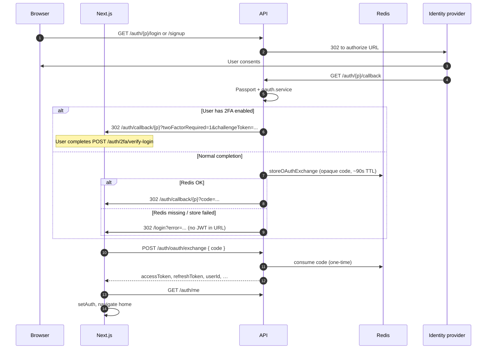
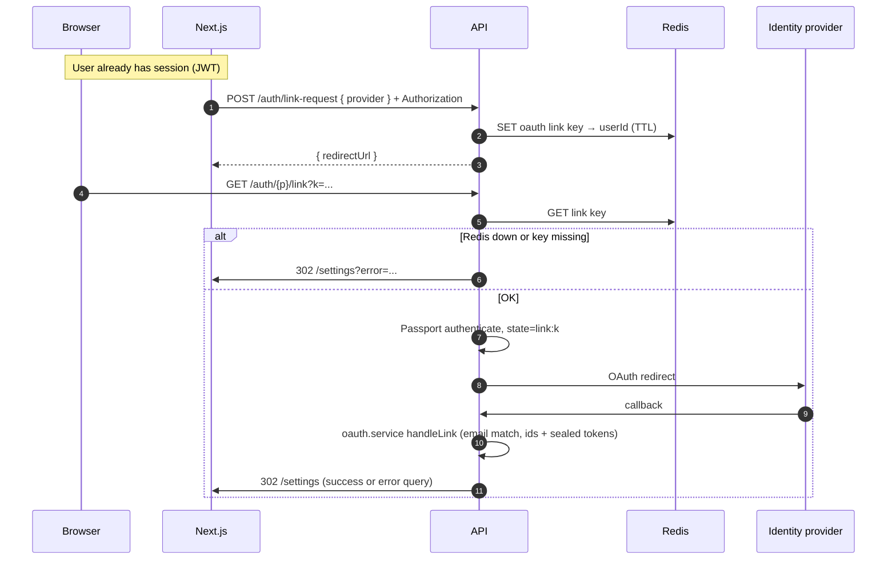

# OAuth refactor: plan vs before vs current

This document compares the **week-by-week plan** in [OAuthPlan.md](./OAuthPlan.md) with how OAuth worked **before** that work and what the codebase does **now**. Use it for onboarding, releases, and keeping [Auth.md](./Auth.md) in sync (some sections there still describe the pre-exchange wording).

---

## Changelog (OAuth + related auth stack)

| Phase | What changed |
| ----- | ------------ |
| **Weeks 1–4** | Provider registry + route factory; shared `oauth.service.ts` + thin Passport; Redis one-time `code` + `POST /auth/oauth/exchange`; unified Next.js `/auth/callback/[provider]` with legacy `*-callback` redirects preserving query. |
| **Hardening (after Week 4)** | **No JWTs in URL:** if exchange storage fails → `/login?error=…` (Redis required for browser OAuth). **Optional encryption** for provider tokens on `User` via `OAUTH_PROVIDER_TOKEN_KEY` + `providerTokenCrypto.ts`. **Audit taxonomy:** `auth.*` action strings in `AuditAction`; app event renamed to `auth.signin.success`. **Passport** left in place; `oauth.providers.ts` documents `oauth.service.ts` as the seam for a future transport swap. |
| **Docs touched** | [HardeningSprint.md](./HardeningSprint.md) and [Auth2.md](./Auth2.md) reference `auth.signin.success`; this file is the single comparison source. |

---

## Summary

| Area | Before | After (current) |
| ---- | ------ | ---------------- |
| Backend route wiring | Per-provider duplication | Single registry + factory (`oauth.providers.ts`, `registerOAuthRoutes.ts`) |
| Sign-in / signup / link logic | Mostly inside Passport strategy files | Shared `oauth.service.ts` + thin strategies (`oauth.profiles.ts`, `oauth.types.ts`) |
| Tokens after browser OAuth | Often in the URL query (`token`, `refreshToken`, …) | Opaque `code` + `POST /auth/oauth/exchange` only; if Redis is unavailable the API redirects to `/login` with an error (no tokens in URL) |
| Next.js return pages | Five top-level routes (`/google-callback`, …) | One pattern `/auth/callback/[provider]` + legacy redirects that preserve query |
| 2FA after OAuth | Challenge in query on frontend callback | Unchanged: `twoFactorRequired` + `challengeToken`, then `POST /auth/2fa/verify-login` |
| IdP dashboard callback URLs | Backend `/auth/{provider}/callback` | Unchanged — still backend URLs |
| Provider access tokens on `User` | Stored plaintext (fields like `githubToken`) | Same fields; when `OAUTH_PROVIDER_TOKEN_KEY` is set, values are AES-256-GCM blobs (`sspt1:` prefix). Future formats can use `sspt2:` etc. Reads unseal in `github.routes.ts` (and any future API callers). |
| Audit log `action` + app events | Mixed names (`session_created`, `OTP_SENT`, `oauth_login`, …) | New writes use `auth.*` namespace; in-process sign-in event is `auth.signin.success`. Legacy action strings remain in DB and in `AUDIT_ACTIONS` for typing. |

---

## Runtime: browser OAuth (login / signup)

High-level sequence after rollout + hardening (`{p}` = provider route key, e.g. `google`).

Linear cheat sheet:

`Browser → GET /auth/{p}/login|signup → IdP → GET /auth/{p}/callback → (2FA branch | Redis exchange code) → 302 /auth/callback/{p}?code → POST /auth/oauth/exchange → GET /auth/me → setAuth`

---

## Runtime: account linking (logged-in user)

Linking reuses Passport with `state: link:{key}`; success usually lands on **Settings**, not the unified browser callback used for sign-in.

Linear cheat sheet:

`POST /auth/link-request` → Redis `link:<key>` → `GET /auth/{p}/link?k=` → Passport `state=link:key` → provider callback → `oauth.service` attach provider → redirect `/settings`

---

## Failure and edge-case matrix

| Situation | Typical outcome | Notes |
| --------- | ---------------- | ----- |
| **Redis unavailable** during browser OAuth completion | `302 /login?error=…` | Exchange cannot be stored; JWTs are not put in the URL. |
| **Invalid / expired / reused exchange `code`** | `400` on `POST /auth/oauth/exchange` | One-time consume; client should send user to login. |
| **Passport / provider error** (misconfig, denied consent) | `302 /login?error=…` | Message from `oauthExpress` / strategy. |
| **OAuth signup: email already registered** | Error to user; must sign in then link from settings | Thrown in `oauth.service` signup path. |
| **OAuth login: no linked account** | Error; sign up or link from settings | `handleLogin` guard. |
| **Link: Redis down** | `302 /settings?error=Linking unavailable` | `oauthLinkHandler`. |
| **Link: expired / invalid `k`** | `302 /settings?error=Link expired or invalid` | |
| **Link: provider email ≠ account email** | Passport error / redirect with message | `handleLink` email check per provider. |
| **User has 2FA** after OAuth | `302` to callback with `twoFactorRequired` + `challengeToken` | No session JWT until `POST /auth/2fa/verify-login`. |
| **`OAUTH_PROVIDER_TOKEN_KEY` set, then removed** | Encrypted blobs unreadable | **Operational:** decrypt failures until key restored or tokens re-linked. Document rotation separately (see backlog below). |

---

## Legacy frontend callback routes (`/google-callback`, …)

**Today:** Next.js keeps thin **server redirect** pages that forward **all query params** to `/auth/callback/{provider}` so old bookmarks and staggered deploys keep working.

**Deprecation target:** Remove these routes once (a) production metrics show **negligible traffic** to `/*-callback` for several release cycles, and (b) internal runbooks / comms no longer reference them. Until then, treat them as **compatibility shims**, not the canonical contract. Canonical path is always `/auth/callback/{routeKey}`.

---

## Week 1 — Provider registry + route factory

| | Plan (OAuthPlan.md) | Before | Done now |
| --- | --- | --- | --- |
| Goal | Extract config; loop registrations; keep `/auth/{provider}/...` URLs stable | Repeated `app.get` / similar per provider | `getOAuthProviderRegistrations()` in `server/src/oauth/oauth.providers.ts`; `registerOAuthRoutes` in `server/src/bootstrap/registerOAuthRoutes.ts` |
| Risk | Low; mechanical | — | Same public paths for login/signup/callback where providers stay enabled |

**Key files:** `server/src/oauth/oauth.providers.ts`, `server/src/bootstrap/registerOAuthRoutes.ts`

---

## Week 2 — Shared OAuth service + thin Passport

| | Plan (OAuthPlan.md) | Before | Done now |
| --- | --- | --- | --- |
| Goal | Move normalize / `handleProviderAuth` into one service; strategies call into it | Heavier logic in `server/src/passport/*` | `server/src/oauth/oauth.service.ts` centralizes provider auth; `oauth.profiles.ts` / `oauth.types.ts`; strategies remain thin |
| Note | Ship per provider if needed | — | “Thin Passport, fat service” |

**Key files:** `server/src/oauth/oauth.service.ts`, `server/src/oauth/oauth.profiles.ts`, `server/src/oauth/oauth.types.ts`, `server/src/passport/*`

---

## Week 3 — Redis exchange (no tokens in redirect URL)

| | Plan (OAuthPlan.md) | Before | Done now |
| --- | --- | --- | --- |
| Goal | Redirect with `?code=`; frontend calls `POST /auth/oauth/exchange` before `setAuth` | `/{slug}?token=...&refreshToken=...` in browser history | `storeOAuthExchange` / `consumeOAuthExchange` in `oauth.exchange.service.ts`; `oauthCallbackHandler` in `oauthExpress.ts` |
| API | New JSON contract | — | `POST /auth/oauth/exchange` — `oauthExchange.controller.ts`; route in `auth.routes.ts` |
| Frontend | All callbacks must exchange | Read `token` from query only | `authApi.exchangeOAuthCode`; `OAuthBrowserCallback`: `code` → exchange → `getAccount` → `setAuth` |
| Compatibility | Optional dual support | — | **No query-token path:** exchange failure → `/login?error=...` |
| 2FA | Ideal: only challenge in URL | Already challenge-based | `twoFactorRequired` + `challengeToken` (no exchange code on that branch) |

**Key files:** `server/src/oauth/oauth.exchange.service.ts`, `server/src/oauth/oauthExpress.ts`, `server/src/shared/redis/keys.ts` (`oauth:exchange:*`), `webapp/src/components/auth/OAuthBrowserCallback.tsx`, `OAuthExchangeRequestBody` / `OAuthExchangeResponseBody` in auth API contracts

---

## Week 4 — Unified Next.js callback route

| | Plan (OAuthPlan.md) | Before | Done now |
| --- | --- | --- | --- |
| Goal | One route pattern; `clientCallbackSlug` matches it; retire or redirect old paths | `clientCallbackSlug` = `google-callback`, … | `clientCallbackSlug` = `auth/callback/{routeKey}` in `oauth.providers.ts` |
| Frontend | Single “read code → exchange → setAuth” (+ 2FA) | Five nearly identical pages | `webapp/src/app/auth/callback/[provider]/page.tsx` + `getOAuthCallbackProviderLabel` |
| Old URLs | Delete or redirect | Direct callback targets | Server redirects: `/google-callback`, … → `/auth/callback/{provider}` + query (`legacyOAuthCallbackRedirect.ts`) |

**Key files:** `oauth.providers.ts` (`clientCallbackSlug`), `webapp/src/app/auth/callback/[provider]/`, `webapp/src/lib/legacyOAuthCallbackRedirect.ts`

---

## Cross-cutting items from the plan

| Topic | Status |
| ----- | ------ |
| OAuth provider dashboards must keep **backend** callback URLs | Still true; frontend path change does **not** replace `/auth/{provider}/callback` on the API |
| Facebook Redis key inconsistency (link flow) | Verify `redisKeys.oauth.link` when auditing link code |
| Mobile / future clients | `POST /auth/oauth/exchange` is the JSON contract for turning a browser `code` into tokens |

---

## Post-rollout hardening (implemented)

### 1. Query-token fallback removed

- **`oauthExpress.ts`:** If `storeOAuthExchange` returns no code, redirect **`/login?error=...`** (no JWTs in callback URL).
- **`OAuthBrowserCallback`:** Only **`code`** + exchange path.
- **Ops:** Browser OAuth **requires Redis** for the exchange step.

### 2. Provider tokens encrypted at rest (optional key)

- **`OAUTH_PROVIDER_TOKEN_KEY`** — 32-byte secret (**base64** or **hex**). When set, provider tokens are **AES-256-GCM** with prefix **`sspt1:`** (`providerTokenCrypto.ts`). A future algorithm/version can introduce **`sspt2:`** without breaking reads of old rows.
- **Writes:** `oauth.service.ts` seals on link/login/signup.
- **Reads:** `github.routes.ts` unseals for GitHub API calls. Plaintext legacy rows (no prefix) still work.

### 3. Auth audit + app event taxonomy

- **`AuditAction`:** `auth.*` namespace for identity flows; profile/follow/etc. unchanged snake_case.
- **`audit_logs`:** `action` maxlength **80**; `AUDIT_ACTIONS` lists legacy + new strings.
- **App events:** **`auth.signin.success`** (replaces `auth.login.success`). Deprecated type alias: `AuthLoginSuccessPayload`.

### 4. Passport dependency (deferred)

- **Not removed.** `oauth.providers.ts`: Passport = transport; **`oauth.service.ts`** = seam for a future OAuth2/OIDC transport swap.

---

## Platform documentation backlog (not yet written)

These gaps separate “strong migration doc” from full **platform / incident** maturity:

| Topic | Why it matters |
| ----- | ---------------- |
| **`OAUTH_PROVIDER_TOKEN_KEY` rotation** | Encrypting without a written rotate/re-encrypt or dual-key procedure is an ops risk. |
| **Session invalidation matrix** | Explicit rules per event (password change, provider unlink, suspicious login) vs refresh/access behavior. |
| **Auth incident dashboards** | Queries/alerts aligned to `auth.*` audit actions and Redis/OAuth metrics. |
| **Passport transport replacement** | Deferred; tracked in plan above. |

**Recommended next artifact:** **Auth Incident Matrix** — OTP abuse, refresh replay, OAuth exchange failure, Redis outage behavior, 2FA bypass prevention — tied to runbooks and audit fields.

---

## Related docs

- [OAuthPlan.md](./OAuthPlan.md) — original phased plan and pacing notes (renamed from `Outh.md` for clarity)  
- [Auth.md](./Auth.md) — broader auth architecture (update §5 OAuth if it still mentions query tokens and `*-callback` only)  
- [HardeningSprint.md](./HardeningSprint.md) — `auth.signin.success` and app listeners  
- [Auth2.md](./Auth2.md) — event name aligned with `auth.signin.success`
