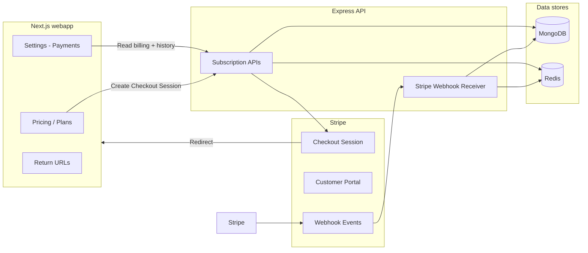
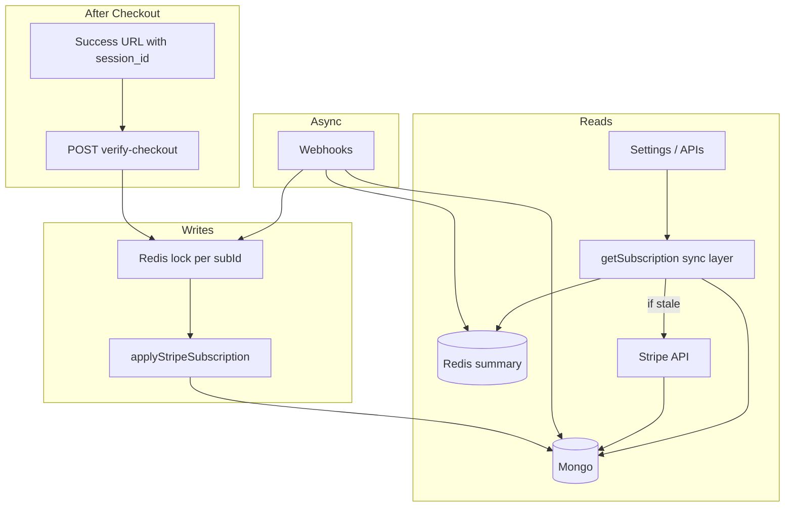

# Syntax Stories — Stripe Subscriptions (Production Blueprint)

This document describes the **end-to-end subscription architecture** for Syntax Stories V2.0: three paid plans in **INR**, **Stripe** as the payment processor, **MongoDB** as the system of record for billing snapshots and transaction history, **Redis** for operational guarantees, and **Next.js** + **Express** for frontend and API layers. Use it as the single reference before implementation.

**Repository context today**

| Layer | Stack |
|--------|--------|
| Web app | Next.js 16, React 19, TanStack Query, Zustand (`webapp/`) |
| API | Express, TypeScript, Zod (`server/`) |
| Data | MongoDB via Mongoose (`MONGO_CONN` → `env.MONGODB_URI`) |
| Cache / sessions | Redis (`REDIS_URL`), e.g. rate limits, session store |
| Billing (planned) | Stripe (Products, Prices, Checkout, Billing Portal, Webhooks) |

An early **`Subscription`** Mongoose model exists (`server/src/models/Subscription.ts`) with plans `free | pro | premium`. Implementation should **evolve** this toward Stripe-backed identifiers and the product names below (`pro`, `proplus`, `ultra`), with a clear migration path for any existing documents.

**Production hardening (at a glance)**

| # | Topic | Where |
|---|--------|--------|
| 1 | Post-checkout verification (fix webhook lag vs UI) | §2.1 |
| 2 | Sync layer: Redis → Mongo → Stripe if stale | §2.2 |
| 3 | Dual idempotency: Redis + Mongo unique `eventId` | §4.4 |
| 4 | Ledger: **invoice-only**, one row per invoice | §4.3 |
| 5 | Checkout security: bind `customer` to user, not metadata alone | §6.6 |
| 6 | Upgrades / downgrades / cancel rules | §3.5 |
| 7 | `invoice.payment_failed`: past_due, soft lock, notify | §3.4 |
| 8 | Summary cache `subscription:summary:{userId}` TTL + invalidation | §5 |
| 9 | Schema: `version`, `lastSyncedAt`, `source` | §4.2 |
| 10 | Edge cases: one sub per user, orphans, account delete | §9 |
| 11 | **Concurrency:** verify + webhook monotonic guard | §2.4 |
| 12 | **Webhook recovery:** `failed` rows + background retry | §4.4 |
| 13 | **Single writer:** `applyStripeSubscription` only | §6.7 |
| 14 | **CheckoutIntent** binds `sessionId` → `userId` | §4.5 |
| 15 | **Rate limit** `verify-checkout` | §5 |
| 16 | **Reconciliation job** (cold start / daily) | §10.2 |
| 17 | Ledger: **no row** until invoice exists / paid policy | §4.3 |
| 18 | **Grace** schema: `graceUntil`, `isGraceActive` | §4.2 |
| 19 | **Monitoring & alerts** | §10.1 |
| 20 | **Scale:** queue, circuit breaker | §10.3 |
| 21 | **Lock token / TTL extend** (safe distributed lock) | §2.4 |
| 22 | **Object-level ordering** (not global `event.created`) | §2.4 |
| 23 | **Mongo transactions** in `applyStripeSubscription` | §6.7 |
| 24 | **Queue + lock** worker contract | §10.3 |
| 25 | **DLQ** `dead` + manual replay | §4.4 |
| 26 | **Reconcile throttling** (`lastReconciledAt`, sample) | §10.2 |
| 27 | **Stripe `idempotencyKey`** on Checkout create | §6.3 |
| 28 | **Grace:** compute `isGraceActive`, do not trust stale bool | §4.2 |
| 29 | **`BillingAuditLog`** | §4.6 |
| 30 | **Backpressure** (queue / Mongo) | §10.3 |

---

## 1. Product definition

| Plan key (app) | Display name | Price (INR) | Billing cadence |
|----------------|----------------|---------------|-----------------|
| `pro` | Pro | 500 | Monthly |
| `proplus` | Pro Plus | 1,000 | Monthly |
| `ultra` | Ultra | 1,500 | Monthly |

**Stripe mapping (recommended)**

- One **Stripe Product** per plan (3 products).
- One **recurring Price** per product, **currency `inr`**, **interval `month`**, amount in **paise** (Stripe’s smallest currency unit for INR): `50000`, `100000`, `150000` respectively — **verify** in Dashboard; Stripe documents amounts in minor units.
- Store **Price IDs** (`price_...`) in server config or a small `BillingPlanConfig` collection so the app never hardcodes amounts twice.

**Entitlements**

- Define a matrix: which features each plan unlocks (API flags, UI gates, quotas). The **source of truth for payment state** is Stripe; the **source of truth for “what the user can do now”** can be derived fields on `User` or linked `Subscription` updated from webhooks.

---

## 2. High-level architecture



**Principles**

1. **Never** trust the client for paid state. Authoritative billing state lives in **Stripe**; the app uses **Mongo** as a **replicated, queryable projection** plus **Redis** for speed and deduplication.
2. Treat webhook delivery as **at-least-once**: handlers must be **idempotent** (same `event.id` processed once) using **dual-layer** idempotency (see §4.4).
3. **Event consistency:** webhooks are **async and can lag**. The UI must not rely on webhooks alone immediately after Checkout — add a **post-checkout verification** path (§2.1).
4. **Sync strategy:** reads go through a **sync layer** that can **self-heal** stale Mongo from Stripe when needed (§2.2); Redis summary cache is **invalidated on every successful webhook** that touches that user’s billing state.
5. Persist enough in Mongo to power **Settings → Payments** without Stripe on every request; use **invoice-based ledger** only (§4.3).
6. **All subscription document mutations** that reflect Stripe subscription state go through **one function** — `applyStripeSubscription` (§6.7) — so verify, webhooks, sync, and reconciliation cannot drift.
7. **Concurrent writers** (`verify-checkout` vs webhook) use a **token lock + retrieve** (§2.4.1–§2.4.2), not last-writer-wins.

### 2.1 Event consistency — post-checkout verification (required)

**Problem:** After `success_url` redirect, the webhook `checkout.session.completed` may not have run yet, so Mongo can still show “free” or stale data — wrong UI and wrong entitlements.

**Fix:** On success redirect, the frontend calls a dedicated authenticated endpoint, e.g. `POST /billing/verify-checkout` with **`session_id`** (from Stripe URL query `session_id`) or a short-lived server-issued token tied to the session.

**Backend behavior:**

1. Resolve the authenticated **Syntax Stories user** from the session/JWT (never from Checkout metadata alone).
2. **CheckoutIntent binding (required):** Load `CheckoutIntent` by `sessionId` (§4.5). Reject **403** if `intent.userId !== loggedInUser` or `intent.expiresAt < now` — closes the hole where a stolen `session_id` is POSTed to verify.
3. **Rate limit:** Enforce Redis limit `rateLimit.verifyCheckout:{userId}` (§5) before calling Stripe.
4. `stripe.checkout.sessions.retrieve(session_id, { expand: ['subscription', 'customer', 'subscription.latest_invoice'] })`.
5. **Assert ownership** (same as §6.6): `session.mode === 'subscription'`; customer matches user’s Stripe customer; subscription belongs to that customer.
6. Call **`applyStripeSubscription(stripeSub, { source: 'verify', stripeSignalCreated: … })`** (§6.7) — **not** ad-hoc field copies. Ledger: only upsert invoice rows when an invoice exists and meets your rule (§4.3 — e.g. `paid` only, or `open` with amount due for display-only).
7. **Invalidate** `subscription:summary:{userId}` in Redis.
8. Return the same DTO as `GET /billing/subscription` so the UI updates immediately.

This removes the **race** between redirect and webhook for UX; **§2.4** removes the race for **data correctness** when both paths write.

### 2.2 Sync layer — Stripe ↔ Mongo (required)

Mongo is **not** blindly trusted. Stripe remains **source of truth**; Mongo is **eventually consistent** with **strong read path** when stale.

**Staleness signal (choose one or combine):**

- `subscription.lastSyncedAt` older than a threshold (e.g. **120s**), or
- explicit `?forceSync=true` from verify-checkout / support tools, or
- status `incomplete` / `past_due` where fresh payment state matters.

**Read path (conceptual):**

```
function getSubscriptionForUser(userId):
  summary = GET redis subscription:summary:{userId}
  if summary hit and not stale → return summary

  doc = load Subscription from Mongo for userId
  if doc and not isStale(doc) → optionally SET redis TTL 60s → return doc

  // Self-heal
  stripeSub = stripe.subscriptions.retrieve(doc.stripeSubscriptionId) // or list by customer
  applyStripeSubscription(stripeSub, { source: 'sync' })  // §6.7 — same code path as webhook/verify
  invalidate or rewrite redis summary
  return updated doc
```

**When to call Stripe:** Sparingly — only when cache miss, stale, or post-checkout. Normal Settings loads should hit **Redis → Mongo** only.

**Optional:** See **§10.2** for the full **daily reconciliation** job (cold start and long-term consistency); ad-hoc drift metrics can alert if drift `> 0`.

### 2.3 Architecture (revised)



### 2.4 Concurrent `verify-checkout` and webhooks (required)

**Problem:** `verify-checkout` and `customer.subscription.*` / `checkout.session.completed` webhooks can **update Mongo concurrently**. Without ordering you risk duplicate ledger churn (invoice upserts are safe) and **stale overwrites** on subscription scalars.

#### 2.4.1 Distributed billing lock — **token pattern** (required)

**Problem:** Naive `SET lock:billing:{subId} 1 NX EX 5` is **unsafe** if work exceeds TTL: lock expires, a second process acquires, both write → race returns.

**Fix — lock value = unique token; compare-and-delete only your token**

1. `token = uuid()` (v4).
2. `SET lock:billing:{stripeSubscriptionId} {token} NX EX {baseTtl}` — e.g. **30s** base TTL (tune per p99 handler time).
3. If processing may exceed TTL: **extend** before expiry — e.g. Redis **`GET` + `SET` same key with same token** and new `EX`, or Lua script `if GET == token then EXPIRE key newTtl end` in a loop while work runs (heartbeat every **5s**).
4. **Release:** `if GET key == token then DEL key` (Lua atomic compare-and-del). Never `DEL` unconditionally — you might delete another process’s lock after your TTL expired and they acquired.

**Multi-node Redis / HA:** Prefer **Redlock** algorithm or a small **lease** library that implements it if you run several API instances against independent Redis nodes. Single-node Redis: token pattern is usually sufficient.

**Queue workers (§10.3):** Same contract — worker **acquires token lock** before `applyStripeSubscription`, **extends** during long invoice fan-out, releases in `finally`.

#### 2.4.2 Stripe cross-event ordering — **prefer object state, not global `event.created`**

**Problem:** Stripe **`event.created`** is **not** a global causal order across event types. `invoice.paid` may arrive **before** or **after** `customer.subscription.updated` for the same business moment; delayed delivery makes monotonic **`event.created`** alone **incomplete** for deciding “skip apply.”

**Fix:**

1. **Authoritative write path:** Under the billing lock, always **`stripe.subscriptions.retrieve(subId)`** (and for invoice handlers, **`invoices.retrieve`** as needed) **immediately before** persisting subscription/ledger fields. Map from **fresh Stripe objects**, not only from the webhook JSON snapshot.
2. **Supplement with object signals:** Persist e.g. **`lastSeenStripeSubscriptionUpdated`** from Stripe’s subscription payload — the API exposes a top-level **`Stripe.Subscription` object** (check your API version for `items`, `status`, `current_period_end`). Use **`current_period_end`**, **`status`**, **price id on items**, **`cancel_at_period_end`** as the **semantic** diff; if Mongo already matches retrieved object, skip scalar writes (idempotent no-op).
3. **`lastAppliedStripeEventCreated`:** Keep as a **secondary** guard for **duplicate webhook deliveries** of the **same** `event.id` (already handled by §4.4) and for **ordering two webhooks that both carry subscription deltas** — but **do not** rely on it alone across `invoice.*` vs `customer.subscription.*`.
4. **Invoice rows:** Still **upsert by `stripeInvoiceId`**; invoice handler can run independently as long as subscription **customer** linkage is consistent.

#### 2.4.3 Monotonic webhook helper (optional, secondary)

After retrieve (§2.4.2), you may still skip redundant work if `event.created < doc.lastAppliedStripeEventCreated` **and** retrieved subscription is **byte-identical** to last applied hash — optimization only, not correctness.

**Verify / sync path:** Always retrieve under lock (§2.4.1) before mapping.

**Ledger:** Always **upsert by `stripeInvoiceId`** only; never create a subscription “transaction” row without an invoice id (§4.3).

---

## 3. Stripe Dashboard & object model

### 3.1 Objects you will use

| Stripe object | Role |
|----------------|------|
| **Customer** | One per Syntax Stories user; link `stripeCustomerId` on `User` (or equivalent). |
| **Product / Price** | Catalog for Pro, Pro Plus, Ultra. |
| **Checkout Session** (`mode: subscription`) | Hosted payment + mandate collection for India cards/UPI as enabled in Dashboard. |
| **Subscription** | Recurring contract; status drives access. |
| **Invoice** | Each cycle; useful for “transactions” and PDF receipts. |
| **PaymentIntent** | Under the hood for payments; **Charge** / **PaymentIntent** IDs are useful for support. |
| **Billing Portal Session** | Let users update payment method, cancel at period end, see invoices (configure allowed actions in Dashboard). |

### 3.2 India (INR) considerations

- Enable desired **payment methods** (cards, UPI, etc.) in [Stripe Dashboard](https://dashboard.stripe.com/settings/payment_methods) per your compliance and Stripe availability.
- **3D Secure** and recurring mandates: Stripe handles much of this; still document **failed renewals** and **customer.email** for dunning.
- **Tax**: if you collect GST, evaluate **Stripe Tax** vs external invoicing; document the decision in ops runbooks.

### 3.3 Webhooks (production minimum)

Configure a **single** HTTPS endpoint (e.g. `POST /api/stripe/webhook` or `/webhooks/stripe`) with the **signing secret** from the Dashboard.

**Events to subscribe to initially**

| Event | Why |
|--------|-----|
| `checkout.session.completed` | First successful subscribe; link session to user; store subscription id. |
| `customer.subscription.created` | Backup / completeness. |
| `customer.subscription.updated` | Status changes, plan changes, cancel_at_period_end. |
| `customer.subscription.deleted` | End of access when subscription ends. |
| `invoice.paid` | Successful charge; **upsert exactly one ledger row per invoice** (§4.3). |
| `invoice.payment_failed` | **Mandatory handling** — §3.4. |
| `invoice.finalized` | Optional: immutable invoice snapshot / URLs. |

**Ledger rule:** Do **not** create parallel “transaction” rows from `payment_intent.*` for subscription billing. Store `payment_intent` / `charge` ids **inside** the invoice ledger row for support only.

Add **`customer.updated`** if you display billing details from Stripe.

### 3.4 `invoice.payment_failed` — failure handling (required)

Stripe retries dunning; your app must still **react** deterministically.

1. **Mongo:** Set subscription `status` to Stripe’s value (typically `past_due` or remain `active` until Stripe moves it — follow Stripe subscription object after invoice failure).
2. **Entitlements:** Apply a **soft lock** — e.g. keep read access, restrict **premium** actions (define explicitly in product). Do not hard-delete data.
3. **Notify:** Email or in-app (reuse Nodemailer) — “Payment failed; update your card.”
4. **Optional grace:** Business policy **3–7 days** — persist **`graceUntil`** on `Subscription` (§4.2). Set from `invoice.next_payment_attempt` plus offset, or fixed window. **Entitlements:** use **recomputed** `isGraceActive` from **`graceUntil` + current `status` + `now`** (§4.2); clear `graceUntil` on `invoice.paid`.
5. **Cache:** Invalidate `subscription:summary:{userId}`.
6. **UI:** Settings → Payments shows **Past due** + CTA to Billing Portal.

On `invoice.paid` after recovery: restore full entitlements, clear grace flags, invalidate cache.

### 3.5 Plan changes — upgrades, downgrades, cancel (required)

Same rules in **API**, **Billing Portal configuration**, **webhook handlers**, and **UI copy**.

| Action | Stripe / API behavior | User experience |
|--------|------------------------|-----------------|
| **Upgrade** (higher tier) | Prefer **immediate** change with **proration** (`proration_behavior: create_prorations` on subscription update) unless product says otherwise. | New limits effective immediately; next invoice shows proration lines. |
| **Downgrade** (lower tier) | Apply at **period end**: schedule new price for next cycle (`billing_cycle_anchor` / subscription schedule or Portal setting). | UI shows “Switches to Pro on {date}” (scheduled change date). |
| **Cancel** | Set **`cancel_at_period_end: true`** (never confuse with immediate delete unless user explicitly churns now). | Access until `current_period_end`; then `customer.subscription.deleted`. |

Document which flows use **Checkout** (new sub) vs **subscription update API** vs **Customer Portal** so engineers do not fork behavior.

### 3.6 Webhook endpoint security

- Verify signature with **raw body** (no JSON parse before verify in Express).
- Respond `200` quickly after durable idempotency mark; push heavy work to async queue **or** keep processing fast and idempotent.

---

## 4. MongoDB schema design

### 4.1 User extension

Add (names illustrative):

- `stripeCustomerId: string | null` (unique sparse index)
- Optional denormalized fields for fast reads: `subscriptionStatus`, `subscriptionPlanKey`, `currentPeriodEnd` — **always** refreshed from webhooks, not from client.

### 4.2 Subscription document (evolve existing model)

Align with Stripe while keeping app-specific fields:

| Field | Purpose |
|--------|---------|
| `userId` | Owner (keep unique: one active subscription per user, or model multiple if you add teams later). |
| `stripeSubscriptionId` | `sub_...` |
| `stripePriceId` | Current price. |
| `planKey` | `pro` \| `proplus` \| `ultra` |
| `status` | Map from Stripe: `active`, `trialing`, `past_due`, `canceled`, `unpaid`, `incomplete`, `incomplete_expired`, `paused` (subset exposed in UI). |
| `currentPeriodStart`, `currentPeriodEnd` | From Stripe subscription item billing periods. |
| `cancelAtPeriodEnd` | Boolean |
| `trialEnd` | Optional |
| `metadata` | Optional small JSON for debugging |
| **`version`** | **Number** — document shape / migration version. |
| **`lastSyncedAt`** | **Date** — last successful projection from Stripe (webhook or verify / sync path). |
| **`lastAppliedStripeEventCreated`** | **Number \| null** — Unix seconds of last **webhook** `event.created` applied to subscription scalars (§2.4). |
| **`source`** | **`"stripe"` \| `"manual"`** — last write origin; `"manual"` only for support tools. |
| **`graceUntil`** | **`Date \| null`** — end of soft-lock grace after `past_due` (optional product policy). |
| **`isGraceActive`** | **Optional cache only** — if stored, **never trust alone**. At **read** time always recompute: `isGraceActive = Boolean(graceUntil && now < graceUntil && status === 'past_due')` (adjust `status` rule to match product). Stripe retry timing can move reality vs stored flag — **Stripe `status` + `graceUntil` + `now`** is source for gating. |
| **`lastReconciledAt`** | **`Date \| null`** — last successful **reconcile** pass for this record (§10.2 throttling). |

**Migration note:** Replace enum `premium` with **`ultra`** (or map legacy `premium` → `ultra` once in a script).

### 4.3 Payment / transaction history — **invoice-only ledger** (final)

**Rule:** **One Stripe Invoice ⇒ one Mongo ledger row.** Subscriptions are invoice-driven in Stripe; receipts and Settings UX stay aligned with the Dashboard.

- **Do not** key subscription “transactions” on `PaymentIntent`.
- Denormalize `stripePaymentIntentId` / `chargeId` **on the invoice row** for support only.

**Edge — subscription exists, invoice not ready yet:** Right after Checkout, `subscription` may exist while **no paid (or even no finalized) invoice** exists yet.

- **Do not** invent a ledger row without a real **`stripeInvoiceId`**.
- **Policy (recommended):** Create/update ledger rows only when you have a stable **`in_...`** from `invoice.paid`, `invoice.finalized`, or `invoice.payment_failed` as needed for UX — for “current cycle” display before payment, rely on **subscription** fields in Mongo / Stripe retrieve, not a fake transaction row.
- `verify-checkout` may show **Active** from `subscription.status` while the **transactions** table is empty until first invoice event — acceptable UX with copy: “First invoice processing.”

Collection name e.g. **`BillingTransaction`** or **`PaymentLedger`**.

Suggested fields:

- `userId`
- `stripeInvoiceId` (**unique index** — upsert idempotency)
- `stripePaymentIntentId` (optional)
- `amountPaid`, `currency` (`inr`)
- `status` (`paid`, `open`, `void`, `uncollectible`, …)
- `paidAt` (from invoice status transitions)
- `description` / `lineSummary` (human-readable)
- `invoicePdfUrl` or `hostedInvoiceUrl` (Stripe-hosted; refresh if expired)
- `createdAt`, `updatedAt`

This collection powers **Settings → Payments**: sort by `paidAt` desc, paginate.

### 4.4 Webhook idempotency, durability, and **failure recovery** (required at scale)

| Step | Store | Role |
|------|--------|------|
| **1** | **Redis** | `SET stripe:wh:{eventId} processing NX EX 86400` — fast reject of duplicates / concurrent delivery. |
| **2** | **Mongo** | Collection **`StripeWebhookEvent`** — **`eventId` unique index**; lifecycle below. |

**`StripeWebhookEvent` document (illustrative):**

| Field | Purpose |
|--------|---------|
| `eventId` | Stripe `evt_...` (unique). |
| `type` | e.g. `invoice.paid`. |
| `status` | **`pending`** \| **`processed`** \| **`failed`** \| **`dead`** (DLQ — §4.4.1). |
| `retryCount` | Increment on each failed processing attempt. |
| `nextRetryAt` | `Date` — when a background worker may retry. |
| `lastError` | Truncated string / code for dashboards. |
| `payloadRef` | Optional S3/gridfs pointer if bodies are large; else omit. |
| `createdAt`, `updatedAt` | Audit. |

**Flow:**

1. Insert row **`status: pending`** (or transition from absent using upsert) **before** heavy processing — duplicate `eventId` → **200 no-op** (idempotent).
2. On success: **`status: processed`**, set `updatedAt`.
3. On **throw** after Stripe already accepted the HTTP **200** risk: mark **`status: failed`**, increment **`retryCount`**, set **`nextRetryAt`** with exponential backoff (e.g. 1m, 5m, 15m, cap 1h). Stripe **retries** webhooks for days, but your handler can still fail (DB down, bug) — **your** worker must retry **`failed`** rows so Mongo is not wrong forever.

**Background job (required in production):**

- Query `StripeWebhookEvent` where `status === 'failed'` AND `nextRetryAt <= now` AND `retryCount < MAX` (e.g. 25).
- Re-fetch or use stored payload; re-run the same idempotent handler (under **billing token lock** §2.4.1).
- If `retryCount` exhausted: transition to **`dead`** (§4.4.1).

**Correctness:** Mongo unique `eventId` is the **hard** idempotency guarantee; Redis is speed. Return **200** to Stripe only after the event is **durably recorded** as pending/processed per your risk model (some teams ack 200 after enqueue to internal queue — then worker must be at-least-once safe).

#### 4.4.1 Dead letter queue (DLQ) and manual replay

When `retryCount >= MAX`, set **`status: 'dead'`**, freeze **`lastError`**, emit **high-severity alert** (§10.1).

**Ops tooling (required):**

- Internal **admin API** or script: `POST /internal/billing/replay-webhook { eventId }` — validates role, reloads payload from Stripe `events.retrieve` if needed, inserts a **new** processing attempt or resets row to `pending` with `retryCount = 0` under audit (§4.6).
- Runbook: link to Stripe Dashboard event; document **when** to replay vs fix code first.

**Never** silently drop `dead` rows — they represent **lost business processing** until replayed or manually reconciled.

### 4.5 `CheckoutIntent` — bind `sessionId` to `userId` (required)

**Problem:** If an attacker obtains a `session_id`, they could call `verify-checkout` unless the server proves that session was **created for this logged-in user**.

**Fix:** When creating a Checkout Session, persist a **`CheckoutIntent`** (Mongo collection recommended for audit; Redis TTL mirror optional):

| Field | Purpose |
|--------|---------|
| `stripeCheckoutSessionId` | Initially empty or set after `sessions.create` returns `cs_...`. |
| `userId` | Owner. |
| `planKey` | `pro` \| `proplus` \| `ultra`. |
| `expiresAt` | Short TTL (e.g. 30–60 min after creation). |
| `createdAt` | Audit. |

**Flow:** On `sessions.create`, update the intent with **`stripeCheckoutSessionId`**. On **`POST /billing/verify-checkout`**: load intent where `stripeCheckoutSessionId === sessionId`; **reject 403** if `intent.userId !== authUser._id` or `expiresAt < now`.

This is **in addition to** customer matching in §6.6, not a replacement.

### 4.6 `BillingAuditLog` — human and reconcile actions (recommended)

Webhook dedup tables are **not** a product audit trail. Add **`BillingAuditLog`** (append-only) for:

| Field | Purpose |
|--------|---------|
| `userId` | Subject. |
| `action` | e.g. `plan_change`, `cancel_at_period_end`, `reconcile_fix`, `admin_override`, `checkout_completed`. |
| `source` | `webhook` \| `verify` \| `reconcile` \| `admin`. |
| `stripeSubscriptionId` / `stripeInvoiceId` | Optional refs. |
| `before` / `after` | Small JSON snapshots of **relevant** fields (plan, status, period end) — avoid PII. |
| `createdAt` | Immutable. |

Emit from **`applyStripeSubscription`** when diff is non-empty, from **reconcile** fixes, and from **admin** tools. Retention policy per compliance.

---

## 5. Redis usage

| Concern | Pattern |
|---------|---------|
| Webhook deduplication | **Dual layer** with Mongo — §4.4. |
| Rate limiting checkout creation | Reuse existing `redisKeys` pattern (`server/src/shared/redis/keys.ts`) — e.g. `rateLimit.createCheckout`. |
| **`verify-checkout` abuse** | **`rateLimit.verifyCheckout:{userId}`** — e.g. 10/min/IP + 5/min/user; prevents Stripe API spam and session brute force. |
| **Billing write serialization** | **`lock:billing:{stripeSubscriptionId}`** = **UUID token**; compare-and-del release; **extend** TTL during long work — §2.4.1. |
| Short-lived Checkout Session reference | **Canonical:** **`CheckoutIntent`** in Mongo (§4.5). Optional Redis mirror `checkout:pending:{id}` for TTL-only dev setups — not a substitute for intent + `userId` check. |
| **Subscription summary cache** | `subscription:summary:{userId}` — JSON with plan, status, `currentPeriodEnd`. **TTL 60s** (tunable). **DEL** (or version bump) on **any** webhook or verify-checkout that updates that user’s billing. |

**Performance:** Settings and gated APIs should prefer **cached summary** after verify/sync warmed it; stale reads fall through per §2.2.

If Redis is unavailable, webhook processing should **still** work (Mongo idempotency only); reads fall back to Mongo-only sync path; checkout rate limit may fall back to in-memory or fail closed per your security policy.

---

## 6. Backend (Express) — modules & routes

### 6.1 Dependencies

Add official **`stripe`** Node SDK to `server/package.json`. Pin major version; follow [Stripe API version](https://stripe.com/docs/api/versioning) upgrades deliberately.

### 6.2 Configuration / env

| Variable | Description |
|----------|-------------|
| `STRIPE_SECRET_KEY` | Secret API key (live vs test). |
| `STRIPE_WEBHOOK_SECRET` | Endpoint signing secret (`whsec_...`). |
| `STRIPE_PRICE_PRO` / `STRIPE_PRICE_PROPLUS` / `STRIPE_PRICE_ULTRA` | Recurring price IDs. |
| `PUBLIC_APP_URL` | Success/cancel URLs for Checkout. |
| `STRIPE_PORTAL_RETURN_URL` | Billing Portal return URL. |

Never expose **secret** keys to Next.js client bundles.

### 6.3 Authenticated routes (examples)

| Method | Route | Behavior |
|--------|--------|----------|
| `POST` | `/billing/checkout-session` | Body: `planKey`. **`idempotencyKey`** on `stripe.checkout.sessions.create` — e.g. `checkout:${userId}:${planKey}:${yyyy-mm-dd-hour}` or stable hash so **double-clicks** do not spawn multiple sessions (Stripe dedupes within idempotency window). Resolve price id; **reuse or create** Customer; persist **`CheckoutIntent`**; `success_url` with `{CHECKOUT_SESSION_ID}`. |
| `POST` | `/billing/verify-checkout` | Body: `sessionId`. **Rate limit** §5 → **`CheckoutIntent`** §4.5 → retrieve session → **`applyStripeSubscription`** §6.7 → invalidate Redis. |
| `POST` | `/billing/portal-session` | Create Billing Portal session for logged-in user. |
| `GET` | `/billing/subscription` | **`getSubscriptionForUser`** — §2.2: Redis → Mongo → Stripe if stale. |
| `GET` | `/billing/transactions` | Paginated **invoice ledger** only. |

Use **Zod** for input validation; reuse existing auth middleware.

### 6.4 Webhook route

- **Raw body** middleware **only** on this route.
- Verify signature → **dual idempotency** (§4.4) → persist **`StripeWebhookEvent`** lifecycle → under **billing lock** (§2.4) call **`applyStripeSubscription`** / invoice handlers — never scatter raw `Subscription` updates.
- **Fast path at scale (optional):** respond `200` after enqueue to **BullMQ / SQS / RabbitMQ**; worker runs idempotent handler with **same** §4.4 dedup + **§2.4.1 token lock** + **§6.7 transaction**. See §10.3.
- On conflicts (e.g. duplicate invoice id), no-op safely.

### 6.5 Service layer

Suggested files:

- `server/src/services/stripe/stripeClient.ts` — singleton Stripe client.
- `server/src/services/stripe/checkout.service.ts` — creates Checkout + **`CheckoutIntent`** (§4.5).
- `server/src/services/stripe/webhook.service.ts` — one function per `event.type`; delegates to **`applyStripeSubscription`** and ledger upserts.
- `server/src/services/billing/applyStripeSubscription.ts` — **single writer** (§6.7).
- `server/src/services/billing/webhookRetry.worker.ts` — polls **`StripeWebhookEvent`** `failed` rows; escalates **`dead`** (§4.4.1).
- `server/src/services/billing/billingAudit.service.ts` — append **`BillingAuditLog`** (§4.6).

### 6.6 Checkout session security — do not trust metadata alone

**Problem:** `metadata.userId` or `client_reference_id` can be **tampered** if ever echoed from client without binding to the server-created session. Treat them as **hints**, not proof.

**Rules:**

1. **Create Checkout** only on authenticated routes; persist **`CheckoutIntent`** (§4.5) binding `userId` → eventual `sessionId`.
2. On **webhook** `checkout.session.completed` and on **verify-checkout**:
   - Load user **from session**, not from metadata.
   - **`CheckoutIntent`** must match `sessionId` + `userId` on verify (§4.5).
   - **`session.customer` must match** `user.stripeCustomerId` after attach (§2.1).
3. Reject if `subscription` / `customer` on the session points to a **different** user’s customer id.
4. Never grant entitlements from metadata alone.

### 6.7 Single writer — `applyStripeSubscription` (required)

**Problem:** Webhook handlers, `verify-checkout`, and sync each mapping Stripe → Mongo **duplicates logic** and drifts over time.

**Fix:** Exactly **one** exported function, e.g. `applyStripeSubscription(stripeSubscription: Stripe.Subscription, ctx: { source: 'webhook' | 'verify' | 'sync' | 'reconcile'; eventCreated?: number })`.

**Responsibilities:**

- Acquire **token lock** `lock:billing:{stripeSubscription.id}` (§2.4.1); **extend** if transaction approaches TTL.
- **`stripe.subscriptions.retrieve`** inside the lock before mapping (§2.4.2).
- Map price id → `planKey`, status, periods, `cancelAtPeriodEnd`, **`graceUntil`** (persist); **do not** persist `isGraceActive` as authoritative — compute at read (§4.2).
- **`mongoose.startSession()`** + **`session.withTransaction(async () => { ... })`:** within one transaction, update **`Subscription`**, denormalized **`User`** fields, and any **ledger** rows touched in the same business operation **when** they share the same consistency unit. If ledger writes are **only** invoice-driven from a separate event, keep them in the **invoice handler** transaction — but **never** leave User updated and Subscription rollback without handling (single transaction per **apply** batch that must succeed together).
- Update **`lastSyncedAt`**, **`source: 'stripe'`**, optional **`lastAppliedStripeEventCreated`** / object fingerprint per §2.4.2.
- Append **`BillingAuditLog`** when non-no-op (§4.6).
- Invalidate **`subscription:summary:{userId}`** after commit.

All callers (**webhook**, **verify-checkout**, **sync**, **daily reconcile**) must use this function only for subscription-shaped state.

**Partial failure:** Without Mongo transactions, multi-collection updates **will** eventually corrupt. Use **replica set** + transactions for production; if standalone Mongo in dev, document weaker guarantees.

---

## 7. Frontend (Next.js)

### 7.1 Public marketing / pricing

- Page or section listing **Pro / Pro Plus / Ultra** with feature comparison.
- CTA: “Subscribe” → calls API → receives `url` → `window.location.href = url` (Checkout).

### 7.2 Authenticated flows

- **Guard:** only logged-in users can start Checkout; pass auth cookie / bearer token to API.
- **Success URL:** include Stripe’s `{CHECKOUT_SESSION_ID}` (see [success URL](https://stripe.com/docs/payments/checkout/custom-success-page)); e.g. `/settings?tab=payments&checkout=success&session_id={CHECKOUT_SESSION_ID}`.
- **On load:** if `checkout=success` and `session_id` present, call **`POST /billing/verify-checkout`** first, **then** refetch subscription — avoids stale UI while webhooks catch up.
- **Cancel URL:** return to pricing or settings with neutral message.

### 7.3 Settings — new “Payments” area

Under Settings navigation, add a section (or sidebar item) **Payments** containing:

1. **Subscription status** — Active / Past due / Canceled (at period end) / None.
2. **Plan name** and **renewal or end date** (`currentPeriodEnd`).
3. **Actions** — “Manage billing” (Billing Portal), “Change plan” (new Checkout or in-portal if you enable plan switching).
4. **Transactions** — table: date, description, amount (INR), status, link “Receipt” (Stripe hosted invoice URL when available).

Use existing layout patterns from `webapp/src/app/settings/page.tsx` (section headers, skeletons, auth slice).

### 7.4 Client-side Stripe.js?

- For **Checkout**, you typically **do not** need `@stripe/stripe-js` on the client unless you build **Embedded Checkout** or **Elements**.
- If you later add **Elements** for custom UIs, load Stripe.js with **publishable key** only; payment still completes with client secrets from your server.

---

## 8. Third-party integrations checklist

| Integration | Responsibility |
|-------------|----------------|
| **Stripe Checkout** | Hosted payment + subscription creation; pass **`idempotencyKey`** on `sessions.create` (§6.3). |
| **Stripe Customer Portal** | Self-serve payment method and cancellation. |
| **Stripe Webhooks** | Authoritative lifecycle events → Mongo. |
| **Email (existing Nodemailer)** | Optional: send “payment failed”, “welcome to Pro” (trigger from webhook handler or Stripe Billing emails). |
| **Analytics** | Optional: server-side events on `checkout.session.completed` / `invoice.paid`. |

---

## 9. Edge cases & invariants

| Scenario | Policy |
|----------|--------|
| **One active paid subscription per user** | Enforce in app: before Checkout, if user already has `stripeSubscriptionId` in **active/trialing** state, route to **portal** or **subscription update** instead of creating a second Checkout subscription. |
| **Duplicate subscriptions created** | Webhook + verify-checkout should **detect** multiple active subs for one customer; **cancel** or merge per runbook; alert ops. |
| **Abandoned Checkout** | `open` / `expired` sessions: no Mongo write for entitlements. Optional cron: **list** abandoned sessions for analytics only — do not charge. |
| **User deletes account** | Runbook: **cancel** Stripe subscription at period end or immediately per policy; anonymize or retain ledger per legal; clear `stripeCustomerId` link or mark user **deleted** with frozen Stripe id for audits. |
| **Webhook replay / delay** | Idempotency §4.4 + verify-checkout §2.1 + **failed-event retry** §4.4. |
| **Orphan Stripe subscriptions** | Periodic job: customers with subs **not** linked to any user (failed onboarding) — cancel after SLA. |
| **Concurrent verify + webhook** | **Token lock + extend** §2.4.1; **retrieve under lock** §2.4.2; only **`applyStripeSubscription`** §6.7. |

---

## 10. Operations, recovery, observability, and scale

### 10.1 Monitoring and alerting (required)

Stripe and your app can disagree silently without dashboards.

| Alert | Condition (examples) |
|-------|----------------------|
| **Webhook processing failures** | Count `StripeWebhookEvent.status === 'failed'` created in last 15m **>** threshold (e.g. 5), or any `retryCount` **>** `MAX`. |
| **Duplicate subscriptions** | Query finds more than one `active` / `trialing` Stripe subscription for the same `stripeCustomerId` — §9. |
| **Stripe vs Mongo mismatch** | Reconcile job (§10.2) reports `mismatchCount` above zero for **active** users. |
| **Lock contention** | High `lock:billing:*` wait time — tune TTL or queue webhooks. |
| **Verify-checkout 403 spike** | Possible session-id scanning — tighten rate limits (§5). |
| **DLQ / dead webhooks** | Count **`StripeWebhookEvent.status === 'dead'`** in last 24h above zero, or growth rate — §4.4.1. |

Emit **structured logs** (`eventId`, `type`, `stripeCustomerId`, `userId` hash). Forward to your stack (Datadog, Grafana, CloudWatch). Page on-call for failure-rate SLO breaches.

### 10.2 Reconciliation jobs — **cold start** and **daily** (required)

**Cold start:** After deploy, Redis cache is empty; some Stripe events may have been **missed** (webhook downtime, processing bug). **Daily job** catches long-term drift.

**Algorithm (per run) — throttled (required at scale):**

1. **Do not** fan out `subscriptions.list` for **every** user every hour — **429**, cost, and Mongo load will spike.
2. **Watermark:** Persist **`lastReconciledAt`** on `User` or `Subscription`. Select candidates where `lastReconciledAt` is older than **24–72h** **or** `lastSyncedAt` is stale while status is non-terminal.
3. **Sampling:** For full passes, reconcile only a **deterministic 1–5% shard** per day (`hash(userId) % 100 < k`) so the whole base rotates without blasting Stripe.
4. For each candidate: `stripe.subscriptions.list({ customer, … })` behind a global **Stripe token-bucket** (§10.3).
5. Compare **price**, **status**, **`current_period_end`**, **`cancel_at_period_end`** with Mongo.
6. On mismatch: **`applyStripeSubscription(retrieved, { source: 'reconcile' })`** + **`BillingAuditLog`** (`reconcile_fix`); `billing_reconcile_fix_total++`; set **`lastReconciledAt = now`**.
7. Optionally upsert recent invoices (idempotent by `in_...`).

**Schedule:** Daily off-peak; optional hourly **hot-set** only (e.g. `past_due` + active trials).

**GDPR / runbooks:** Keep the same checklist as before: test/live keys, TLS, runbook for “I paid”, data export.

### 10.3 Scale: queues, Stripe rate limits, circuit breaker, **backpressure**

| Concern | Mitigation |
|---------|------------|
| **Webhook bursts** | Ack quickly + **queue** (BullMQ, RabbitMQ, SQS). |
| **Queue + lock + workers** | **Partition** jobs by `stripeSubscriptionId` (e.g. BullMQ **group** / consistent hash) so **at most one worker** per subscription at a time **or** every worker still **acquires §2.4.1 token lock** before `applyStripeSubscription`. **Extend lock** if job waits in queue past initial TTL. Order: **dequeue → acquire lock → retrieve Stripe → transaction → release → ack**. |
| **Worker concurrency** | Cap global **concurrent** Stripe calls (e.g. pool of 10–20); tune queue **rate limit** (jobs/sec) to protect DB and Stripe. |
| **Stripe API cost / 429** | Centralize Stripe calls; **token-bucket** rate limiter; **exponential backoff**; **circuit breaker** on Stripe client (open circuit → pause reconcile + non-critical sync; webhooks queue depth alert). |
| **Mongo overload** | Circuit breaker or **adaptive concurrency** when Mongo latency exceeds SLO; optional **separate** read preference for reconcile reads. |
| **Many small writes** | Batch user lookups where possible; Mongo **bulkWrite** for ledger backfill only when safe. |
| **DLQ depth** | Alert on count of **`StripeWebhookEvent.status === 'dead'`** and queue **oldest age** (§4.4.1). |

### 10.4 Operational & security checklist

- [ ] Separate **test** and **live** Stripe projects; rotate keys via env per environment.
- [ ] Restrict webhook route IP if you use allowlists (optional; signature is mandatory).
- [ ] **TLS** termination valid for webhook URL in production.
- [ ] **§10.1** alerts wired (including **DLQ**); **§4.4** retry worker + **§4.4.1** replay path deployed.
- [ ] **§10.2** throttled reconcile job + **`lastReconciledAt`**.
- [ ] **§2.4.1** token locks + compare-and-del; **§6.7** Mongo transactions on multi-collection writes.
- [ ] **§6.3** Checkout **`idempotencyKey`**.
- [ ] **GDPR / data export:** subscription + ledger in user export if you provide one.

---

## 11. Local development

1. Install [Stripe CLI](https://stripe.com/docs/stripe-cli); `stripe login`.
2. Forward webhooks: `stripe listen --forward-to localhost:<PORT>/webhooks/stripe` and set `STRIPE_WEBHOOK_SECRET` to the CLI’s secret.
3. Use test cards from [Stripe testing docs](https://stripe.com/docs/testing).
4. Trigger renewals with **Test Clocks** for long-term behavior without waiting a month.

---

## 12. Testing strategy

| Layer | What to test |
|--------|----------------|
| Unit | Map Stripe payload → domain updates; Zod schemas. |
| Integration | Webhook handler with **fixture JSON** + fake signature (or Stripe CLI generated). |
| **Race / ordering** | Parallel verify + webhook: both use **token lock** §2.4.1; assert **compare-and-del** does not delete wrong holder; ledger **one row per `in_...`**. |
| **Lock TTL** | Work longer than TTL → assert second worker waits or extends; no double-apply. |
| **DLQ** | After `MAX` retries → **`dead`**; admin replay → **`processed`**. |
| **Transactions** | Force failure mid-`applyStripeSubscription` → assert **no** partial User/Subscription update (Mongo session aborted). |
| **Load (optional)** | Burst duplicate `event.id` deliveries — Redis rejects fast; Mongo unique index prevents double apply; **`failed`** events reprocessed by worker. |
| E2E (optional) | Full Checkout in test mode with Stripe test publishable key. |

---

## 13. Implementation order (recommended)

1. Stripe Dashboard: create Products/Prices (INR monthly), note Price IDs.
2. Env + `stripe` SDK + webhook route with **signature verification**, **dual idempotency**, and **`StripeWebhookEvent`** lifecycle (§4.4).
3. Extend **User** + **Subscription** (including `graceUntil`, `lastReconciledAt`, optional `lastAppliedStripeEventCreated`) + **invoice-only** ledger + **`CheckoutIntent`** + **`StripeWebhookEvent`** (with **`dead`**) + **`BillingAuditLog`** (§4.6).
4. Implement **`applyStripeSubscription`** (§6.7): **token lock** §2.4.1, **retrieve** §2.4.2, **Mongo transaction**, audit log.
5. Implement **`POST /billing/checkout-session`** (`idempotencyKey` §6.3, `CheckoutIntent`) + **`POST /billing/verify-checkout`** + portal session.
6. Implement **`getSubscriptionForUser`** (§2.2) + Redis summary + invalidation.
7. Webhook worker: delegate to **`applyStripeSubscription`**; **`invoice.payment_failed`** (§3.4); optional **queue** (§10.3).
8. **Background:** webhook **retry** + **`dead`** DLQ + **replay** tool (§4.4.1); **throttled reconcile** (§10.2).
9. **Queue (optional):** partition + backpressure (§10.3).
10. Plan-change API rules (§3.5) aligned with Portal.
11. **§10.1** monitoring + alerts (include DLQ).
12. Frontend: pricing CTAs, success URL with `session_id`, **verify then refetch**, Settings **Payments** UI.
13. Production webhook URL in Dashboard.

---

## 14. Related files in this repo (today)

- `server/src/models/Subscription.ts` — baseline schema to extend.
- `server/src/models/User.ts` — `subscription` ref exists; align with Stripe customer id strategy.
- `server/src/config/env.ts` — add Stripe env vars here.
- `server/src/shared/redis/keys.ts` — add billing-related keys.
- `webapp/src/app/settings/page.tsx` — integrate Payments section / navigation.

---

## 15. Glossary

| Term | Meaning |
|------|---------|
| **Price** | Stripe recurring or one-time line item attached to Checkout. |
| **Subscription** | Stripe object representing recurring billing agreement. |
| **Ledger** | Mongo collection: **one row per Stripe Invoice** for subscription billing history. |
| **Sync layer** | Read path that prefers cache + Mongo and **refetches Stripe** when stale to self-heal. |
| **Verify-checkout** | Synchronous post-redirect Stripe fetch to fix **webhook lag** before UI shows state. |
| **`applyStripeSubscription`** | Single module that maps Stripe `Subscription` → Mongo (+ cache invalidation); only writer for subscription scalars. |
| **`CheckoutIntent`** | Binds Checkout `sessionId` to `userId` so verify cannot be hijacked with a stolen id. |
| **Token lock** | Redis lock value = UUID; release only if `GET` matches; extend TTL during long work (§2.4.1). |
| **DLQ** | `StripeWebhookEvent.status === 'dead'` after max retries; requires replay or manual fix. |

---

*Document version: 4.0 — enterprise pass: token/Redlock-style billing locks, Stripe object ordering under lock, Mongo transactions in `applyStripeSubscription`, queue–lock worker contract, DLQ + replay, reconcile throttling + `lastReconciledAt`, Checkout `idempotencyKey`, grace recompute, `BillingAuditLog`, backpressure and Mongo/Stripe circuit breaking. Update when behavior or Stripe objects change.*
