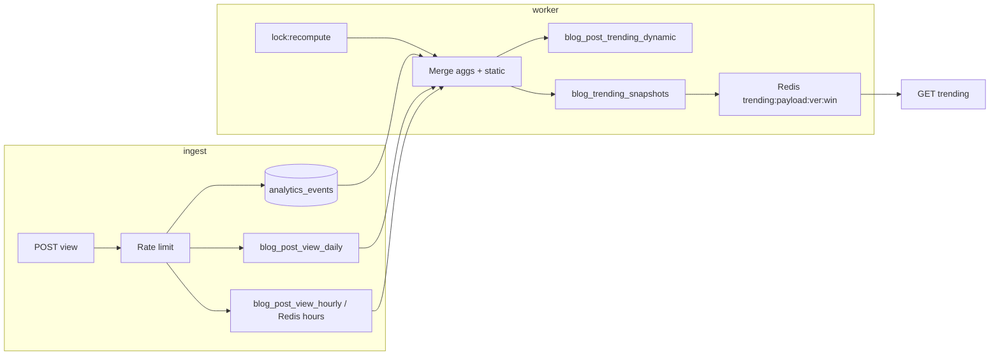

# Blog trending — product roadmap, data model, and implementation plan

This document defines **trending logic**, **MongoDB structure**, **backend services**, **Redis worker flow**, and **Mongo aggregation patterns** for Syntax Stories blog trending. It matches the codebase: `BlogPost`, `BlogCategory` / `BlogTag`, `BlogComment`, `analytics_events`, and `/api/blog/*` + `/blogs/[username]/[slug]`.

**Companion doc:** [`docs/Analytics.md`](./Analytics.md) — visitor identity, cookies, rate limits, bot filtering.

---

## 0. Maturity: MVP vs production-grade

| Area | MVP risk | Production target |
|------|-----------|-------------------|
| Scoring | Raw views dominate; unstable \(C/V\) on tiny \(V\) | **Log-based** \(Q_p\); **acceleration** \(M_p\); **\(T_p\)** trust × anti-abuse; **blend** 24h/7d; **engagement-mismatch** |
| Age | Cold-start **×** decay fights itself | **Age shift only** (no separate cold-start multiplier) |
| Categories | Min–max skewed by one outlier | **Percentile rank** for category UX; optional min–max only where stable |
| Tags | Top‑3 per tag but one post still hits many tags | **Each post contributes to at most 2 tags** for tag leaderboard |
| Abuse | Spike-only | Spike + **slow-drip** + **views vs comments** mismatch |
| Hero | Over-parameterized weighted draws | **v1:** top‑2/category → merge → shuffle + **hard** diversity constraints |
| Compute | Monolithic score doc | **Static vs dynamic** split in materialized layer |
| Read path | Unversioned cache | **Redis key includes `algorithmVersion`** — no stale mix on deploy |
| Momentum | Ratio \(V^{1h}/V^{6h}\) blows up when \(V^{6h}\) tiny | **Acceleration-style** \(M_p\) vs hourly baseline (§2.7) |
| Trust / abuse | Reactive penalties only | **Trust score \(T_p^{\text{trust}}\)** (preventive) **×** anti-abuse (reactive) → **\(T_p\)** (§2.6.E) |
| Author fairness | Adjust only after top‑N cut | **Progressive** multipliers **during** scoring **+** **hard cap** ≤2 posts/author in top 20 (§2.8) |
| Tag pick (max 2) | Array order gameable | **Top 2 tags by `tagStrength`** (rolling / prior snapshot) (§2.5) |
| Stale virality | Decay alone | Optional **<24h freshness** ×1.1 on `scoreS` (§2.3.1) |
| UX | Purely deterministic | **Exploration:** hero-only jitter **not** persisted (§2.9 / §8) |
| Redis MISS | Cold latency to Mongo | **Stale-while-revalidate** + async refresh (§5.4) |
| `dynamic` growth | Unbounded rows | **Prune** low-score / stale rows (§3.4.1) |
| Comment cap | \(\min(C,0.6V)\) hurts legit threads | **Hybrid** \(C^{\text{eff}}=\min(C,\,0.6V+20)\) — §2.1.1 |
| Momentum dampen | Hard \(V^{6h}\) cutoff → rank jumps | **Smooth** \(\tilde M\) — §2.7 |
| 7d in blend | Huge \(\text{score}^{7d}\) “ghost trending” | **Cap** \(\text{score}^{7d\prime}\) vs \(2\cdot\text{score}^{24h}\) — §2.12 |
| Noise | Micro-\(V\) surfaces | **`V_{\min}^{\text{signal}}=30`** — §2.1.1 |
| `tagStrength` | Rich-get-richer | **EMA** \(0.8\cdot\text{prev}+0.2\cdot\text{new}\) — §3.7 |
| SWR stale | Mixed algo bodies | **Ignore** stale if `algorithmVersion` mismatch — §5.4 |
| Windows | 24h vs 7d isolated | **Blended score** for default ranking (§2.12) |

---

## 1. Goals and scope

### 1.1 Product goals

| Surface | Behavior |
|--------|------------|
| **Hero** | **v1 (default):** take **top 2** posts per category by within-category ranking, **merge**, **shuffle** with constraints: **no duplicate author**, **no duplicate primary tag**; backfill from global if needed. **v2 (optional):** weighted draws + rotation memory (see §2.9). |
| **Per-category trending** | Rank by **`scoreS`** (raw). Display stability: expose **percentile rank** \(=\,\texttt{rank} / \texttt{totalPostsInCategory}\) instead of min–max for UI bands. |
| **Tags** | Top‑3 per tag; each post contributes to **at most 2 tags**, chosen by **`tagStrength`** (not array order) — §2.5. |
| **Global top** | **`scoreBlended`** (§2.12, with **7d′ cap**); \(\epsilon\); **progressive author fairness** + **hard max 2 posts/author in top 20** — §2.8. |

### 1.2 Non-goals

- WebSockets; paid slots; `/stories/*` links.

### 1.3 Categories

`technical`, `tutorial`, `story`, `news`, `opinion`, `misc` — from `ensureBlogTaxonomySeeds.ts`; `BlogPost.category` matches slug.

---

## 2. Trending logic — production-grade (stabilized)

### 2.1 Signals

| Signal | Source |
|--------|--------|
| \(V_p\) | Deduped views in window (rollup +/or events) |
| \(V_p^{1h}, V_p^{6h}\) | For **momentum** (hourly buckets in Redis or `blog_post_view_hourly` rollup) |
| \(C_p\) | `blogcomments` in window |
| Age | `createdAt` (or `publishedAt` when added) |

### 2.1.1 Effective comments, minimum signal, eligibility

**Hybrid comment cap (for scoring inputs only — UI still shows real \(C_p\)):**

Let \(V_p\) be **deduped** views in the active window, \(C_p\) raw comment count in window, \(\alpha \approx 0.6\), **`C_{\text{floor}} = 20`** (config).

\[
C^{\text{eff}}_p = \min\left(C_p,\;\alpha \cdot V_p + C_{\text{floor}}\right)
\]

- **Why:** \(\min(C,\alpha V)\) alone caps **100 views / 90 comments** at **60** and punishes real viral discussion. The **\(+\,C_{\text{floor}}\)** headroom yields \(C^{\text{eff}}=\min(90,\,80)=\mathbf{80}\) for that case, while still capping spam (e.g. \(V=80,C=120 \rightarrow C^{\text{eff}}=\min(120,\,68)=68\)).

**Minimum views (noise gate):** if **\(V_p < V_{\min}^{\text{signal}}\)** (default **`30`** deduped views in that window), the post is **ineligible** for trending lists, hero pool, and tag leaderboards — **exclude** before ranking (still OK in author feed / search). Tunable in `trending_config`.

**Use \(C^{\text{eff}}_p\)** everywhere **`log(1+C)`** or comment mass appears in §2.2 / §2.10 (not in raw audit tables).

### 2.2 Engagement and quality (log-based \(Q_p\) — critical)

**Base engagement** (tune weights via `trending_config`; example weights match §2.10 compact formula). Use **`C^{\text{eff}}_p`** from §2.1.1 in comment terms:

\[
E_p = w_v \cdot \log(1 + V_p) + w_c \cdot \log(1 + C^{\text{eff}}_p)
\]

**Quality factor** — use **logs** so small-\(V\) samples do not explode; use **`C^{\text{eff}}_p`** in the numerator log:

\[
Q_p = 1 + k_q \cdot \frac{\log(1 + C^{\text{eff}}_p)}{\log(2 + V_p)}
\]

- Denominator \(\log(2+V_p) \geq \log 2 > 0\) for all \(V_p \geq 0\).
- Smooth, stable under real traffic; no separate \(V_{\min}\), \(q_{\max}\) required for v1 (optional extra cap in code if needed).

**No cold-start multiplier.** Instead, **shift age** for decay only (§2.3).

### 2.3 Age decay (HN-style) + age shift (replaces cold-start × decay conflict)

Let \(\text{AgeHours}_p\) be hours since publish.

**Effective age** (subtract 2h “grace” so very new posts are not double-penalized):

\[
A^{\text{eff}}_p = \max(0,\,\text{AgeHours}_p - 2)
\]

**Base score (engagement × quality × trust × reactive abuse):** define **`T_p`** in §2.6.E first (`T_p = \text{trustScore}(p)\cdot\text{antiAbuseMultiplier}(p)\)).

\[
\text{base}_p = \frac{(E_p \cdot Q_p) \cdot T_p}{\left(A^{\text{eff}}_p + 2\right)^{\gamma}}
= \frac{(E_p \cdot Q_p) \cdot T_p}{\left(\max(2,\,\text{AgeHours}_p)\right)^{\gamma}}
\]

(Algebraically \(\max(0, h-2)+2 = \max(2,h)\) for \(h \geq 0\).)

- \(\gamma \approx 1.2\) default.

**Pipeline order (per window):** §2.1.1 **eligibility** (\(V\ge V_{\min}^{\text{signal}}\)) + **`C^{\text{eff}}`** → §2.6.E **`T_p`** → **`base_p`** (above) → §2.7 **momentum** (\(\tilde M\)) → §2.8 **authorFairness** → §2.3.1 **freshnessMult** (optional) → §2.12 **`score^{7d\prime}`** + **`scoreBlended`** when using dual windows.

#### 2.3.1 Optional soft freshness (against stale viral dominance)

If \(\text{AgeHours}_p < 24\), set **`freshnessMult(p)=\rho_f`** (e.g. **1.1**); else **1**. Multiply into **`scoreS`** after momentum and author fairness so decay in **`base_p`** still dampens old posts; tunable in `trending_config`.

### 2.4 Category “normalization” — use percentile rank, not min–max

**Problem:** min–max is **unstable** when one outlier compresses the rest.

**For category leaderboards and UI:**

- Sort by raw **`scoreS`** descending → `rank` 1…n.
- **Percentile rank** (for display / hero candidate ordering alongside raw):

\[
\text{pctRank}_p = \frac{\text{rank}_p}{n_c + 1}
\]

where \(n_c\) = published posts in category \(c\) with `scoreS > 0` (or all with scores).

**Hero v1** uses **raw rank within category** (top 2), not min–max. Optionally use `pctRank` only for **telemetry** or future weighted hero.

### 2.5 Tag trending — top‑3 per tag + max 2 tags per post

1. Among posts with **\(V_p \geq V_{\min}^{\text{signal}}\)** (§2.1.1), compute **`scoreS`** (per window) for every eligible post.
2. **Tag assignment cap (not array order):** each post \(p\) may contribute to **at most 2** tags. For each tag \(t \in p.\text{tags}\), read **`tagStrength(t)`** — a rolling signal of how strong that tag has been platform-wide (e.g. **sum of prior `tagScore(t)`** from last snapshot, **EMA**, or **7d comment-weighted mass** stored in a small **`blog_tag_trending_meta`** doc or Redis hash updated each recompute). **Pick the two tags on the post with highest `tagStrength`.** Ties → higher `scoreS` contribution wins, then lexicographic slug. This avoids authors gaming order in `tags[]`.
3. For each tag \(t\), among posts allowed to contribute to \(t\), take **top 3** by `scoreS`, sum:

\[
\text{tagScore}(t) = S_{p_1} + S_{p_2} + S_{p_3}
\]

This blocks “one viral post → 10 tags on leaderboard.”

### 2.6 Anti-gaming (spike + slow-drip + mismatch)

#### A. Ingest (unchanged core)

visitorId dedupe, max **3** counted views/post/visitor/day, author self-view excluded, hashed IP/UA bucket optional, bot filter.

#### B. Spike (fast burst)

If short-window views \(> \beta \times\) baseline → `antiAbuseMultiplier` *= **0.5** (tunable).

#### C. Slow-drip (bypass spike)

If **views increase steadily** over several windows (e.g. monotonic + low variance) **and** **comments stay near zero**, apply same class of penalty (e.g. *= **0.85** or merge into mismatch rule). Implement with: **rolling slope** of counted views vs **flat** comment rate — exact thresholds in `trending_config`.

#### D. Engagement mismatch (fake / paid traffic)

If \(V_p > 1000\) (window-dependent; tune per 24h) **and** \(C_p < 2\):

\[
\text{antiAbuseMultiplier}(p) \mathrel{*}= 0.6
\]

(Order: compute **trust** × reactive **antiAbuse** → `T_p` (§2.6.E), then `base_p`, then momentum, author fairness, freshness, blend §2.12 — **deterministic** order in code.)

#### E. Trust score (preventive, not only reactive)

Reactive rules fire **after** damage; **trust** down-weights unknown or historically low-quality surfaces **before** ranking settles. **`trustScore(p)`** must be **fully deterministic** from documented inputs (no hidden ML in v1) to avoid bias bugs.

**Definition (v1 ladder — deterministic: evaluate **in order**, first matching rule wins):**

| Step | If … | then `trustScore(p)` |
|:----:|------|:---------------------:|
| 1 | Author `User.createdAt` is **within the last 7 days** | **0.8** |
| 2 | Else: **few posts** — published count **under 3** *or* documented “low quality” flag from prior strikes | **0.9** |
| 3 | Else: author in **`topCreatorAllowlist`** *or* (tenure **and** documented “top creator” composite threshold) | **1.1** |
| 4 | Else: **good engagement history** — e.g. rolling median of historical \(C^{\text{eff}}/V\) above platform **P75**, no active strikes | **1.05** |
| 5 | Else | **1.0** (normal) |

Implement **exact predicates** in `trendingTrust.ts` and unit-test boundaries (especially **2 vs 3** so top creators are not misclassified as “low history”). Tune thresholds only via `trending_config`; bump **`algorithmVersion`** when ladder rules change.

Define combined **trust + reactive** factor for the compact formula:

\[
T_p = \text{trustScore}(p) \cdot \text{antiAbuseMultiplier}(p)
\]

Use **`T_p`** in place of bare `antiAbuseMultiplier` in **`base_p`** numerator (so `base_p = (E_p Q_p T_p) / (\max(2,\text{AgeHours}))^\gamma`). Keeps one pipeline: preventive × reactive in one multiplier.

### 2.7 Momentum (rising posts) — acceleration-style (stable)

**Problem:** ratio \(M = V^{1h} / \max(V^{6h},\varepsilon)\) **explodes** when the last 6h total is small but the last 1h is large (e.g. 50 vs 10 → ratio 5 with misleading “momentum”).

**Fix — compare last hour to the uniform baseline implied by 6h traffic:**

Let \(\bar{v} = V_p^{6h} / 6\) (expected views per hour if spread evenly). Use **difference from baseline** over smoothed baseline:

\[
M_p = \frac{V_p^{1h} - \bar{v}}{\bar{v} + \varepsilon_v}
= \frac{V_p^{1h} - V_p^{6h}/6}{V_p^{6h}/6 + \varepsilon_v}
\]

- \(\varepsilon_v\) small (e.g. **1** or **3**) to avoid divide-by-zero.
- **Interpretation:** \(M_p > 0\) means the last hour is **hotter than** the average of the previous six hours → **acceleration**, harder to game with a single thin spike across 6h.
- Still **cap** raw \(M_p\) to e.g. \([-1,\,5]\) before dampening.

**Smooth momentum dampening (no hard cutoff on \(V^{6h}\)):** binary “if \(V^{6h}<100\) dampen” causes **rank jumps**. Instead scale acceleration by a **smooth factor** toward 0 as 6h volume shrinks:

\[
\tilde{M}_p = M_p \cdot \frac{V_p^{6h}}{V_p^{6h} + V^{\min}_{6h}}
\]

with **`V^{\min}_{6h}`** (e.g. **100**) in `trending_config`. As \(V^{6h}\to 0\), \(\tilde M\to 0\) continuously; as \(V^{6h}\gg V^{\min}\), \(\tilde M \approx M_p\).

**Final window score** (use \(\tilde M\) in the momentum bracket):

\[
\text{scoreS}_p = \text{base}_p \cdot \left(1 + k_m \cdot \min(\max(\tilde{M}_p,\,0),\,M_{\max})\right) \cdot \text{authorFairness}(p) \cdot \text{freshnessMult}(p)
\]

(Use \(\max(\tilde M_p,0)\) if you only want **boost**, not deceleration penalty — product choice in config.)

- Default **`k_m = 0.2`** (post-sim; §12.6); **`M_{\max} = 5`**; tune if momentum share in top 20 drifts.

**Data:** requires **hourly** rollups (`blog_post_view_hourly` or Redis `INCR` per post per hour with TTL 7d).

### 2.8 Author fairness (global diversity) — during scoring, not only post-hoc

**Problem:** Applying fairness **only after** a global top‑N cut **freezes** bias: ordering is already wrong before reshuffle.

**Fix — progressive multiplier by author rank band** (same recompute pass, after an initial `scoreS` sort or during batched sort):

For each `authorId`, take that author’s posts **sorted by descending provisional score** (window-specific). Apply multipliers to **`scoreS`** before final global sort:

| Author’s post index (by score among their posts) | Multiplier on `scoreS` |
|--------------------------------------------------|-------------------------|
| 1st (best) | **1.0** |
| 2nd | **0.9** |
| 3rd | **0.8** |
| 4+ | **0.7** (or continue decay — tune in `trending_config`) |

Re-sort globally **after** this pass. Optionally **iterate** once (two passes) if order changes materially; usually one pass suffices.

This is **`authorFairness(p)`** in the compact formula — applied **with** momentum / freshness ordering as documented in config, not as a separate “dedupe top-10” hack.

**Hard cap (snapshot / API assembly — pairs with soft multipliers):** after final sort by `scoreBlended` (or active `scoreS`), when building **`globalTop` (e.g. top 20)** and any list consumed as “trending strip”, **enforce at most 2 posts per `authorId`**: walk rank order and **skip** lower-ranked extras from the same author. Same rule for **hero** backfill lists. Document in OpenAPI / UI so clients know the strip can differ slightly from raw sorted scores — **intentional** diversity, not a bug.

### 2.9 Hero v1 (recommended default — simple, debuggable)

1. Per category \(c\): sort by `scoreS` among posts with `category === c`, take **top 2**.
2. **Merge** all candidates into one pool.
3. **Shuffle** (Fisher–Yates) then **greedily filter**: drop if **same `authorId`** as already chosen, drop if **same primary tag** (first tag or `category` as fallback) as already chosen.
4. Take first **K** cards; if \(< K\), **backfill** from global top by `scoreS` with same filters.

**Exploration (UX only — do not persist):** when ordering hero candidates or breaking ties, apply **`displayOrderFactor \sim \mathcal{U}(0.95,\,1.05)\`** to a **copy** of scores used **only** for hero shuffle / slot order — **never** write back to `blog_post_trending_dynamic` or snapshots. Keeps rankings auditable while reducing “same five cards” perception.

**v2 (optional):** weighted category sampling + Redis rotation memory — only after v1 metrics look good.

### 2.10 Compact reference formula (weights illustrative)

With \(w_v=1\), \(w_c=3\), **`T_p = \text{trustScore}(p)\cdot\text{antiAbuseMultiplier}(p)\)** (§2.6.E), **`C^{\text{eff}}_p`** (§2.1.1), and **smoothed acceleration** \(\tilde M_p\) (§2.7):

\[
\text{base}_p =
\frac{
\left(\log(1+V_p) + 3\log(1+C^{\text{eff}}_p)\right)
\cdot
\left(1 + k_q \frac{\log(1+C^{\text{eff}}_p)}{\log(2+V_p)}\right)
\cdot
T_p
}{
\left(\max(2,\,\text{AgeHours}_p)\right)^{\gamma}
}
\]

\[
\text{scoreS}_p^{\text{(window)}} = \text{base}_p \cdot \bigl(1 + k_m \min(\max(\tilde{M}_p,0),\,M_{\max})\bigr) \cdot \text{authorFairness}(p) \cdot \text{freshnessMult}(p)
\]

- **`freshnessMult(p)`** = \(\rho_f\) if \(\text{AgeHours}_p<24\) else \(1\) (optional §2.3.1).
- **`scoreS` without superscript** in §2.5 / hero usually means the active window or **`scoreBlended`** (§2.12).

Set \(k_q\) in config. **Anti-abuse** inside \(T_p\): spike, slow-drip, mismatch.

### 2.12 Multi-window blending (24h + 7d)

**Problem:** 24h-only is noisy; 7d-only is sluggish — they should not stay **isolated** for the default “Trending” strip.

**Facility:** compute **`scoreS_p^{24h}`** and **`scoreS_p^{7d}`** separately (two dynamic rows or two fields on one doc per `postId`).

**Cap 7d influence (anti “ghost trending”):** a huge stale **7d** score must not dominate the blend when **24h** is quiet. Before blending, set:

\[
\text{scoreS}_p^{7d\prime} = \min\left(\text{scoreS}_p^{7d},\;\kappa \cdot \text{scoreS}_p^{24h}\right)
\]

Default **\(\kappa = 2\)** — tune in `trending_config`. If **\(\text{scoreS}_p^{24h}=0\)**, set **\(\text{scoreS}_p^{7d\prime}=\text{scoreS}_p^{7d}\)** *or* apply a small absolute ceiling on the 7d term (pick one rule in code; stay deterministic).

**Blended** default for global / hero seeding:

\[
\text{scoreBlended}_p = \omega_{24}\,\text{scoreS}_p^{24h} + \omega_{7}\,\text{scoreS}_p^{7d\prime}
\]

Example: \(\omega_{24}=0.7\), \(\omega_{7}=0.3\) — in `trending_config`. **Category lists** may still show pure 24h or pure 7d tabs; **default home** uses `scoreBlended`.

Store `scoreBlended` on snapshot entries for API stability, or compute at read from dual fields.

### 2.11 Thresholds

- **`V_{\min}^{\text{signal}}`:** posts with deduped **\(V_p < 30\)** (default) are **ineligible** for trending — see §2.1.1 (applied before \(\epsilon\) and before hero).
- \(\epsilon\): exclude posts with **`scoreBlended` or active window `scoreS`** \(< \epsilon\) from surfaces (config clarifies which).
- Hero: one slot per `postId`.

---

## 3. MongoDB — collections

### 3.1 Existing

`blogposts`, `blogcategories`, `blogtags`, `blogcomments`, `analytics_events`.

### 3.2 `analytics_events` (blog views)

Indexes: `{ type: 1, targetId: 1, timestamp: -1 }`, compound for dedupe queries.

### 3.3 Rollups

**`blog_post_view_daily`** — `{ postId, day, uniqueVisitors, rawHits }`, unique `{ postId, day }`.

**`blog_post_view_hourly`** (for momentum + slow-drip) — `{ postId, hourBucket: 'YYYY-MM-DDTHH' (UTC), uniqueVisitors }`, unique `{ postId, hourBucket }`. Optional: derive in worker from events until volume justifies ingest-time writes.

### 3.4 Split materialized layer (performance)

**Static** (changes only on publish / edit / soft-delete):

| Collection or subdoc | Fields |
|----------------------|--------|
| **`blog_post_trending_static`** | `postId`, `authorId`, `category`, `tags[]`, `createdAt`, `publishedAt?`, `status`, `deletedAt`, `algorithmVersion` (for invalidation) |

Unique `postId`. Index `{ status: 1, deletedAt: 1, category: 1 }`.

**Dynamic** (every recompute or incremental tick):

| Collection | Fields |
|--------------|--------|
| **`blog_post_trending_dynamic`** | `postId`, `windowLabel`, `views24h`, `comments24h`, `views1h`, `views6h`, `ageHours`, `E`, `Q`, `trustScore`, `antiAbuseMultiplier`, `baseScore`, `momentumM`, `authorFairnessMult`, `scoreS`, `scoreBlended?`, `updatedAt` |

Unique `{ postId, windowLabel }`. Index `{ windowLabel: 1, scoreS: -1 }`.

Worker joins static + dynamic by `postId` in application code or `$lookup` once per run — **never** re-derive static fields from full `blogposts` scan unless static row missing (backfill).

#### 3.4.1 Pruning / retention (keep `dynamic` lean)

Without TTL on a secondary store, **`blog_post_trending_dynamic`** grows with every post that ever received a row.

**Facility:** after each recompute (or nightly job):

- **`deleteMany`** where `updatedAt` older than **14d** AND `scoreS < \epsilon` (and not referenced in last snapshot if you keep refs); or
- **partition by week** into time-bucket collections (advanced).

Also cap **upserts** to posts that appeared in window or top‑5000 candidates to avoid writing noise rows.

### 3.5 `blog_trending_snapshots`

Same as prior doc; `heroDeck[].reason` includes `'category_top2' | 'global_fill'`. Store `algorithmVersion`.

### 3.6 `trending_config`

Single doc: weights, \(\epsilon\), \(\beta\), mismatch thresholds; **`omega24` / `omega7`** (blend); **\(\kappa\)** (7d cap vs 24h, default **2**); **comment cap** \(\alpha\) (default **0.6**), **`C_{\text{floor}}`** (default **20**); **`V_{\min}^{\text{signal}}`** (default **30**); **`V^{\min}_{6h}`** for momentum dampening (default **100**); **`k_m`** (default **0.2**); **`trustScore` ladder** thresholds; **`freshnessMult`**; `algorithmVersion` (must match Redis key and every cached JSON body).

### 3.7 `blog_tag_trending_meta` (optional, for §2.5 `tagStrength`)

Per-tag doc: `{ tagSlug, tagStrength, updatedAt }`. **Avoid lock-in** from “yesterday’s winners always win”: update **`tagStrength`** with a **decayed moving average** each recompute when you have a fresh raw signal **`newScore`** (e.g. this run’s `tagScore(t)` or incremental mass):

\[
\text{tagStrength}_{t} \leftarrow 0.8 \cdot \text{tagStrength}_{t}^{\text{prev}} + 0.2 \cdot \text{newScore}
\]

(Weights **0.8 / 0.2** tunable.) Cold start: initialize **`tagStrength`** from taxonomy defaults or uniform small constant. Worker reads this map before assigning each post’s **2** contributing tags (§2.5).

---

## 4. Backend modules

| Module | Responsibility |
|--------|------------------|
| `trendingScore.ts` | \(E, Q\), age shift + HN decay, momentum, author fairness |
| `trendingAntiAbuse.ts` | Spike, slow-drip, mismatch multipliers |
| `trendingTags.ts` | Top‑3 + max‑2-tags-per-post assignment |
| `trendingHero.ts` | **v1** top‑2 merge shuffle + constraints |
| `trendingNormalize.ts` | Percentile rank helpers (no min–max default) |
| `recomputeTrending.ts` | Orchestration, snapshot write |
| `trendingRedisCache.ts` | Versioned keys, SET, GET, singleflight, **SWR** stale payload |
| `trendingTrust.ts` | `trustScore(p)` from user + author history |
| `trendingBlend.ts` | `scoreBlended` from 24h + 7d fields |

---

## 5. Redis — versioned keys, worker flow, ingest helpers

### 5.1 Cache versioning (mandatory)

Pattern:

```text
trending:payload:{algorithmVersion}:{windowLabel}
```

Examples: `trending:payload:3:24h`, `trending:payload:3:7d`.

- Bump **`algorithmVersion`** in `trending_config` when formulas change.
- API reads **current** version from config (or snapshot doc) — **no** manual flush of old keys; old keys expire via TTL.

### 5.2 Key catalog

| Key | Type | TTL | Purpose |
|-----|------|-----|---------|
| `trending:payload:{ver}:{win}` | STRING (JSON gzip optional) | 300–600s | Full API payload |
| `trending:payload:stale:{ver}:{win}` | STRING (JSON) | 12–24h (or no TTL) | **SWR** last-good body; JSON **must** include **`algorithmVersion`** (same schema as primary) |
| `trending:hero:shown` | ZSET `(postId, ts)` | 1800s | Rotation: `ZREMRANGEBYSCORE` prune old |
| `trending:lock:recompute` | STRING | 240–300s | `SET key nx ex` |
| `trending:views:1h:{postId}` | STRING counter or HASH by hour | 2h | Ingest or rollup writer |
| `trending:spike:{postId}` | sliding window | 15m | Optional fast spike |

### 5.3 Worker sequence (single leader)

```text
1. SET trending:lock:recompute NX EX 300
   → if not OK, exit (another worker runs).

2. Load trending_config (algorithmVersion, window, weights).

3. Mongo: refresh blog_post_trending_dynamic for window
   (pipelines in §6) — OR incremental delta since watermark.

4. $lookup static + compute scoreS in TS or $setWindowFields in aggregation.

5. Build snapshot: globalTop, byCategory, tagsTop, heroDeck (v1 logic).

6. WRITE blog_trending_snapshots (primary durability).

7. SET trending:payload:{ver}:{win} JSON TTL 600 — body **must** include top-level **`algorithmVersion`** (same as config).

7b. SET trending:payload:stale:{ver}:{win} to the same JSON (longer TTL) for SWR §5.4.

8. DEL trending:lock:recompute (or let EX expire).

9. Optional: PUBLISH trending:updated { ver, win } for WebSocket later.
```

### 5.4 HTTP read path (singleflight + stale-while-revalidate)

```text
GET /api/blog/trending?window=24h
  → GET Redis trending:payload:{ver}:24h
  → if HIT: return JSON (optional Cache-Control: short max-age)

  → if MISS (primary key expired or cold start):
      a) Try trending:payload:stale:{ver}:24h (last-good JSON).
      b) If stale exists AND stale.algorithmVersion === currentConfig.algorithmVersion:
           return stale immediately with X-Trending-Stale: 1 (or JSON stale: true)
           AND fire-and-forget singleflight refresh.
         If stale.algorithmVersion !== current → IGNORE stale (treat as MISS) —
           mixed ranking logic after deploy is worse than a cold Mongo read.
      c) If no usable stale: block on Mongo snapshot once, SET primary + stale, return.

  → singleflight / mutex per key in-process to prevent stampede on refresh
```

**Facility:** on every successful `SET` of `trending:payload:{ver}:{win}`, also `SET` **`trending:payload:stale:{ver}:{win}`** with **longer TTL** (e.g. 24h) or no TTL + explicit delete on algorithm bump. **Always persist `algorithmVersion` inside the JSON** for step **(b)**. Primary TTL 5–10m; stale acts as **warm fallback** so MISS does not always pay Mongo latency.

**Async refresh:** optional `SETNX trending:refresh:{ver}:{win}` short TTL so only one in-flight recomputation from read path.

### 5.5 Ingest path (view API) + Redis

On counted view:

- `INCR trending:views:1h:{postId}` with **hour field** in key if you prefer: `trending:views:{postId}:{YYYY-MM-DD-HH}` EX 7200.
- Optional: `ZADD trending:spike:series:{postId} {nowMs} 1` trimmed to last 10m for spike heuristic.

---

## 6. Mongo aggregation pipelines (copy-paste patterns)

> Adjust collection names (`blogposts` vs actual Mongoose pluralization: **`blogposts`** in codebase). Use `ObjectId` window dates passed from application.

### 6.1 Comments per post in window

```javascript
// const windowStart, windowEnd as Date
db.blogcomments.aggregate([
  { $match: { createdAt: { $gte: windowStart, $lte: windowEnd } } },
  { $group: { _id: "$postId", commentsInWindow: { $sum: 1 } } },
  // optional: $lookup post to filter published only
  {
    $lookup: {
      from: "blogposts",
      localField: "_id",
      foreignField: "_id",
      as: "post",
    },
  },
  { $unwind: "$post" },
  {
    $match: {
      "post.status": "published",
      "post.deletedAt": null,
    },
  },
  {
    $project: {
      _id: 0,
      postId: "$_id",
      commentsInWindow: 1,
    },
  },
]);
```

### 6.2 Views from daily rollup (24h / 7d)

```javascript
// days = array of strings 'YYYY-MM-DD' covering window
db.blog_post_view_daily.aggregate([
  { $match: { day: { $in: days } } },
  { $group: { _id: "$postId", viewsDeduped: { $sum: "$uniqueVisitors" } } },
]);
```

> **Note:** Summing daily uniques **overcounts** multi-day uniques. For **strict** 7d unique, either HyperLogLog sidecar or **recompute from events** for 7d only at off-peak — document tradeoff. **24h** sum is often acceptable if `uniqueVisitors` is “day-unique”.

### 6.3 Merge dynamic counts (comments + views)

After running 6.1 and 6.2 in app, **merge by `postId`** in TS; or use `$unionWith` / `$facet` with two branches and `$group` — simpler to **merge in worker (TS)** for v1.

### 6.4 Refresh `blog_post_trending_dynamic` with `$merge`

```javascript
// pipeline output shape must match dynamic collection fields
db.blogposts.aggregate([
  {
    $match: {
      status: "published",
      deletedAt: null,
    },
  },
  {
    $project: {
      postId: "$_id",
      ageHours: {
        $divide: [{ $subtract: ["$$NOW", "$createdAt"] }, 3600000],
      },
    },
  },
  // $lookup comments aggregate — often cleaner as separate small pipeline + merge in code
  {
    $merge: {
      into: "blog_post_trending_dynamic",
      on: ["postId", "windowLabel"],
      whenMatched: "merge",
      whenNotMatched: "insert",
    },
  },
]);
```

**Practical v1:** run **6.1** and **6.2** as two aggregations → cursor to TS → compute `E,Q,base,scoreS` → **`bulkWrite`** `updateOne` with `upsert: true` on `{ postId, windowLabel }` for `blog_post_trending_dynamic`. Easier to unit-test than one giant pipeline.

### 6.5 Global top N from dynamic collection

```javascript
db.blog_post_trending_dynamic.aggregate([
  { $match: { windowLabel: "24h" } },
  { $sort: { scoreS: -1 } },
  { $limit: 50 },
  {
    $lookup: {
      from: "blog_post_trending_static",
      localField: "postId",
      foreignField: "postId",
      as: "st",
    },
  },
  { $unwind: "$st" },
  {
    $project: {
      postId: 1,
      scoreS: 1,
      authorId: "$st.authorId",
      category: "$st.category",
      tags: "$st.tags",
    },
  },
]);
```

Use output then apply **§2.8 progressive author fairness** in TS and **§2.12** `scoreBlended` if default strip uses blend — avoid “fairness only after cut” (§2.8).

### 6.6 Hourly views for momentum (if stored in Mongo)

```javascript
db.blog_post_view_hourly.aggregate([
  {
    $match: {
      hourBucket: { $gte: hourStart6h, $lte: hourEndNow },
    },
  },
  {
    $group: {
      _id: "$postId",
      views6h: { $sum: "$uniqueVisitors" },
      // views1h: $sum where hourBucket in last 1h — use $cond inside $sum
    },
  },
]);
```

Implement `views1h` with `$sum: { $cond: [{ $gte: ["$hourBucket", hourStart1h] }, "$uniqueVisitors", 0] }` in same `$group` with `$facet` or two matches.

---

## 7. HTTP API

| Method | Path | Cache |
|--------|------|--------|
| `GET` | `/api/blog/trending?window=24h` | Redis `trending:payload:{ver}:24h` |
| `POST` | `/api/analytics/blog-post-view/...` | Rate limit; Redis hourly counters |

Response includes `algorithmVersion`, `computedAt` for client debugging and cache coherence.

---

## 8. Frontend

Unchanged: cards → `/blogs/[username]/[slug]`; show “updated Xm ago”; `prefers-reduced-motion` on hero.

**Exploration:** optional micro-jitter for **hero** order only (§2.9) — client-side `shuffle` with seeded random from `computedAt` + session id if you want reproducibility per session; **do not** alter persisted scores.

---

## 9. Phased roadmap

### If you only ship **5** improvements first

1. **Log-based \(Q_p\)** (replace raw \(C/V\)).
2. **Age shift** \(\max(2,\text{AgeHours})^\gamma\) — **remove** cold-start multiplier.
3. **Momentum** \(M_p\) + hourly storage.
4. **Engagement mismatch** + **slow-drip** penalties.
5. **Max 2 tags per post** on tag leaderboard + **Redis cache versioning**.

### Phases

- **0:** Links, `trending_config`, `algorithmVersion`.
- **1:** View API, dedupe, daily rollup; optional hourly rollup or Redis hours.
- **2:** `blog_post_trending_static` + `dynamic`, worker, snapshot, **versioned Redis**.
- **3:** UI.
- **4:** Incremental dynamic updates; **trustScore** calibration; **blend** tuning; **`blog_tag_trending_meta`**; dynamic **prune** job; Redis **stale** dual-key + SWR; likes; optional hero v2.

---

## 10. Testing

- Unit: \(Q_p\) with **\(C^{\text{eff}}\)**; \(\max(2,h)\) decay; **\(\tilde M\)** smooth dampening; trust **ladder** (§2.6.E); progressive author + **hard cap 2/author in top 20**; **tagStrength** EMA; **`score^{7d\prime}`** cap + blend; mismatch + slow-drip; **`V_{\min}^{\text{signal}}`**; Redis stale **version** gate (§5.4).
- Integration: two aggregations + merge → `scoreS` order; Redis key includes new `ver` after bump.
- **Regression cohorts:** re-run **§12** style 100-post (or 1000-post) simulation when changing **`algorithmVersion`**; assert top-20 composition and author cap invariants.

---

## 11. Diagram



---

## 12. Stress simulation (100 posts) — validation against this doc

Deterministic or Monte Carlo runs with **realistic cohorts** catch tuning bugs before production. The run below assumes the **full pipeline** in this document: log **\(E_p\)**, log **\(Q_p\)**, **\(T_p\)** = trust × anti-abuse, **acceleration** **\(M_p\)**, age shift + HN decay, **freshnessMult** (under 24h age), **progressive author fairness**, **`scoreBlended`** (70% 24h / 30% 7d).

### 12.1 Cohort setup (100 posts)

| Type | Count | Intended behavior |
|------|------:|-------------------|
| Rising | 15 | High **acceleration** (recent view spike vs 6h baseline) |
| High engagement | 20 | Strong comments vs views |
| Normal | 30 | Balanced traffic |
| Fake traffic | 15 | High views, **very low** comments |
| Old viral | 10 | High historical / 7d mass, **weak** recent 24h |
| Niche quality | 10 | Low views, **high** comments (high \(Q_p\)) |

### 12.2 Outcome summary (representative ranking)

**Top 10 (illustrative):** dominated by **rising** and **high engagement**, with **niche quality** appearing (strong \(Q\)); **normal** mid-pack; **fake** and **old viral** absent from the top band when mismatch + decay + blend are on.

**Bottom band (ranks ~91–100):** **fake traffic** (mismatch / trust / low \(Q\)) and **old viral** (decay + low 24h slice in blend).

### 12.3 Top-20 composition (sanity targets)

| Type | Target share in top 20 (order of magnitude) |
|------|---------------------------------------------|
| Rising | ~30–40% — discovery / momentum working |
| High engagement | ~25–35% |
| Niche | ~15–25% — small creators not buried |
| Normal | remainder |
| Fake / old viral | **~0%** in top 20 when anti-abuse + decay + blend active |

If **rising** share **consistently exceeds ~40%** of top 20, **reduce** **`k_m`** (see §12.6).

### 12.4 What “passing” looks like

- Rising posts surface → momentum + 24h slice of blend **discover** breaking content.
- Comment-heavy posts rank high → **\(E\)**, **\(Q\)**, trust reward real discussion.
- Niche posts can enter top 20 → log-**\(Q\)** avoids crushing low \(V\) when \(C\) is real.
- Fake high-view / low-comment cohort **drops** → mismatch + **\(T_p\)** + low \(Q\) path.
- Old viral without recent heat **drops** on blended / 24h-heavy leaderboard → decay + blend.
- **Author fairness:** without progressive multipliers, one author can own **many** of top 20; with §2.8 **soft** tiers **and** **hard** max **2 posts per author** in published top‑20 lists, assert **≤2** in simulation regression.

### 12.5 Edge cases exposed by simulation (add to implementation)

| Case | Symptom | Mitigation (production) |
|------|---------|-------------------------|
| **Comment spam** | \(V=80, C=120\) → absurdly high \(Q\) / \(E\) | **§2.1.1:** \(C^{\text{eff}}=\min(C_p,\,\alpha V_p + C_{\text{floor}})\) with \(\alpha\approx0.6\), **`C_{\text{floor}}=20`**. Preserves legit high-discussion threads (e.g. 100 views / 90 comments → cap **80**, not **60**). |
| **Micro-spike / thin 6h volume** | Momentum jitter when \(V^{6h}\) small | **§2.7:** smooth **\(\tilde M = M\cdot V^{6h}/(V^{6h}+V^{\min}_{6h})\)** — no binary cutoff. |
| **Ghost 7d in blend** | Stale week-long score dominates | **§2.12:** \(\text{score}^{7d\prime}=\min(\text{score}^{7d},\,\kappa\cdot\text{score}^{24h})\). |
| **SWR stale body** | Served payload from **old** `algorithmVersion` | **§5.4:** if `stale.algorithmVersion !== current`, **do not** return stale. |
| **Niche + coordinated comments** | Low \(V\) niche over-ranked | If \(V_p\) is **below** **`V_{\text{niche}}`** (e.g. **50**), multiply **\(Q_p\)** contribution by **\((1-\delta_Q)\)** (e.g. **0.8**) *or* require minimum \(V\) before full \(Q\) applies — **trade-off** vs true small-audience gems; feature-flag. |

Document **`alpha`**, **`C_{\text{floor}}`**, **`V^{\min}_{6h}`**, **`V_{\min}^{\text{signal}}`**, **`\kappa`**, **`V_{\text{niche}}`**, **`\delta_Q`** in **`trending_config`** and bump **`algorithmVersion`** when changing them.

### 12.6 Recommended defaults after this simulation pass

| Parameter | Prior / doc mention | Post-sim recommendation |
|-----------|---------------------|-------------------------|
| **`k_m`** | 0.3 | **0.2** (default in §2.7); lower further if rising share in top 20 stays high |
| **`C^{\text{eff}}`** | \(\min(C,0.6V)\) only | **\(\min(C,\,0.6V+20)\)** — §2.1.1 |
| **Momentum** | Hard cutoff on \(V^{6h}\) | **Smooth \(\tilde M\)** + **`V^{\min}_{6h}=100`** — §2.7 |
| **`V_{\min}^{\text{signal}}`** | — | **30** deduped views — §2.1.1 |
| **7d in blend** | — | **\(\kappa=2\)** on \(\text{score}^{7d\prime}\) — §2.12 |
| **Blend weights** | 0.7 / 0.3 | **Keep** \(\omega_{24}=0.7\), \(\omega_{7}=0.3\) |

### 12.7 Qualitative scorecard (for QA signoff)

| Area | Expectation |
|------|-------------|
| Ranking accuracy | Top cohort matches intent (rising + quality + some normal) |
| Anti-gaming | Fake cohort excluded from top N; spam edge case mitigated by **\(C^{\text{eff}}\)** |
| Fairness | **≤2** posts per author in top 20 (soft tiers + hard assembly cap, §2.8) |
| Discovery | Rising + niche non-zero in top 20 |
| Stability | No rank jumps from binary \(V^{6h}\) rules; **\(\tilde M\)** + **\(C^{\text{eff}}\)** + **7d′** cap |

### 12.8 Next steps (optional tooling)

- **Node script:** generate 500–1000 synthetic posts with cohort priors, run the same pure functions as production (`trendingScore.ts`), dump CSV / JSON ranks — regression on every **algorithmVersion** bump.
- **Dashboard:** plot rank vs type, author histogram, and sensitivity to **`k_m`**.

---

## 13. Document maintenance

Record: exact `algorithmVersion` bump policy; whether 7d unique uses sum-of-dailies vs event scan; Redis TLS and DB index names after deploy; **attach** latest simulation artifact (commit hash or `reports/trending-sim-*.json`) when tuning **\(k_m\)**, **\(C^{\text{eff}}\)**, or **\(V^{\min}_{6h}\)**.

---

*Last updated: hybrid \(C^{\text{eff}}=\min(C,0.6V+20)\); smooth \(\tilde M\) momentum; explicit trust ladder; \(\text{score}^{7d\prime}\) cap (\(\kappa=2\)); \(V_{\min}^{\text{signal}}=30\); author hard cap 2/20; tagStrength EMA 0.8/0.2; Redis SWR `algorithmVersion` sync; §12 tables aligned.*
